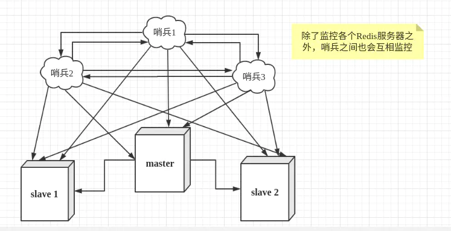

# 安装

下载、解压、编译

ps:https://redis.io/download  有安装介绍

```shell
wget http://download.redis.io/releases/redis-2.8.18.tar.gz    
tar xzf redis-2.8.18.tar.gz     
cd redis-2.8.１８    
make    
```

注：执行make时可能会出现的错误:

1. 未安装gcc，请先: yum install gcc tcl -y；

2. 安装报错 error: jemalloc/jemalloc.h: No such file or directory；解决方案：make 换==》make MALLOC = libc

```shell
## 安装
[root@localhost redis-6.2.1]# make install
## 查看安装结果
[root@localhost redis-6.2.1]# cd /usr/local/bin
[root@localhost bin]# ll
总用量 18844
-rwxr-xr-x. 1 root root 4833416 3月  22 10:09 redis-benchmark
lrwxrwxrwx. 1 root root      12 3月  22 10:09 redis-check-aof -> redis-server
lrwxrwxrwx. 1 root root      12 3月  22 10:09 redis-check-rdb -> redis-server
-rwxr-xr-x. 1 root root 5003464 3月  22 10:09 redis-cli
lrwxrwxrwx. 1 root root      12 3月  22 10:09 redis-sentinel -> redis-server
-rwxr-xr-x. 1 root root 9450288 3月  22 10:09 redis-server

## 备份配置文件
[root@localhost redis-6.2.1]# cp redis.conf redis.conf.bak

# 测试启动
cd /usr/local/redis    
./redis-server redis.conf
```

- redis默认不是后台启动的，如果想要后台启动，一个办法就是修改配置文件

```conf
## 将其修改为yes
daemonize yes
```

- 关闭redis

```shell
[root@localhost redis-6.2.1]# redis-cli 
127.0.0.1:6379> shutdown 
```

# 性能测试

- redis-benchmark
- redis自带的测试

```shell
[root@localhost redis-6.2.1]# redis-benchmark -c 100 -n 100000
```

- 日志查看

```shell
====== SET ======                                                    
  100000 requests completed in 1.01 seconds
  100 parallel clients
  3 bytes payload ## 每次请求3个字节
  keep alive: 1  ## 只一台服务器接收请求
  host configuration "save": 3600 1 300 100 60 10000
  host configuration "appendonly": no
  multi-thread: no

Latency by percentile distribution:
0.000% <= 0.127 milliseconds (cumulative count 1) ##  
50.000% <= 0.463 milliseconds (cumulative count 54809)
```

# 基础知识

- redis默认16个数据库
- 切换数据库

```shell
127.0.0.1:6379> select 1
OK
127.0.0.1:6379[1]>
```

- 查看数据库大小

```shell
127.0.0.1:6379[1]> DBSIZE
(integer) 1
```

- 清空当前数据库

```shell
127.0.0.1:6379[1]> FLUSHDB
OK
127.0.0.1:6379[1]> DBSIZE
(integer) 0

```

# 数据结构

## 字符串操作

### 注意

- 键命名规范：通常，公司用：：来代表一个级别

- redis key 值是二进制安全的，这意味着可以用任何二进制序列作为key值

  key取值原则

  - 键值不需要过长，会消耗内存
  - 键值不宜太短，可读性差

  一个字符类型的值最多能存512M字节的内容

### set

- 设置值

```shell
127.0.0.1:6379> set name laoxiao
OK
```

- 设置过期时间,查看过期时间

```shell
127.0.0.1:6379> EXPIRE name 10
(integer) 1
127.0.0.1:6379> ttl name
(integer) 2
```

- 在SET命令中，有很多选项可用来修改命令的行为。 以下是SET命令可用选项的基本语法。
  - EX seconds − 设置指定的到期时间(以秒为单位)。
  - PX milliseconds - 设置指定的到期时间(以毫秒为单位)。
  - NX - 仅在键不存在时设置键。
  - XX - 只有在键已存在时才设置。

```shell
redis 127.0.0.1:6379> SET KEY VALUE [EX seconds] [PX milliseconds] [NX|XX]
```

- 判断key是否存在

```shell
127.0.0.1:6379> EXISTS name
(integer) 0
```

- 移除key

```shell
127.0.0.1:6379> MOVE name 1
(integer) 1
```

- 自增,自减
  - 可以用来设置某个文章的阅读量

```
127.0.0.1:6379> INCR count
(integer) 1
127.0.0.1:6379> DECR count
(integer) 0
```

- 自增指定数字

```shell
127.0.0.1:6379> INCRBY views 10
(integer) 11
```

- 替换

```shell
127.0.0.1:6379> SETRANGE name 2 zy
(integer) 7
127.0.0.1:6379> get name
"lazyiao"
```

### mset

- 表示一次可以设置多个键值对

```shell
redis 127.0.0.1:6379> MSET key1 value1 key2 value2 .. keyN valueN
```

- msetnx 是原子性的，如果一个没有设置成功，则其他键值对都设置不成功
- 可以用mset来设置用户是否已读文章，如： title:userid:docId  1,设置多个

### Redis的CAS

- getset
- 如果存在值则进行替换

```shell
127.0.0.1:6379> GETSET key value
```


### 应用场景

#### 分布式锁

- 利用过期的键，可以做分布式的锁
  - 配合他的过期的键

```shell
## 设置一个锁，过期时间为10秒，NX: 如果存在则为nil
SET lock1 1 ex 10 NX
```

- 如：

```shell
## 当前锁
127.0.0.1:6379> set lock1 1 ex 10
OK
127.0.0.1:6379> ttl lock1
(integer) 4
```

##### 简单的锁

```java
public static final String KEY = "lock:key";

/**
 * 加锁操作，value可以添加自己的线程 <br/>
 * 目的是为了能够在将来，防止其他线程删除本线程的锁
 */
public  String lock() {
    String value = UUID.randomUUID().toString()+Thread.currentThread().getId();
    Boolean bool = redisTemplate.opsForValue().setIfAbsent(KEY, value, 60L, TimeUnit.SECONDS);
    if(bool) {
        return value;
    } else {
        return "";
    }

}

public void  unlock(String value) {
    String script = "local value = redis.call('get', KEYS[1])\n" +
            "if value == KEYS[2] then\n" +
            "\tredis.call('del', KEYS[1])\n" +
            "\treturn 1\n" +
            "else \n" +
            "\treturn 0 end";
    Object res = redisTemplate.execute(new RedisCallback<Long>() {
        @Override
        public Long doInRedis(RedisConnection connection) throws DataAccessException {
            return connection.eval(script.getBytes(StandardCharsets.UTF_8), ReturnType.INTEGER, 2, KEY.getBytes(StandardCharsets.UTF_8), value.getBytes(StandardCharsets.UTF_8));
        }
    });
    System.out.println(res);
}
```

存在问题：

1. 业务时间大于锁时间问题
2. redis异步复制造成的锁丢失,比如:主节点没来的及把刚刚set进来这条数据给从节点，就挂了。
   1. 一主多从的情况
   2. 因为redis集群是ap原则

#### 某个文章进行点赞

- 利用INCR count自增
- 点一次赞执行下命令

## List

### 基本操作

- list命令都是L或者R开头的
- 元素时字符串类型，列表头部和尾部增删快、元素可以重复，最多存2^32-1个元素
- push操作,往key里面设置值，放入列表的头部

```shell
127.0.0.1:6379> LPUSH list one
(integer) 1
127.0.0.1:6379> LPUSH list 2
(integer) 2
127.0.0.1:6379> lpush list 3
(integer) 3
```

- 获取值

```shell
127.0.0.1:6379> LRANGE list 0 1
1) "3"
2) "2"
```

- 将值push到列表尾部

```shell
127.0.0.1:6379> RPush list rpu
(integer) 4
127.0.0.1:6379> LRANGE list 0 -1
1) "3"
2) "2"
3) "one"
4) "rpu"
```

- 从左边弹出值

```shell
127.0.0.1:6379> LPOP list
"3"
127.0.0.1:6379> LRANGE list 0 -1
1) "2"
2) "one"
3) "rpu"
```

### 移除

- 移除指定值
  - count > 0 : 从表头开始向表尾搜索，移除与 VALUE 相等的元素，数量为 COUNT 。
  - count < 0 : 从表尾开始向表头搜索，移除与 VALUE 相等的元素，数量为 COUNT 的绝对值。

  - count = 0 : 移除表中所有与 VALUE 相等的值。

```shell
127.0.0.1:6379> LREM key count element
```

- 移除一个值
  - 移除1个指定的值
  - 可以用来如:取消某个人的关注

```shell
127.0.0.1:6379> LREM list 1 one
(integer) 1

```

### 截断

- 设置 0 1 2 3四个元素
- 截取index =1  2的元素
- 可以看到四个元素只剩下1 2了

```shell
127.0.0.1:6379> LTRIM mylist 1 2
OK
127.0.0.1:6379> LRANGE mylist 0 -1
1) "2"
2) "1"
```

### 弹入弹出

- 从右边弹出一个元素，从左边push到一个新的元素中

```shell
127.0.0.1:6379> RPOPLPUSH mylist mylist2
"1"
```

### 使用场景

#### 队列

- LPUSH  RPOP

#### 栈

- LPUSH LPOP

#### 订阅的文章推送

- 如果订阅了某个公众号，则这个公众号发布文章时

```shell
lpush article:用户id 文章id
```

## SET集合

- 无序的、去重的、元素是字符串类型

```shell
# 添加一个或者多个成员
SADD key member1 [member2]
# 返回集合中的所有成员
smembers key
# 判断 member 元素是否是集合 key 的成员
## key中存在member返回1
sismember key member
# 返回集合中一个或多个随机数
srandmember key [count]
# 获取集合的成员数
scard key
# 移除并返回集合中的一个随机元素

```

- 获取集合个数

```shell
127.0.0.1:6379> SCARD myset
(integer) 4
```

- 移除指定元素

```shell
127.0.0.1:6379> SREM myset 3
(integer) 1
```

### 多个集合操作

- 将一个集合中的指定元素移动到另一个集合

```shell
127.0.0.1:6379> SMOVE myset myset2 2
(integer) 1
```

- 求差集

```shell
127.0.0.1:6379> SDIFF myset myset2
1) "1"
2) "1,"
```

- 求交集(用户之间的共同关注)
  - A用户的关注放一个集合，粉丝放一个集合
  - A用户和B用户的关注求交集就是共同关注

```shell
127.0.0.1:6379> sadd myset laoxiao
(integer) 1
127.0.0.1:6379> sadd myset2 laoxiao
(integer) 1
127.0.0.1:6379> SINTER myset myset2
1) "laoxiao"
```

- 求并集

```shell
127.0.0.1:6379> SUNION myset myset2
1) "1"
2) "laoxiao"
3) "2,"
4) "1,"
```

### 应用场景

#### 用户之间的共同关注

- A用户的关注放一个集合，粉丝放一个集合
- A用户和B用户的关注求交集就是共同关注

#### 抽奖活动

```shell
# 抽取某个人，还可以继续抽奖
srandmember key [count]

# 随机抽奖，删除抽奖的
SPOP key [count]
```

#### 朋友圈点赞

```shell
## 点赞
sadd 用户id:文章id  点赞用户1 点赞用户2
## 删除点赞
SREM myset 点赞用户

```


## HASH(哈希)

### 基本操作

- 由field和关联的value组成的map键值对

- field和value是字符串类型

- 一个hash中最多包含2^32-1个键值对

```shell
set key field value
```

```shell
127.0.0.1:6379> hset myhash name laoxiao
(integer) 1
127.0.0.1:6379> hget myhash name
"laoxiao"
```

- 获取所有的键或者值

```shell
127.0.0.1:6379> HKEYS myhash
1) "name"
127.0.0.1:6379> HVALS myhash
1) "laoxiao"
```

- 不适用hash的情况
  - 使用二进制位操作命令
  - 使用过期键功能

### 使用场景

#### 购物车功能

```shell
## 新增商品
hset shopcar:用户id 商品id 数量
## 增加某个商品的数量
hincrby shopcar:用户id 商品id
##获取商品总数
hlen shopcar:用户id
## 获取全部商品
hgetall shopcar:用户id
```


## 有序集合

- 添加语法

```shell
127.0.0.1:6379> ZADD key [NX|XX] [GT|LT] [CH] [INCR] score member [score member ...]
```

- 返回指定下标区间

```shell
127.0.0.1:6379> ZRANGE key min max [BYSCORE|BYLEX] [REV] [LIMIT offset count] [WITHSCORES]
## 查询下标的元素
127.0.0.1:6379> zrange myz 1 2
1) "lisi"
2) "wangwu"

```

- 按照分数查询（返回指定分数区间）

```shell
127.0.0.1:6379> ZRANGEBYSCORE key min max [WITHSCORES] [LIMIT offset count]
```

- 获取分数2-3开始

```shell
127.0.0.1:6379> ZRANGEBYSCORE myz 2 3
1) "lisi"
2) "wangwu"
```

- 从负无穷到正无穷查询（升序查找）

```shell
127.0.0.1:6379> ZRANGEBYSCORE myz -inf +inf
1) "laoxiao"
2) "lisi"
3) "wangwu"
```

- 降序查询

```shell
127.0.0.1:6379> ZREVRANGEBYSCORE key max min [WITHSCORES] [LIMIT offset count]
```

- 给member增加increment

```shell
ZINCRBY key increment member
```


# 特殊数据类型

## 经纬度

- 3.2版本推出
- 可以计算地理位置的距离
  - longitude 经度
  - latitude 纬度

```shell

GEOADD key [NX|XX] [CH] longitude latitude member [longitude latitude member
## 插入地理位置
## 两级无法添加
127.0.0.1:6379> GEOADD china:city 112.98626 28.25591 changsha
(integer) 1
127.0.0.1:6379> GEOADD china:city 113.64317 28.16378 liuyang
(integer) 1

```

- 获取经纬度

```shell
127.0.0.1:6379> GEOPOS china:city changsha
1) 1) "112.98626035451889038"
   2) "28.25590931465907119"
```

- 获取城市距离

```shell
127.0.0.1:6379> GEODIST china:city changsha liuyang
"65197.3795"

##计算的距离单位（km）
127.0.0.1:6379> GEOdist china:city changsha liuyang km
"65.1974"

```

- 求附近人，（以半径为中心）
  - 经度， 维度：longitude， latitude
  - radius：半径
  - withcoord：显示经度维度
  - withdist：直线距离
  - COUNT：查出来的数量

```shell
GEORADIUS key longitude latitude radius m|km|ft|mi [WITHCOORD] [WITHDIST] [WITHHASH] [COUNT count [ANY]] [ASC|DESC] [STORE key] [STOREDIST key]

127.0.0.1:6379> GEORADIUS china:city 112 28 200 km
1) "changsha"
2) "liuyang"
```

- 以元素为中心寻找周围城市

```shell
GEORADIUSBYMEMBER key member radius m|km|ft|mi [WITHCOORD] [WITHDIST] [WITHHASH] [COUNT count [ANY]] [ASC|DESC] [STORE key] [STOREDIST key]

## 获取长沙100km访问的城市
127.0.0.1:6379> GEORADIUSBYMEMBER china:city changsha 100 km withdist
1) 1) "changsha"
   2) "0.0000"
2) 1) "liuyang"
   2) "65.1974"
```

- 删除地理位置

```shell
127.0.0.1:6379> ZREM china:city liuyang
```

## 基数

基数：一组集合中，不重复的数据量

- 网页的UV(一个人访问网站多次，但还是算作一个人访问)
  - 传统方式：使用set保存userId---但是用户的数量大，就有弊端
  - Hyperloglog：占用内存固定，2^64不同的元素，只需要12kb，但是有0.81%的错误率

```shell
PFADD key element [element ...]

## 存入用户
127.0.0.1:6379> PFADD uv user1 user2 user3 user4 user5
(integer) 1
## 统计
127.0.0.1:6379> PFCOUNT uv
(integer) 5

##合并两个集合
127.0.0.1:6379> PFADD uv2 user3 user 5 user6
(integer) 1
127.0.0.1:6379> PFMERGE uv3 uv uv2
OK

```


## 位运算

- 网站用户的上线次数统计（活跃用户），统计用户的活跃信息， 活跃 0 不活跃 1

  - 网站用户的上线次数统计（活跃用户）

  - 用户id作为key，天作为offset，上线置为1

  - 例如：id为500的用户，今年第1天上线、第30天上线

    setbit u500 1 1

    setbit u500 30 1

    bitcount u500

- 打卡， 哪天打卡=1

```shell
## 设置第一天 第三天打卡
127.0.0.1:6379> SETBIT u1 0 1
(integer) 0
127.0.0.1:6379> SETBIT u1 2 1
(integer) 0
##获取第二天和第三天有没有打卡（默认0）
127.0.0.1:6379> GETBIT u1 1
(integer) 0
127.0.0.1:6379> GETBIT u1 2
(integer) 1
## 获取用户打卡天数
127.0.0.1:6379> BITCOUNT u1 
(integer) 2

```

# 事务

## 基本操作

- Redis单条命令保证原子性，但是事务不保证原子性
- Redis事务没有隔离级别概念
- Redis事务本质：一组命令，在队列中，按照顺序执行

- Redis事务
  - 开启事务：MULTI 
  - 命令入队
  - 执行事务

```shell
## 事务开启
127.0.0.1:6379> MULTI
OK
## 入队操作
127.0.0.1:6379(TX)> set k1 v1
QUEUED
127.0.0.1:6379(TX)> set k2 v2
QUEUED
## 执行命令
127.0.0.1:6379(TX)> EXEC
1) OK
2) OK

```

- 放弃事务
  - 事务里的命令不会执行

```shell
127.0.0.1:6379> MULTI
OK
127.0.0.1:6379(TX)> set k3 v3
QUEUED
127.0.0.1:6379(TX)> DISCARD
OK
```

- 错误
  - 命令错误，其他命令不会执行
  - 运行时异常，其他命令照样执行

## Redis乐观锁

- 乐观锁的实现，必须基于WATCH，然后利用redis的事务。

1. 开启监控money
   1. 监控了这个键后，如果其他线程修改了这个键，那么事务执行的时候就会失败
2. 开启事务

```shell
127.0.0.1:6379> set money 100
OK
## 监控money
127.0.0.1:6379> WATCH money
OK
127.0.0.1:6379> MULTI
OK
## 执行新增的时候，在另一个线程执行加20
127.0.0.1:6379(TX)> INCRBY money 10
QUEUED
##执行命令的时候发现money值改了，不再进行修改
127.0.0.1:6379(TX)> EXEC
(nil)
127.0.0.1:6379> get money
"120"
## 解除监控 （ps：执行失败要先解锁，再执行watch）
127.0.0.1:6379> UNWATCH
OK
```

## 秒杀案例

- 秒杀场景：库存-1， 人数+1

### 基于乐观锁

**错误示例**

1. 查验库存还够不够
2. 开启乐观锁监听，然后开启事务
3. 扣除库存
4. 执行事务命令，如果成功返回的不是null，则将用户设置进入用户set集合

```java
sendUserNumber.incrementAndGet();
String userId = IdUtil.simpleUUID();
redisTemplate.setEnableTransactionSupport(true);
long inventory = Long.parseLong(redisTemplate.opsForValue().get("px:inventory").toString());
if(inventory <= 0) {
    log.debug("==>库存不够....");
    return;
}
redisTemplate.watch("px:inventory");
redisTemplate.multi();
try {
    redisTemplate.opsForValue().decrement("px:inventory");
} finally {
    List list = redisTemplate.exec();
    Optional.ofNullable(list).filter(var -> var.size()>0).ifPresent( var -> {
        log.debug("用户 {} 抢到商品", userId);
        getUserNumber.incrementAndGet();
        redisTemplate.opsForSet().add("px:user", userId);
    });
}
```

- 问题：

1. 库存问题，即有200个库存，2000个用户抢，可是只消耗了30个
2. 并发问题，虽然执行操作是乐观锁，但是，获取和执行库存-1不是原子操作

### lua脚本模式

1. 通过lua脚本保证原子性，在脚本里对库存-1 和 对用户集合的添加

```java
String userId = IdUtil.simpleUUID();
String lua = "local num = redis.call('get', KEYS[1])\n" +
    "if tonumber(num) <= 0 then\n" +
    "\treturn -1\n" +
    "else\n" +
    "\tredis.call('decr', KEYS[1])\n" +
    "redis.call(\"sadd\", KEYS[2], KEYS[3])\n" +
    "\treturn 1\n" +
    "end";
Object obj = redisTemplate.execute((RedisCallback) (connection) -> {
    return connection.eval(lua.getBytes(StandardCharsets.UTF_8), ReturnType.MULTI,
                           3,
                           "px:inventory".getBytes(StandardCharsets.UTF_8),
                           "px:user".getBytes(StandardCharsets.UTF_8),
                           userId.getBytes(StandardCharsets.UTF_8));
});
Optional.ofNullable(obj).map(var -> (List<Long>) var)
    .filter(var -> var.size()>0)
    .map(var -> var.get(0))
    .ifPresent(var -> {
        if(var.compareTo(1L) == 0) {
            getUserNumber.incrementAndGet();
        }
    });
```

- 脚本示例：

```lua
local num = redis.call('get', KEYS[1])
if num == 0 then
	return -1
else
	# 扣减活动库存
	redis.call('decr', KEYS[1])
    # 设置用户信息
    redis.call("sadd", KEYS[2], KEYS[3])
	return 1
end
```


# 安全配置

```shell
## 默认获取密码是为空的
127.0.0.1:6379> config get requirepass
1) "requirepass"
2) ""
## 设置密码
127.0.0.1:6379> config set requirepass 123456
OK
## 再吃执行命令没有权限
127.0.0.1:6379> config set requirepass
(error) ERR Unknown subcommand
## 认证
127.0.0.1:6379> auth 123456
OK
###
127.0.0.1:6379> config get requirepass
1) "requirepass"
2) "123456"
```


# 配置文件

## 配置端口和ip

```shell
## 可以导入多个配置文件
# include /path/to/local.conf
# include /path/to/other.conf

## 绑定ip
bind 0.0.0.0 -::1
port 6379

```


## 最大内存配置

- 默认64位是不限制内存的
  - 一般配置物理内存的3/4

```shell
### 最大内存配置
# maxmemory <bytes>
## 配置内存
maxmemory 1024
```

内存满了的策略

如果超过内存，会报OOM错误

```shell
## 内存满了的策略
# maxmemory-policy noeviction
```


## 持久化配置

```shell
#### 持久化配置

## 如果3600秒内有一个key修改，就进行持久化操作
# save 3600 1
# save 300 100
## 60秒内有一个key修改，就进行持久化
# save 60 10000
##持久化出错，是否继续工作
stop-writes-on-bgsave-error yes

## 是否压缩持久化（rdb）文件（会消耗cpu资源）
rdbcompression yes

## 是否校验rdb文件
rdbchecksum yes

# rdb保存文件
dbfilename dump.rdb
```


```shell


#日志级别
loglevel notice

## 日志文件名
logfile ""


################################主从复制


####################### SECURITY(安全)

# 在配置文件中设置密码
# requirepass foobared

##最大的客户端连接数
# maxclients 10000


##########APPEND ONLY MODE (另一种持久化模式)
## 默认不开启AOF
appendonly no
## 持久化文件
appendfilename "appendonly.aof"

### 同步机制
## 每次修改都写入（速度慢）
# appendfsync always
## 每一秒同步
appendfsync everysec
## 不执行sync， 操作系统自己同步
# appendfsync no
```

## 以守护进程运行

```shell
# 是否以守护进程运行，默认是NO
daemonize yes
## 如果以守护进程运行，则需要指定一个进程文件
pidfile /var/run/redis_6379.pid
```


# Redis 持久化

## RDB模式

- RDB持久化是指在指定的时间间隔内将内存中的数据集快照写入磁盘。也是默认的持久化方式，这种方式是就是将内存中数据以快照的方式写入到二进制文件中,默认的文件名为dump.rdb
- 既然RDB机制是通过把某个时刻的所有数据生成一个快照来保存，那么就应该有一种触发机制，是实现这个过程。对于RDB来说，提供了三种机制：save、bgsave、自动化
- save模式
  - 该命令会阻塞当前Redis服务器，执行save命令期间，Redis不能处理其他命令，直到RDB过程完成为止
  - 执行完成时候如果存在老的RDB文件，就把新的替代掉旧的。我们的客户端可能都是几万或者是几十万，这种方式显然不可取

```shell
127.0.0.1:6379> save
OK
```

- bgsave
  - 执行该命令时，Redis会在后台异步进行快照操作，快照同时还可以响应客户端请求
  - 具体操作是Redis进程执行fork操作创建子进程，RDB持久化过程由子进程负责，完成后自动结束。阻塞只发生在fork阶段，一般时间很短。基本上 Redis 内部所有的RDB操作都是采用 bgsave 命令

```shell
127.0.0.1:6379> BGSAVE
Background saving started
```

- 自动触发
  - 自动触发是由我们的配置文件来完成的
- 如何恢复
  - 将rdb文件放到对应文件下，redis启动会自动检查

```shell
127.0.0.1:6379> config get dir
1) "dir"
2) "/root"  ### 这个目录下存在rdb文件，就会恢复
```

- 优点
  - 适合大规模的数据恢复
  - 数据完整性要求不高，（在没有触发save规则的时候宕机，数据就没了）
- 缺点
  - 数据可能丢失（在没有触发save规则的时候宕机，数据就没了）
  - fork进程会占用空间

## AOP

- AOF持久化是通过保存Redis所执行的写命令来记录数据库状态的

# 发布订阅

- 发布
  - channel：管道名称
  - message：消息

```shell
127.0.0.1:6379> PUBLISH channel message
```

- 订阅

```shell
127.0.0.1:6379> SUBSCRIBE laoxiao 
Reading messages... (press Ctrl-C to quit)
1) "subscribe"
2) "laoxiao"
```

# 主从复制

- 只一个redis服务器的数据，复制到其他redis服务器
- 数据复制是单向的，只能 master -> slave
- 主从复制作用
  - 数据热备份，数据故障修复
  - 负载均衡，主节点写，从节点进行读操作
  - 高可用（防止一台服务器宕机）

## 环境配置

- 查看当前库信息

```shell
127.0.0.1:6379> info replication
# Replication
role:master
connected_slaves:0
master_failover_state:no-failover
master_replid:413efdc5cccbb10f3430d1d012b52fed3209db1c
master_replid2:0000000000000000000000000000000000000000
master_repl_offset:0
second_repl_offset:-1
repl_backlog_active:0
repl_backlog_size:1048576
repl_backlog_first_byte_offset:0
repl_backlog_histlen:0
```

- 复制三个配置文件

```shell
[root@localhost redis-6.2.1]# cp redis.conf redis79.conf
[root@localhost redis-6.2.1]# cp redis.conf redis80.conf
[root@localhost redis-6.2.1]# cp redis.conf redis81.conf
```

- 修改每个配置文件

```conf
port 6380
pidfile /var/run/redis_6380.pid
logfile "log-80.log"
dbfilename dump80.rdb
dir ./data/
```

## 一主二从

### 通过命令配置

- 不是永久的

- 从机找主机，配置

```shell
127.0.0.1:6380> SLAVEOF 192.168.1.131 6379
OK
### 能够看到6379有两个从机
127.0.0.1:6379> info replication
# Replication
role:master
connected_slaves:2
slave0:ip=192.168.1.131,port=6381,state=online,offset=42,lag=0
slave1:ip=192.168.1.131,port=6380
```

### 配置文件配置

```shell
### 配置主机的ip 和端口
# replicaof <masterip> <masterport>
### 配置主机的密码
# masterauth <master-password>

```

### 特性

- 主机可以写，从机不能写只能读
- 所有主机的信息都会被从机保存

```shell
## 从机只能读
127.0.0.1:6380> set name laoxiao1
(error) READONLY You can't write against a read only replica.
```

- 第一次连接主机，slave会发生全量复制，接收master的数据库文件数据
- 后面的新增，则发生的是增量复制

### 手动的从机变主机

```shell
127.0.0.1:6379> SLAVEOF no one
```

## 哨兵模式

- 通过发送命令，让Redis服务器返回监控其运行状态，包括主服务器和从服务器
- 当哨兵监测到master宕机，会自动将slave切换成master，然后通过**发布订阅模式**通知其他的从服务器，修改配置文件，让它们切换主机

### 单哨兵模式


- 配置sentinel配置
  - port:端口
  -  redis-master:自定义监控主节点名称， 
  - 1：至少有一个sentinel来投票才能成为主节点，这里单哨兵，所以为1

```shell
[root@localhost conf]# vim sentinel.conf

port 26379
Sentinel monitor redis-master 127.0.0.1 6379 1
```

- 启动配置文件，能看到配置文件

```shell
[root@localhost redis-6.2.1]# redis-sentinel conf/sentinel.conf
```

```console
16816:X 27 Mar 2021 00:54:35.398 # +monitor master redis-master 127.0.0.1 6379 quorum 1
16816:X 27 Mar 2021 00:54:35.399 * +slave slave 192.168.1.131:6381 192.168.1.131 6381 @ redis-master 127.0.0.1 6379
16816:X 27 Mar 2021 00:54:35.400 * +slave slave 192.168.1.131:6380 192.168.1.131 6380 @ redis-master 127.0.0.1 6379
```

- 关闭主节点，稍等能看到从节点有一个选举为主节点

```
16816:X 27 Mar 2021 00:56:35.055 * +slave slave 127.0.0.1:6379 127.0.0.1 6379 @ redis-master 192.168.1.131 6381
```


### 多哨兵模式



### 常用配置

```shell
## 告诉sentinel去监听地址为ip:port的一个master，这里的master-name可以自定义，quorum是一个数字，指明当有多少个sentinel认为一个master失效时，master才算真正失效
sentinel monitor <master-name> <ip> <redis-port> <quorum>

## 设置连接master和slave时的密码，注意的是sentinel不能分别为master和slave设置不同的密码，因此master和slave的密码应该设置相同
sentinel auth-pass <master-name> <password>

## 这个配置项指定了需要多少失效时间，一个master才会被这个sentinel主观地认为是不可用的。 单位是毫秒，默认为30秒
sentinel down-after-milliseconds <master-name> <milliseconds> 

## 发生failover主备切换时最多可以有多少个slave同时对新的master进行 同步，这个数字越小，完成failover所需的时间就越长，但是如果这个数字越大，就意味着越 多的slave因为replication而不可用。可以通过将这个值设为 1 来保证每次只有一个slave 处于不能处理命令请求的状态
sentinel parallel-syncs <master-name> <numslaves> 

##  同一个sentinel对同一个master两次failover之间的间隔时间
##  当一个slave从一个错误的master那里同步数据开始计算时间。直到slave被纠正为向正确的master那里同步数据时
## 默认3分钟
sentinel failover-timeout <master-name> <milliseconds>
```

# Redis 缓存过期淘汰策略

- 定期删除： 每隔一段时间，去随机抽取，看有没有需要删除的key
- 惰性删除：被使用的时候，如果需要删除则删除

如果内存快满了，则还有兜底策略，就是上面提到的内存配置策略

 volatile-lru ->对所有设置了过期时间的key使用LRu算法进行删除
 allkeys-lru -> **对所有key使用LRU算法进行删除**（一般生产使用）
 volatile-lfu -> Evict using approximated LFU, only keys with an expire set.
 allkeys-lfu -> 对所有key使用LRu算法进行删除
 volatile-random -> 对所有过期key随机删除
 allkeys-random -> 对所有key随机删除
 volatile-ttl -> 对所有设置了过期时间的key随机删除
 noeviction ->不会驱逐任何key

# 源码解析

- 每个链表都是用adlist.h来表示

```c
typedef struct listNode {
    //上一个节点
    struct listNode *prev;
    //后置节点
    struct listNode *next;
    //节点值
    void *value;
} listNode;
```

# 缓存常见问题

什么是缓存穿透？如何避免？什么是缓存雪崩？何如避免？

> 缓存穿透

一般的缓存系统，都是按照key去缓存查询，如果不存在对应的value，就应该去后端系统查找（比如DB）。一些恶意的请求会故意查询不存在的key,请求量很大，就会对后端系统造成很大的压力。这就叫做缓存穿透。

**恶意请求数据库不存在的数据**

如何避免？

1：对查询结果为空的情况也进行缓存，缓存时间设置短一点，如（key-null）

2：使用布隆过滤器

> 缓存雪崩

当缓存服务器重启或者大量缓存集中在某一个时间段失效，这样在失效的时候，会给后端系统带来很大压力。导致系统崩溃。

如何避免

1. 不同的key，设置不同的过期时间，让缓存失效的时间点尽量均匀

2. 在缓存失效后，通过加锁或者队列来控制读数据库写缓存的线程数量。比如对某个key只允许一个线程查询数据和写缓存，其他线程等待。

> 缓存击穿

如果你的应用中有一些**访问量很高的热点数据**，我们一般会将其放在缓存中以提高访问速度。

另外，为了保持时效性，我们通常还会设置一个过期时间。但是对于这些访问量很高的KEY，我们需要考虑一个问题：当热点KEY在失效的瞬间，海量的请求会不会产生大量的数据库请求，从而导致数据库崩溃？

**某一个热点key失效，直接查询了数据库**

现在常用的解决方式有这么两种：

1. 互斥锁,互斥锁指的是在缓存KEY过期去更新的时候，先让程序去获取锁，只有获取到锁的线程才有资格去更新缓存KEY。（也可以分布式的锁，抢到锁的去更新缓存，没有抢到的先阻塞一下，等待缓存更新完毕）

2. 永远不过期。（不太好）

# 布隆过滤器

布隆过滤器可以判断这个值存不存在

1. 布隆过滤器由一个二进制的数组组成
2. 当一个字符串，通过hash计算当前字符串的坐标，则将当前坐标至1


如：key，通过三个hash算法，计算了三个位置，下次key再来时，发现这三个1就会判断当前这个值存在

3. 布隆会有误差问题：因为不同的值，hash的坐标可能是相同的

解决缓存穿透问题：

当数据库查询这个值不存在时候，直接将当前key放入布隆过滤器中

如果下次这个key还来查询，直接不查数据库，通过布隆过滤器进行返回（redisson里有直接封装好的）

# Redis为什么快

**首先，采用了多路复用io阻塞机制**
**然后，数据结构简单，操作节省时间**
**最后，运行在内存中，自然速度快**

# Redis Cluster（集群）

Redis的哨兵模式基本已经可以实现高可用，读写分离 ，但是在这种模式下每台redis服务器都存储相同的数据，很浪费内存，因为一个master节点并不能放海量数据，而且单个Redis的实例过大时，会导致rdb文件过大，当执行主从同步时时间过长，所以在redis3.0上加入了cluster模式，实现的redis的分布式存储，也就是说每台redis节点上存储不同的内容。

> Redis-Cluster采用无中心结构,它的特点如下

- 所有的redis节点彼此互联(PING-PONG机制),内部使用二进制协议优化传输速度和带宽。
- 节点的fail是通过集群中超过半数的节点检测失效时才生效。
- 客户端与redis节点直连,不需要中间代理层.客户端不需要连接集群所有节点,连接集群中任何一个可用节点即可。