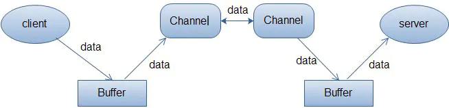
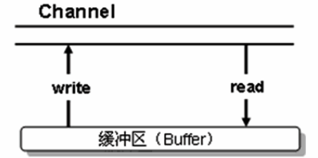
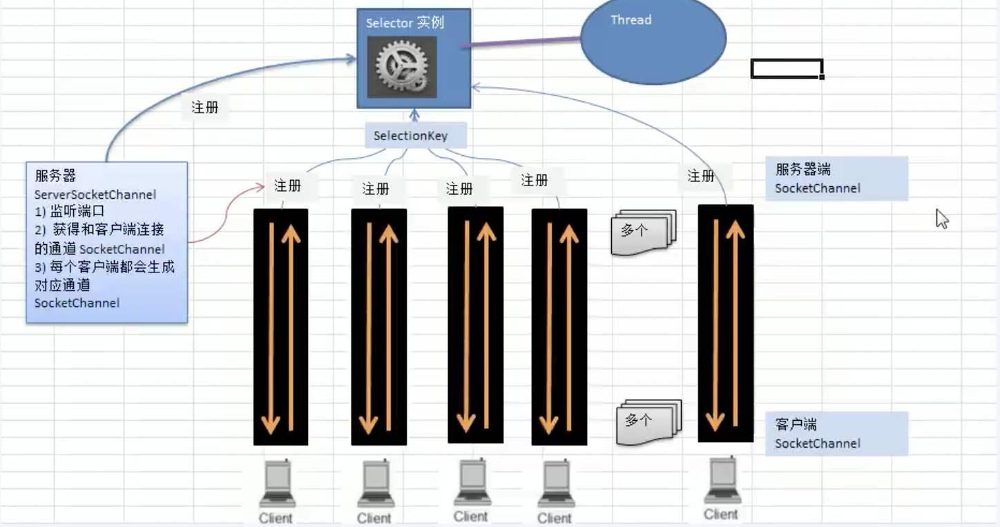

# netty介绍

netty是一个基于异步的，基于事件的网络应用框架

- 基于一个事件，这个事件可能是连接，或者断开


# IO模型

## BIO

- 阻塞型io
- 一个线程对应一个连接,并发量上来了，线程开销就大了


代码解析

```java
@Slf4j
public class TestBio {

    public void createCocket() throws Exception {
        //创建一个线程池，维护连接进来的通讯
        ExecutorService executorService = Executors.newCachedThreadPool();
        //建立一个socket
        ServerSocket serverSocket = new ServerSocket(8000);
        log.debug("服务器启动");
        while (true) {
            Socket accept = serverSocket.accept();
            //来一个连接启动一个线程
            log.debug("建立一个连接");
            executorService.execute(()->{
                handler(accept);
            });
        }
    }

    /**
     * 与客户端通信handler
     * @param socket
     */
    public void handler(Socket socket)  {
        try {
            log.debug("开始接受信息");
            InputStream inputStream = socket.getInputStream();
            while (true) {
                byte[] bytes = new byte[1024];
                int read = inputStream.read(bytes);
                if(read!=-1){
                    log.debug("收到信息：{}", new String(bytes, "UTF-8"));
                } else {
                    break;
                }
            }
        } catch (IOException e) {
            e.printStackTrace();
        } finally {
            try {
                socket.close();
            } catch (IOException e) {
                e.printStackTrace();
            }
        }
    }

    public static void main(String[] args) throws Exception {
        new TestBio().createCocket();
    }
}
```

telnet 127.0.0.1 8000

```shell
Escape 字符为 'CTRL+]'


Microsoft Telnet> send 好的
发送字符串 好的
Microsoft Telnet> send 111
发送字符串 111
Microsoft Telnet>
```


## NIO

- 同步非阻塞

- server端启动一个线程，线程维护一个selector
- selector一直轮询，查询通道有没有连接事件
- 也可以有多个线程维护selector
- 适合连接数多且连接比较短，如聊天服务器，弹幕系统，


### 介绍

- NIO有三个核心部分channel(通道)， buffer(缓冲区), selector(选择器)
- 每一个channel对应一个buffer，channel可以通过buffer进行读写，程序只与buffer进行交互



### Buffer

以intbuffer为例

```java
@Slf4j
public class TestBuffer {
    public static void main(String[] args) {
        //创建一个buffer，可以存放5个int
        IntBuffer intBuffer = IntBuffer.allocate(5);
        //将i设置进入buffer，将buffer塞满
        for(int i=0; i<intBuffer.capacity(); i++){
            intBuffer.put(i);
        }
        //转化读操作
        intBuffer.flip();
        //判读是否还有数据
        while (intBuffer.hasRemaining()) {
            log.info("取出数据：{}", intBuffer.get());
        }

    }
}
```

buffer几个参数

```java
//标记
private int mark = -1;
//当前下标
private int position = 0;
//操作过程中，下标不能超过limit
//作用：读数据不能超过这个数，flip时，会将position赋值给limit
private int limit;
//容量
private int capacity;
```

### Channel

- 可以同时读写
- 可以一步读写数据



- FileChannel  用来对本地文件进行IO操作

举例：使用通道的方式，将目标文件写入文件夹中

### buffer和channel进行文件copy

```java
public static void main(String[] args) throws Exception {
    FileInputStream input = new FileInputStream("E:\\1.avi");
    FileChannel channelSource = input.getChannel();
    FileOutputStream outputStream = new FileOutputStream("d:\\1.mp4");
    FileChannel channelTarget = outputStream.getChannel();
    ByteBuffer byteBuffer = ByteBuffer.allocate(5);
    while (true) {
        byteBuffer.clear();
        int read = channelSource.read(byteBuffer);
        if(read == -1){
            //读取完成
            break;
        }
        byteBuffer.flip();
        channelTarget.write(byteBuffer);
    }
    input.close();
    outputStream.close();
}
```

### MappedByteBuffer

能够直接在内存中进行修改，操作系统不需要再拷贝一次

### Buffer 分散聚合

- scattering : 将数据写入buffer时，采用buffer数组依次写入
  - channel.read(buffers[])
- gathering： 从buffer读数据，采用buffer数组，依次读
  - channel.write(buffers[])

### Selector

- 一般称 为选择器 ，当然你也可以翻译为 多路复用器 。它是Java NIO核心组件中的一个，用于检查一个或多个NIO Channel（通道）的状态是否处于可读、可写。如此可以实现单线程管理多个channels,也就是可以管理多个网络链接
- 当有事件发生时，返回select Key 数组，通过selectKey可以获取对应channel

对应方法

```java
int select()：阻塞到至少有一个通道在你注册的事件上就绪了。
int select(long timeout)：和select()一样，但最长阻塞时间为timeout毫秒。
int selectNow()：非阻塞，只要有通道就绪就立刻返回、。
```

```java
//获取有事件发生的key
Set selectedKeys = selector.selectedKeys();
//获取所有注册的key
Set<SelectionKey> keys = selector.keys();

```

### Selector Key

```java
//有新的网络连接
SelectionKey.OP_ACCEPT
//连接已建立
SelectionKey.OP_CONNECT
//读操作
SelectionKey.OP_READ
//写操作
SelectionKey.OP_WRITE
```


### NIO网络编程原理

- 客户端连接，通过serversocketChannel 得到 socketChannel

- socketChannel注册到selector上



- NIO server


### NIO网络代码
ServerSocketChannel：负责监听客户端连接
SocketChannel：负责读写操作

```java
public static void main(String[] args) throws IOException {
    ServerSocketChannel socketChannel = ServerSocketChannel.open();
    Selector selector = Selector.open();
    //绑定一个服务器监听端口
    socketChannel.socket().bind(new InetSocketAddress(7070));
    //设置为非阻塞
    socketChannel.configureBlocking(false);
    //将连接事件注册到selector中
    socketChannel.register(selector, SelectionKey.OP_ACCEPT);
    //循环获取连接事件
    while (true) {
        //1s没有获取到事件就重新获取
        if(selector.select(1000) == 0) {
            System.out.println("没有人连接....");
            continue;
        }
        //获取发生的事件集合
        Iterator<SelectionKey> keys = selector.selectedKeys().iterator();
        while (keys.hasNext()) {
            SelectionKey key = keys.next();
            //如果是连接事件，注册读事件,并关联一个buffer
            if(key.isAcceptable()){
                //有新的客户端连接，注册一个生成一个socket，注册一个读事件
                SocketChannel socketChannelRead = socketChannel.accept();
                socketChannelRead.configureBlocking(false);
                socketChannelRead.register(selector, SelectionKey.OP_READ, ByteBuffer.allocate(1024));
            }
            if(key.isReadable()) {
                SocketChannel channel = (SocketChannel) key.channel();
                ByteBuffer buffer = (ByteBuffer) key.attachment();
                channel.read(buffer);
                System.out.println("客户端传来： "+ new String(buffer.array()));
            }
            keys.remove();
        }
    }
}
```

```java
public static void main(String[] args) throws Exception {
    //打开选择器
    Selector selector = Selector.open();
    //打开套字接通道
    SocketChannel channel = SocketChannel.open();

    //设置非阻塞
    channel.configureBlocking(false);
    ;
    //注册通道，设置为链接就绪
    channel.register(selector, SelectionKey.OP_CONNECT);
    //绑定IP，端口
    if(!channel.connect(new InetSocketAddress("127.0.0.1", 7070))){
        while (!channel.finishConnect()) {
            System.out.println("客户端还未连接，不会阻塞，可以做其他事");
        }
    }
    ByteBuffer byteBuffer = ByteBuffer.wrap("hello, 老肖".getBytes());
    channel.write(byteBuffer);
    System.out.println("写入完毕");
}
```


### NIO和BIO比较

- NIO 以块的方式处理数据，BIO以流的方式处理

## AIO

- 异步非阻塞

