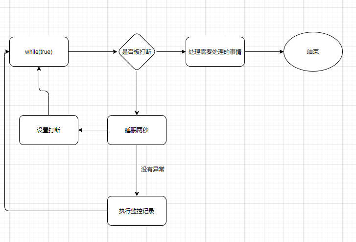
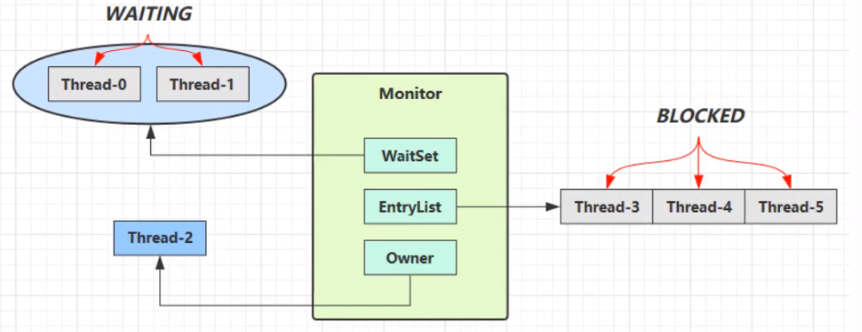

# 多线程效率问题

- 单核CPU下，多线程并不能实际的提高程序运行的效率，但是能够使不同的线程轮询使用cpu
- 多核下，可以并行的执行，可以提高效率

# 线程的创建

1. 直接继承Thread的方式

```java
public static void main(String[] args) {
    new MyThread().start();
    log.debug("主线程运行结束...");
}

static class MyThread extends Thread {
    @Override
    public void run() {
        log.debug("线程运行中....");
    }
}
```

2. 使用Runnable接口的方式创建（建议使用）

```java
public static void main(String[] args) {
    Runnable runnable = new Runnable() {
        @Override
        public void run() {
            log.debug("线程运行中....");
        }
    };
    new Thread(runnable).start();
    log.debug("主线程运行中.....");
}
```

- Thread 方式和Runnable的方式原理

Runable方式中，将Runable的实现类赋值了target

```java
this.target = target;
```

最终在run方法中，可以看到，执行的是Runnable的实现的方法

```java
@Override
public void run() {
    if (target != null) {
        target.run();
    }
}
```

Thread 方式中，执行的是子类的run方法，也就是我们重写的方法，所以两种方式原理是一样的

3. future模式,future模式能够阻塞的等待异步线程的结果，他要配合Callable的方式

```java
FutureTask<Integer> futureTask = new FutureTask<>(new Callable<Integer>() {
    @Override
    public Integer call() throws Exception {
        log.debug("future执行中.....");
        Thread.sleep(1000);
        return 1000;
    }
});
new Thread(futureTask).start();
log.debug("main 线程执行中.....");
log.debug("获取到future的结果：{}", futureTask.get());
```

# 线程切换

线程上下文切换原因：

1. 线程的cpu时间片用完
2. 垃圾回收
3. 有更高优先级的线程需要运行
4. 线程自己调用了sleep yield等方法

- 当线程切换时候，需要**程序计数器**保存当前线程的状态（记录执行指令的地址以及栈帧信息）
- 频繁切换上下文会影响性能

# 线程常见方法

## sleep

- 将线程有Runnable转为Time Waiting状态
- 其他线程可以使用interrupt方法打断正在sleep的线程，这时，线程抛出java.lang.InterruptedException异常

```java
Thread.sleep(1000);
```

- 建议使用TimeUnit来代替Thread，如：

```java
TimeUnit.SECONDS.sleep(3);
```

## yield

- 可以使线程从Running进入Runnable状态 

## 防止Cpu100%的方案

- 死循环中，不让空转一直耗费cpu，加一个sleep可以让出cpu使用权给其他程序

```java
while (true) {
    TimeUnit.SECONDS.sleep(1);
}
```

## join

- 阻塞等待线程结束

```java
//主线程同步等待t1线程
Thread t1 = new Thread(() -> {
    try {
        TimeUnit.SECONDS.sleep(1);
    } catch (InterruptedException e) {
        e.printStackTrace();
    }
    log.debug("t1 执行结束");
});
t1.start();
//等待t1线程结束后，在执行下面的代码
t1.join();
log.debug("main 执行结束");
```

- 有时效的等待
  - java.lang.Thread#join(long)
  - 最多等待long毫秒

## interrupt

- 打断sleep，wait, join 的线程
- 当睡眠中打断后，打断标识：false，正常过程，设置打断，标识为true

```java
Thread t1 = new Thread(() -> {
    try {
        TimeUnit.SECONDS.sleep(1);
    } catch (InterruptedException e) {
        e.printStackTrace();
    }
    log.debug("t1 执行结束");
});
t1.start();
t1.interrupt();
log.debug("打断标识： {}", t1.isInterrupted());
```

输出结果

```tex
打断标识： true
t1 执行结束
```

-  isInterrupted:判断是否打断，执行后不清除标记
-  Thread.interrupted()：返回打断标记，但是返回打断标记以后会清除打断标记

### interrupt对park的影响

- park作用是让线程阻塞

```java
Thread t1 = new Thread(() -> {
    //线程阻塞，等待打断
    LockSupport.park();
    log.debug("interrupt: {}", Thread.currentThread().isInterrupted());
    //线程不阻塞，因为线程打断标识=true
    LockSupport.park();
    //清除打断标识
    log.debug("interrupt: {}", Thread.interrupted());
    //线程阻塞
    LockSupport.park();
    log.debug("interrupt: {}", Thread.currentThread().isInterrupted());
});
t1.start();
Thread.sleep(1000);
t1.interrupt();
Thread.sleep(1000);
```

## 两阶段终止模式

- 在线程t1中，优雅的结束线程t2(优雅指的是：让t2做完自己该做的事情后结束线程)

### 错误思路

- 使用线程对象的stop方法
  - 会真正的杀死线程，当线程锁住某个资源时被杀死，那么此线程会没法释放锁
- 使用System.exit方法
  - 会停止整个程序

### 常见解决方案

- 如：需要做一个监控，当需要停止这个监控时，只需要对这个线程设置打断
- 睡眠2秒为了避免循环耗尽资源
- 出现异常设置打断是因为：睡眠阶段打断标识会抛出异常，并且打断标识为false



```java
private static Thread monitor;
public static void main(String[] args) throws InterruptedException {
    start();
    TimeUnit.SECONDS.sleep(10);
    stop();
}
public static void start() {
    monitor = new Thread(() -> {
        while (true) {
            Thread thread = Thread.currentThread();
            if(thread.isInterrupted()) {
                log.debug("==>处理一些事情后退出线程...");
                break;
            }
            try {
                TimeUnit.SECONDS.sleep(3);
            } catch (InterruptedException e) {
                thread.interrupt();
            }
            log.debug("==>正在执行监控记录...");
        }
    });
    monitor.start();
}
public static void stop() {
    monitor.interrupt();
}
```

# 主线程和守护线程

- 正常情况下，Java会等待所有线程结束，程序才会结束
- 特殊情况：守护线程不管有没有结束，主线程结束，都会强制结束
- 垃圾回收线程就是常见的守护线程

# 线程状态

## 从API层面

```java
public enum State {
    /**
     * 初始状态
     */
    NEW,

    /**
     * 保护运行/可运行/阻塞（操作系统的阻塞，如：io的阻塞accept）状态
     */
    RUNNABLE,

    /**
     * 阻塞状态：被锁住了
     */
    BLOCKED,

    /**
     * 阻塞：调用了wating/join
     */
    WAITING,

    /**
     * 阻塞：调用sleep
     */
    TIMED_WAITING,

    /**
     * Thread state for a terminated thread.
     * The thread has completed execution.
     */
    TERMINATED;
}
```

## 从操作系统角度

# 共享模型

## 对象头

- 一般我们造的对象，都由对象头和对象的成员属性组成

## Monitor

- monitor是操作系统提供的对象
- 当对某个对象加synchronized（obj）的时候，obj的对象头会尝试加上一个monitor的指针
- monitor里面的owner属性指向抢到锁的线程
- 此时另外一个线程来抢这个锁，则monitor的的EntryList指向抢锁的线程

- 当线程执行完，将EntryList中的线程全部唤醒，继续抢锁



