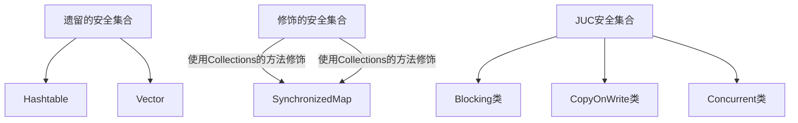

# 多线程效率问题

- 单核CPU下，多线程并不能实际的提高程序运行的效率，但是能够使不同的线程轮询使用cpu
- 多核下，可以并行的执行，可以提高效率

# 线程的创建

1. 直接继承Thread的方式

```java
public static void main(String[] args) {
    new MyThread().start();
    log.debug("主线程运行结束...");
}

static class MyThread extends Thread {
    @Override
    public void run() {
        log.debug("线程运行中....");
    }
}
```

2. 使用Runnable接口的方式创建（建议使用）

```java
public static void main(String[] args) {
    Runnable runnable = new Runnable() {
        @Override
        public void run() {
            log.debug("线程运行中....");
        }
    };
    new Thread(runnable).start();
    log.debug("主线程运行中.....");
}
```

- Thread 方式和Runnable的方式原理

Runable方式中，将Runable的实现类赋值了target

```java
this.target = target;
```

最终在run方法中，可以看到，执行的是Runnable的实现的方法

```java
@Override
public void run() {
    if (target != null) {
        target.run();
    }
}
```

Thread 方式中，执行的是子类的run方法，也就是我们重写的方法，所以两种方式原理是一样的

3. future模式,future模式能够阻塞的等待异步线程的结果，他要配合Callable的方式

```java
FutureTask<Integer> futureTask = new FutureTask<>(new Callable<Integer>() {
    @Override
    public Integer call() throws Exception {
        log.debug("future执行中.....");
        Thread.sleep(1000);
        return 1000;
    }
});
new Thread(futureTask).start();
log.debug("main 线程执行中.....");
log.debug("获取到future的结果：{}", futureTask.get());
```

# 线程切换

线程上下文切换原因：

1. 线程的cpu时间片用完
2. 垃圾回收
3. 有更高优先级的线程需要运行
4. 线程自己调用了sleep yield等方法

- 当线程切换时候，需要**程序计数器**保存当前线程的状态（记录执行指令的地址以及栈帧信息）
- 频繁切换上下文会影响性能

# 线程常见方法

## sleep

- 将线程有Runnable转为Time Waiting状态
- 其他线程可以使用interrupt方法打断正在sleep的线程，这时，线程抛出java.lang.InterruptedException异常

```java
Thread.sleep(1000);
```

- 建议使用TimeUnit来代替Thread，如：

```java
TimeUnit.SECONDS.sleep(3);
```

## yield

- 可以使线程从Running进入Runnable状态 

## 防止Cpu100%的方案

- 死循环中，不让空转一直耗费cpu，加一个sleep可以让出cpu使用权给其他程序

```java
while (true) {
    TimeUnit.SECONDS.sleep(1);
}
```

## join

- 阻塞等待线程结束

```java
//主线程同步等待t1线程
Thread t1 = new Thread(() -> {
    try {
        TimeUnit.SECONDS.sleep(1);
    } catch (InterruptedException e) {
        e.printStackTrace();
    }
    log.debug("t1 执行结束");
});
t1.start();
//等待t1线程结束后，在执行下面的代码
t1.join();
log.debug("main 执行结束");
```

- 有时效的等待
  - java.lang.Thread#join(long)
  - 最多等待long毫秒

## interrupt

- 打断sleep，wait, join 的线程
- 当睡眠中打断后，打断标识：false，正常过程，设置打断，标识为true

```java
Thread t1 = new Thread(() -> {
    try {
        TimeUnit.SECONDS.sleep(1);
    } catch (InterruptedException e) {
        e.printStackTrace();
    }
    log.debug("t1 执行结束");
});
t1.start();
t1.interrupt();
log.debug("打断标识： {}", t1.isInterrupted());
```

输出结果

```tex
打断标识： true
t1 执行结束
```

-  isInterrupted:判断是否打断，执行后不清除标记
-  Thread.interrupted()：返回打断标记，但是返回打断标记以后会清除打断标记

### interrupt对park的影响

- park作用是让线程阻塞

```java
Thread t1 = new Thread(() -> {
    //线程阻塞，等待打断
    LockSupport.park();
    log.debug("interrupt: {}", Thread.currentThread().isInterrupted());
    //线程不阻塞，因为线程打断标识=true
    LockSupport.park();
    //清除打断标识
    log.debug("interrupt: {}", Thread.interrupted());
    //线程阻塞
    LockSupport.park();
    log.debug("interrupt: {}", Thread.currentThread().isInterrupted());
});
t1.start();
Thread.sleep(1000);
t1.interrupt();
Thread.sleep(1000);
```

## 两阶段终止模式

- 在线程t1中，优雅的结束线程t2(优雅指的是：让t2做完自己该做的事情后结束线程)

### 错误思路

- 使用线程对象的stop方法
  - 会真正的杀死线程，当线程锁住某个资源时被杀死，那么此线程会没法释放锁
- 使用System.exit方法
  - 会停止整个程序

### 常见解决方案

- 如：需要做一个监控，当需要停止这个监控时，只需要对这个线程设置打断
- 睡眠2秒为了避免循环耗尽资源
- 出现异常设置打断是因为：睡眠阶段打断标识会抛出异常，并且打断标识为false


```java
private static Thread monitor;
public static void main(String[] args) throws InterruptedException {
    start();
    TimeUnit.SECONDS.sleep(10);
    stop();
}
public static void start() {
    monitor = new Thread(() -> {
        while (true) {
            Thread thread = Thread.currentThread();
            if(thread.isInterrupted()) {
                log.debug("==>处理一些事情后退出线程...");
                break;
            }
            try {
                TimeUnit.SECONDS.sleep(3);
            } catch (InterruptedException e) {
                thread.interrupt();
            }
            log.debug("==>正在执行监控记录...");
        }
    });
    monitor.start();
}
public static void stop() {
    monitor.interrupt();
}
```

# 主线程和守护线程

- 正常情况下，Java会等待所有线程结束，程序才会结束
- 特殊情况：守护线程不管有没有结束，主线程结束，都会强制结束
- 垃圾回收线程就是常见的守护线程

# 线程状态

## 从API层面

```java
public enum State {
    /**
     * 初始状态
     */
    NEW,

    /**
     * 保护运行/可运行/阻塞（操作系统的阻塞，如：io的阻塞accept）状态
     */
    RUNNABLE,

    /**
     * 阻塞状态：被锁住了
     */
    BLOCKED,

    /**
     * 阻塞：调用了wating/join
     */
    WAITING,

    /**
     * 阻塞：调用sleep
     */
    TIMED_WAITING,

    /**
     * Thread state for a terminated thread.
     * The thread has completed execution.
     */
    TERMINATED;
}
```

## 从操作系统角度

## 线程状态的转换

### NEW --> RUNNABLE  

1. NEW --> RUNNABLE  

### RUNNABLE <--> WAITING  

1. 调用 obj.wait() 方法时  
2. 调用 obj.notify() ， obj.notifyAll() ， t.interrupt()  
3. 当前线程调用 LockSupport.park() 方法会让当前线程从 RUNNABLE --> WAITING  

### RUNNABLE <--> WAITING  

1. 当前线程调用 t.join() 方法时，当前线程从 RUNNABLE --> WAITING  

### RUNNABLE <--> TIMED_WAITING  

1. 当前线程调用 Thread.sleep(long n) ，当前线程从 RUNNABLE --> TIMED_WAITING  

# 共享模型-管理

## 对象头

- 一般我们造的对象，都由对象头和对象的成员属性组成

### 普通对象头结构

- 此处以32位虚拟机为例

如：一个Integer：8个字节对象头+4个字节的数据，int 只有4个字节数据

- klassword: 类型指针


### Mark Word结构

- age: 垃圾回收的年龄
- biased_lock：是否是偏向锁
- 最后两位：锁状态


## Monitor

- monitor是操作系统提供的对象
- 每个Java对象都可以关联一个Monitor对象，如果使用synchronized给对象上锁〈重量级)之后，该对象头的Mark Word 中就被设置指向Monitor对象的指针


- monitor里面的owner属性指向抢到锁的线程
- 此时另外一个线程来抢这个锁，则monitor的的EntryList指向抢锁的线程
- 当线程执行完，将EntryList中的线程全部唤醒，继续抢锁


## 轻量级锁

轻量级锁的使用场景:如果一个对象虽然有多线程访问，但多线程访问的时间是错开的（也就是没有竞争)，那么可以使用轻量级锁来优化。

- 轻量级锁是没有阻塞的概念的

轻量级锁加锁过程：

1. 当执行到加锁模块时，栈帧中生成一个锁记录的结构，内部存储锁定的对象和Mark Word

2. 让锁记录中Object reference指向锁对象，并尝试用cas替换Object的Mark Word，将Mark Word 的值存入锁记录
3. 如果cas替换成功，对象头中存储了锁记录地址和状态00，表示由该线程给对象加锁(此时，obj的分带年龄，锁标识等都存储到锁记录中，将来解锁可以恢复过去)


3. 如果CAS失败，则有一下两种情况
   1. 如果是其它线程已经持有了该Object的轻量级锁，这时表明有竞争，进入锁膨胀过程
   2. 如果是自己执行了synchronized锁重入，那么再添加一条Lock Record作为重入的计数


3. 当退出synchronized代码块（解锁时）锁记录的值不为null（为null表示为锁重入），这时使用cas将 Mark Word的值恢复给对象头
   1. 成功，解锁成功
   2. 失败，说明轻量级锁进行了锁膨胀或已经升级为重量级锁，进入重量级锁解锁流程

## 锁膨胀

如果在尝试加轻量级锁的过程中，CAS操作无法成功，这时一种情况就是有其它线程为此对象加上了轻量级锁(有竞争)，这时需要进行锁膨胀，将轻量级锁变为重量级锁。

1. 当Thread1 去申请轻量锁的时候，发现obj锁状态是00（轻量级）


1. 此时进入锁膨胀流程
   1. obj对象申请monitor锁，让obj指向monitor重量级锁地址，owner指向已经申请好锁的thread0,entrylist阻塞队列存储一个thread1
   2. monitor地址状态变为10（重量级锁）


3. thread0解锁的时候，发现锁膨胀，则它进入重量级锁解锁流程
   1. owner变为空
   2. 唤醒entrylist的线程

## 自旋优化

重量级锁竞争的时候，还可以使用自旋来进行优化，如果当前线程自旋成功(即这时候持锁线程已经退出了同步块，释放了锁)，这时当前线程就可以避免阻塞。

- 在Java6之后自旋锁是自适应的，比如对象刚刚的一次自旋操作成功过，那么认为这次自旋成功的可能性会高，就多自旋几次;反之，就少自旋甚至不自旋，总之，比较智能。

## 偏向锁

- 轻量级锁在没有竞争时(就自己这个线程，每次重入仍然需要执行CAS(每一次都要看一下是不是**自己线程的锁**)操作。
- Java 6中引入了偏向锁来做进一步优化:只有第一次使用CAS将**线程ID设置到对象的 Mark Word头**，之后发现这个线程ID是自己的就表示没有竞争，不用重新CAS。以后只要不发生竞争，这个对象就归该线程所有

重入锁示例：

```java
static Object LOCK = new Object();
public void method1() {
    synchronized (LOCK) {
        method2();
    }
}
public void method2() {
    synchronized (LOCK) {
    }
}
```

### 偏向锁概念


- 由图可见：
  - 如果开启了偏向锁（默认开启)，那么对象创建后，markword值为0x05即最后3位为101，这时它的thread、epoch、age都为0
  - 当加锁之后，前54位就是线程id，后三位为101
- 如果调用hashcode方法后，就是撤销该对象的偏向状态

### 撤销偏向锁的场景

1. 调用hashcode方法（调用hashcode方法需要将hashcode赋值）
2. 其他线程使用对象（两个线程锁同一个对象，顺序执行场景）（obj的markword不知道记录哪个线程的id，所以无法使用偏向锁）
3. 调用wait/notify

## 锁消除

- JIT即使编译器会将锁进行优化
- 当锁的对象没有竞争时，会对锁进行消除优化

## wait | notify

- Monitor中Owner线程发现条件不满足，调用wait方法，即可进入WaitSet变为WAITING状态
- WAITING线程会在Owner线程调用notify或notifyAll 时唤醒，但唤醒后并不意味者立刻获得锁，仍需进入EntryList重新竞争

### Api

- obj.wait()让进入object 监视器的线程到waitSet等待

```java
synchronized (LOCK) {
    //当前线程必须要获得了这个锁才能调用
    LOCK.wait();
}
```

- notify 唤醒一个线程，notifyall唤醒所有的线程

### sleep和wait区别

- sleep不会释放锁，wait会释放锁
- sleep是 Thread方法，而wait是Object的方法
- sleep不需要强制和synchronized配合使用，**但wait需要和synchronized一起用**

### 虚假唤醒

- 同一个锁下面，其他线程调用了notifyAll，但是当前线程并不满足唤醒条件，这时，就导致了虚假唤醒
- 一般设置待超时的阻塞等待，就需要考虑虚假唤醒的问题

### 使用正确姿势

```java
synchronized (LOCK) {
    while(条件不成立) {
    	LOCK.wait();
    }
    //做事情
}
//另一个线程
synchronized (LOCK) {
    LOCK.notifyall();
}
```

### 原理

- wait: 将线程放入monitor的wait队列中，进行阻塞
- notifyall: 将monitor的wait队列中的待处理线程放入entrylist，让其也可以继续竞争锁

## park$unpark

- 基本用法

```java
//暂停当前线程
LockSupport.park();
//回去暂停的线程
LockSupport.unpark(暂停的线程);
```

- unpark可以在park之前调用
  - 如下：park之后能里面通过

```java
Thread t1 = new Thread(() -> {
    sleep(2000);
    log.debug("==>park");
    LockSupport.park();
    log.debug("==>has unpark");
});
t1.start();
sleep(1000);
log.debug("==>unpark");
LockSupport.unpark(t1);
```

- park是以线程为单位，更加精准；notify是所有线程都通知

### 原理

- 每个thread都有一个park对象

- 当前线程调用Unsafe.park()方法

1. 检查_counter，如果counter=0，这时，获得_mutex互斥锁
2. 进入阻塞队列_cond条件变量阻塞
3. 再设置_counter = 0


- 调用unpark

1. 设置_counter=1
2. 唤醒条件变量中_cond对应的线程
3. thread0恢复运行之后，设置counter=0

- 先调用unpark再调用park

1. 调用unpark，设置_counter=1
2. 调用park，发现_counter=1,线程无需阻塞，继续运行，然后设置__couter=0

# 保护性暂停模式

- 用在一个线程等待另一个线程的执行结果


```java
public class TestGuardedObject {

    public static void main(String[] args) {
        GuardedObject object = new GuardedObject();
        new Thread(() -> {
            log.debug("获取到结果：{}", object.get());
        }).start();

        new Thread(() -> {
            log.debug("开始运行设置结果...");
            object.set("laoxiao");
        }).start();
    }

}

class GuardedObject {
    private Object response;

    public Object get() {
        synchronized (this) {
            while (response == null) {
                try {
                    this.wait();
                } catch (InterruptedException e) {
                    e.printStackTrace();
                }
            }
            return response;
        }
    }
    public void set(Object object) {
        synchronized (this) {
            try {
                TimeUnit.SECONDS.sleep(10);
            } catch (InterruptedException e) {
                e.printStackTrace();
            }
            this.response = object;
            this.notify();
        }
    }
}
```

# 消费者生产者模式

- 与前面的保护性暂停中的GuardObject 不同，不需要产生结果和消费结果的线程一一对应

代码示例中，一个消费者，对应多个生产者

```java
@Slf4j
public class TestMessage {

    public static void main(String[] args) {
        MessageQueue<Message> queue = new MessageQueue<>(2);
        for(int i=0; i<3; i++) {
            int id = i;
            new Thread(() -> {
                queue.put(new Message(id, "消息："+id));
            }).start();
        }

        new Thread(() -> {
            while (true) {
                Message message = queue.pop();
                log.debug("获取到消息: {}", message);
            }
        }).start();
    }
}

class MessageQueue<T> {
    private LinkedList<T> list;

    private int capacity;

    public MessageQueue(int capacity) {
        this.list = new LinkedList();
        this.capacity = capacity;
    }

    public void put(T message) {
        synchronized (list) {
            while (capacity < list.size()) {
                try {
                    list.wait();
                } catch (InterruptedException e) {
                    e.printStackTrace();
                }
            }
            list.addLast(message);
            list.notifyAll();
        }

    }

    public T pop() {
        synchronized (list) {
            while (list.size() <= 0) {
                try {
                    list.wait();
                } catch (InterruptedException e) {
                    e.printStackTrace();
                }
            }
            T message = list.remove();
            list.notifyAll();
            return message;
        }
    }

}

@ToString
@Getter
@Setter
@AllArgsConstructor
class Message {
    private int id;
    private String message;
}
```

# 内存模型

## 可见性

- 问题：我们发现，代码中，并没有按照我们设想，线程暂停下来

```java
static boolean bool = true;
public static void main(String[] args) {
    new Thread(() -> {
        while (bool) {

        }
    }).start();
    sleep(1000);
    log.debug("暂停下来..");
    bool = false;
}
```

- 原因: JIT及时编译器会将bool拉到自己线程私有缓存的空间中（TLAB）,主线程修改的只是主堆空间的数据

解决方案

1. 关键字方式：volatile，可以保证获取bool不从高速缓存中获取

```java
volatile static boolean bool = true;
public static void main(String[] args) {
    new Thread(() -> {
        while (bool) {

        }
    }).start();
    sleep(1000);
    log.debug("暂停下来..");
    bool = false;
}
```

2. synchronized方式

```java
static boolean bool = true;
static Object lock = new Object();
public static void main(String[] args) {
    new Thread(() -> {
        while (true) {
            synchronized (lock) {
                if(!bool) {
                    break;
                }
            }
        }
    }).start();
    sleep(1000);
    log.debug("暂停下来..");
    bool = false;
}
```

### 读写屏障

- 写屏障
  - 保证写屏障之前的变量都同步主内存中
  - 能够保证写屏障之前的代码禁止指令重排

- 读屏障、
  - 保证读屏障之后的变量，都从主内存中读取

## 原子性

- volatile并不能保证原子性，它只保证了一个线程能及时的获取其他线程的值，但是并不能保证线程执行过程中，指令交错的问题
- synchronized能保证代码块的原子性，也同时保证了代码块里面的变量的可见性
- 所以volatile适合一个线程写，多个线程读的情况

## 有序性

- 在代码编译成字节码中，可能会产生指令重排的问题（JIT编译器做的优化）
- 如下可能发生指令重拍，因为不会影响执行结果

```java
int a = 1;
boolean b = true;
```

- volatile 可以禁止指令重排
  - 他可以禁止他之前的代码指令重排

```java
volatile boolean b 

int a = 1;
b = true;
```

## DCL(双端检锁)

- DCL是单例模式的一种方案，如下

```java
class SingletonDemo {
    private SingletonDemo singletonDemo;
    private SingletonDemo() {}
    private SingletonDemo getInstance() {
        if(singletonDemo == null) {
            synchronized (SingletonDemo.class) {
                if(singletonDemo == null) {
                    singletonDemo = new SingletonDemo();
                }
            }
        }
        return singletonDemo;
    }
}
```

- 此时，可能会发生指令重排的风险
- 解决方案：添加volatile

```java
class SingletonDemo {
    private volatile SingletonDemo singletonDemo;
    private SingletonDemo() {}
    private SingletonDemo getInstance() {
        if(singletonDemo == null) {
            synchronized (SingletonDemo.class) {
                if(singletonDemo == null) {
                    singletonDemo = new SingletonDemo();
                }
            }
        }
        return singletonDemo;
    }
}
```

# CAS

## 简介

- CAS的全称compare-and-Swap, 是一条cpu的并发原语（原语的执行必须时连续的，在执行过程不允许被中断，只有等原语操作完成，别人才有机会去获取或执行）

- 比较并交换
  - 当设置值的时候，expect值与主内存对比，如果不一样，则会返回失败，并设置失败

```java
class CASDemo {
    public static void compareAndSet() {       
        AtomicInteger atomicInteger = new AtomicInteger(5);
         //某个线程从主内存拿到5，赋值到自己的工作内存中
        //在刷回主内存的时候，与主内存中的值匹配，如果=5，将值该成20
        System.out.println(atomicInteger.compareAndSet(5,20)+ " " + atomicInteger.get());
        System.out.println(atomicInteger.compareAndSet(5,21)+ " " + atomicInteger.get());
        //输出结果:因为第二个进行匹配时，
        //主内存值已经时20了， 所以不进行替换
        //true 20           false 20
    }
}
```

- cas的操作，需要volatile的支持
- 如：他的值是用volatile修饰的

```java
public class AtomicInteger extends Number implements java.io.Serializable {
    private volatile int value;
```

- 为什么锁的情况下，反而比synchronized要快
  - 无锁情况下，即使重试失败，线程始终在高速运行，没有停歇，而synchronized会让线程在没有获得锁的时候，发生上下文切换，进入阻塞。
  - 但是无锁需要cpu性能的支持

## 特点

- CAS的全称compare-and-Swap, 是一条cpu的并发原语（原语的执行必须时连续的，在执行过程不允许被中断，只有等原语操作完成，别人才有机会去获取或执行）
- CAS 是基于乐观锁的思想：最乐观的估计，不怕别的线程来修改共享变量，就算改了也没关系，我吃亏点再重试呗。  
- synchronized 是基于悲观锁的思想：最悲观的估计，得防着其它线程来修改共享变量，我上了锁你们都别想改，我改完了解开锁，你们才有机会  

## 原子类

### 原子整数

J.U.C 并发包提供了：

- AtomicBoolean
- AtomicInteger
- AtomicLong  

1. 增加和修改api

```java
AtomicInteger integer = new AtomicInteger(5);
//相当于++i  先计算后获取
integer.incrementAndGet();
//相当于 i++
integer.getAndIncrement();
//先获取，再添加5
integer.getAndAdd(5);
```

2. 复杂运算
   1. 在函数体里做复杂的计算

```java
integer.updateAndGet(x -> x * 10)
```

### 原子引用

- AtomicReference
- AtomicMarkableReference
- AtomicStampedReference  

1. 基本api
   1. 构造原子引用

```java
AtomicReference<BigDecimal> ref = new AtomicReference<>(new BigDecimal("10"));
while (true) {
    BigDecimal expect = ref.get();
    BigDecimal update = expect.subtract(new BigDecimal(5));
    if(ref.compareAndSet(expect, update)) {
        break;
    }
}
log.debug("获取减去的值：{}", ref.get());
```

### ABA问题

- 原子引用会导致ABA问题
- 什么是ABA 问题： 加入主内存有值A， T1和T2线程同时获取在自己的工作内存，T1执行修改4s，t2 时间2s，这时 t2将主内存值改为B，t1线程还没操作完，然后t2将值又该成A，这个时候t1执行，发现值还是A，则以为内存中的值没人动过，将其改成C。t1 的  CAS操作是成功的，但并不代表，这个过程没有问题

```java
AtomicReference<String> ref = new AtomicReference<>("A");
String a = ref.get();
new Thread(() -> {
    //中间有线程修改了它
    ref.compareAndSet("A", "B");
    ref.compareAndSet("B", "A");
}).start();
sleep(1000);
//最终此处还是输出：true 
log.debug("A->C : {}", ref.compareAndSet(a, "C"));
```

- 解决ABA问题可以带上版本号，如下：

```java
AtomicStampedReference<String> ref = new AtomicStampedReference<>("A", 0);
String a = ref.getReference();
int stamp = ref.getStamp();
new Thread(() -> {
    //每一次的修改都带上版本号
    ref.compareAndSet("A", "B",stamp,  stamp+1);
    ref.compareAndSet("B", "A", stamp, stamp+1);
}).start();
sleep(1000);
log.debug("A->C : {}", ref.compareAndSet(a, "C", stamp, stamp+1));
```

- 有的时候，最终交换只关心是否更改过值， 此时可以采用boolean来进行代替

```java
AtomicMarkableReference<String> ref = new AtomicMarkableReference<>("A", true);
String a = ref.getReference();
new Thread(() -> {
    ref.compareAndSet("A", "B", true, false);
}).start();
sleep(1000);
//此时发现标记已更改，则返回false
log.debug("A->C : {}", ref.compareAndSet(a, "C", true, false));
```

### 原子数组

- AtomicIntegerArray
- AtomicLongArray
- AtomicReferenceArray  

它保护的是数组中的元素

### 字段更新器

保护的是字段的安全

AtomicReferenceFieldUpdater // 域 字段
AtomicIntegerFieldUpdater
AtomicLongFieldUpdater  

- 注意修改的字段，必须是public volatile修饰的

```java
public static void testField() {
    //修改的类的类型， 字段类型，  字段名称
    AtomicReferenceFieldUpdater<Student, String> 
        fieldUpdater = 
        AtomicReferenceFieldUpdater.newUpdater(Student.class, String.class, "name");
    Student student = new Student();
    fieldUpdater.compareAndSet(student, null, "张三");
    log.debug("修改后的值： {}", student);
}

@ToString
static class Student {
    public volatile String name;
}
```

### 原子累加器

对一个数字，进行累加

- 这个比atomicLong 更快

```java
LongAdder adder = new LongAdder();
adder.increment();
log.debug("获取结果：{}", adder.longValue());
```

## unsafe

# 不可变

- 享元模式等不可变的类是线程安全的（单个方法是线程安全的）

- 采用final修饰
- 采用保护性拷贝

## final

- final的读，直接将final修饰的变量的值，复制一份，到调用的线程的栈中，他没有共享的操作
- 不加final，则直接getstatic，去堆内存（共享内存）获取

# 并发工具

## 自定义线程池

1. 线程池阻塞队列

- 队列的输出存储数组
- 锁
- 生产者条件变量：队列满了需要阻塞
- 消费者条件变量：队列空了需要阻塞
- 容量标记

2. 线程池主类

- 任务队列（存储待执行的线程）
- 线程集合（set集合，存储work，正在工作的线程集合）
- 线程数
- 超时时间：超过这个时间没使用这个线程就停掉这个线程

3. work类设计

- 执行线程的方法（继承Ruanable，重写run方法）
- Ruanable属性（用于通过构造参数接受线程，在run方法里直接调用）

## JDK的线程池

### ThreadPoolExecutor

- 线程池有一个整形参数
- 高三位表示线程池的状态

```java
private final AtomicInteger ctl = new AtomicInteger(ctlOf(RUNNING, 0));
```

### 线程池七大参数

```java
public ThreadPoolExecutor(int corePoolSize,
                          int maximumPoolSize,
                          long keepAliveTime,
                          TimeUnit unit,
                          BlockingQueue<Runnable> workQueue,
                          ThreadFactory threadFactory,
                          RejectedExecutionHandler handler)
```

corePoolSize: 核心线程数，既执行外部请求的线程数量，当线程池的数目达到core值后，任务会放入缓存的队列中。

- 相当于我们上面的work数组的大小

maximumPoolSize：最大的同步执行的线程数量，如果线程大于max，则采用拒绝策略（队列满了才会使用这个参数）

- 这里面包含了**救急线程数**，所以：救急线程数=max-核心线程数
- 如果阻塞队列放不下了，那么那个任务就会丢入救急线程work线程中

keepAliveTime：当线程数超过core，并且这个线程的空闲时间超过keep，则销毁线程到core这个数量

- 对应的是救急线程（救急线程空闲时间超了，则销毁当前线程）

TimeUnit：keepAliveTime的时间单位

- 对应的是救急线程

workQueue：一个阻塞队列

- 如果是有界队列，则线程数少于core时，创建线程，如果大于core，则任务加入本队列中。如果队列满了但是，线程数小于max，则开始创建线程
- 如果时无界队列，则max没有用（**因为队列永远不会满**）

ThreadFactory： 生产线程的工厂，一般默认(可以为线程起一个好名字)

RejectedExecutionHandler：拒绝策略

- 如果救急线程都满了，那么才会触发拒绝策略

### 线程池拒绝策略

AbortPolicy（默认）: 直接抛出RejectedExecutionException异常阻止系统正常运行。

CallerRunsPolicy: 不会抛弃任务，也不会抛出异常，而是将某些任务返回给调用的线程执行，如main方法的线程调用的线程池，则返回给main方法执行

ThreadPoolExecutor.DiscardPolicy：也是丢弃任务，但是不抛出异常。 
ThreadPoolExecutor.DiscardOldestPolicy：丢弃队列最前面的任务（它放弃最旧的未处理请求），然后重新尝试执行任务（重复此过程）


## 线程池的工厂方法

### newFixedThreadPool  

- 核心线程数 == 最大线程数（没有救急线程被创建），因此也无需超时时间
- 阻塞队列是无界的，可以放任意数量的任务  

` 适用于任务量已知，相对耗时的任务`

```java
public static ExecutorService newFixedThreadPool(int nThreads) {
        return new ThreadPoolExecutor(nThreads, nThreads,
                                      0L, TimeUnit.MILLISECONDS,
                                      new LinkedBlockingQueue<Runnable>());
    }
```

### newCachedThreadPool  

- 核心线程数是 0， 最大线程数是 Integer.MAX_VALUE，救急线程的空闲生存时间是 60s，意味着全部都是救急线程（60s 后可以回收）  
- 队列采用了 SynchronousQueue 实现特点是，它没有容量，没有线程来取是放不进去的（一手交钱、一手交货）  

`适合任务数比较密集，但每个任务执行时间较短的情况  `

```java
public static ExecutorService newCachedThreadPool() {
    return new ThreadPoolExecutor(0, Integer.MAX_VALUE,
                                  60L, TimeUnit.SECONDS,
                                  new SynchronousQueue<Runnable>());
}
```

### newSingleThreadExecutor

`希望多个任务排队执行。线程数固定为 1，任务数多于 1 时，会放入无界队列排队。任务执行完毕，这唯一的线程也不会被释放。  `

```
public static ExecutorService newSingleThreadExecutor() {
    return new FinalizableDelegatedExecutorService
        (new ThreadPoolExecutor(1, 1,
                                0L, TimeUnit.MILLISECONDS,
                                new LinkedBlockingQueue<Runnable>()));
}
```

## 线程池提交任务

```java
// 执行任务
void execute(Runnable command);
// 提交任务 task，用返回值 Future 获得任务执行结果
<T> Future<T> submit(Callable<T> task);
// 提交 tasks 中所有任务
<T> List<Future<T>> 
    invokeAll(Collection<? extends Callable<T>> tasks)
					throws InterruptedException;
// 提交 tasks 中所有任务，带超时时间
<T> List<Future<T>> 
    invokeAll(Collection<? extends Callable<T>> tasks,
					long timeout, TimeUnit unit)
					throws InterruptedException;
// 提交 tasks 中所有任务，哪个任务先成功执行完毕，返回此任务执行结果，其它任务取消
<T> T invokeAny(Collection<? extends Callable<T>> tasks)
			throws InterruptedException, ExecutionException;

// 提交 tasks 中所有任务，哪个任务先成功执行完毕，返回此任务执行结果，其它任务取消，带超时时间
<T> T invokeAny(Collection<? extends Callable<T>> tasks,
				long timeout, TimeUnit unit)
		throws InterruptedException, ExecutionException, TimeoutException;
```

## 关闭线程池

```java
/*
线程池状态变为 SHUTDOWN
- 不会接收新任务
- 但已提交任务会执行完
- 此方法不会阻塞调用线程的执行
*/
void shutdown();
```

- 返回值为队列中的任务

```java
/*
线程池状态变为 STOP
- 不会接收新任务
- 会将队列中的任务返回
- 并用 interrupt 的方式中断正在执行的任务
*/
List<Runnable> shutdownNow();
```

## 工作线程模式

- 让有限的工作线程（Worker Thread）来轮流异步处理无限多的任务。也可以将其归类为分工模式，它的典型实现
  就是线程池  

### 饥饿现象

- 一般只有固定大小的线程池才会有饥饿现象
- 如：A B线程都需要等待C线程执行完才能做事情，此时，线程池大小2，如果A B 同时执行，那么C永远不可能执行，则A B线程一直在等待

解决方案：

- 不同类型的线程分给不同的线程池工作

## 线程池配置

### CPU密集型

通常采用cpu核数＋1能够实现最优的CPU利用率，+l是保证当线程由于页缺失故障（操作系统）或其它原因导致暂停时，额外的这个线程就能顶上去，保证CPU时钟周期不被浪费

### IO密集型

CPU不总是处于繁忙状态，例如，当你执行业务计算时，这时候会使用CPU资源，但当你执行IO操作时、远程RPC调用时，包括进行数据库操作时，这时候CPU就闲下来了，你可以利用多线程提高它的利用率。

公式：

线程数=核数*期望CPU利用率 *总时间(CPU计算时间+等待时间)/ CPU 计算时间

## 定时调度

### Timer方式

在『任务调度线程池』功能加入之前，可以使用java.util.Timer来实现定时功能，Timer的优点在于简单易用，但由于所有任务都是由同一个线程来调度，因此所有任务都是串行执行的，同一时间只能有一个任务在执行，前一个任务的延迟或异常都将会影响到之后的任务。

```java
Timer timer = new Timer();

TimerTask timerTask1 = new TimerTask() {
    @Override
    public void run() {
        log.debug("延迟执行1......");
    }
};

timer.schedule(timerTask1, 1000);
```

### 线程池方式

- 延迟执行

```java
ScheduledExecutorService pool = Executors.newScheduledThreadPool(2);
pool.schedule(() -> {
    log.debug("pool1 ....");
}, 1, TimeUnit.SECONDS);
```

- 延迟执行（线程池）

1. 时间间隔：如果时间到了，上个线程池线程没执行完，等待它执行完后立马执行

```java
ScheduledExecutorService pool = Executors.newScheduledThreadPool(2);
pool.scheduleAtFixedRate(() -> {
    log.debug("pool2 ....");
}, 1, 2, TimeUnit.SECONDS);
// 初始延迟，  时间间隔 ，  时间单位
```

2. 时间间隔：从上一个线程执行完毕后，开始算时间

```java
ScheduledExecutorService pool = Executors.newScheduledThreadPool(2);
pool.scheduleWithFixedDelay(() -> {
    log.debug("pool2 ....");
}, 1, 2, TimeUnit.SECONDS);
```

- 定时执行

```java
LocalDateTime now = LocalDateTime.now();
LocalDateTime time = now.withHour(11).withMinute(19).withSecond(0).with(DayOfWeek.WEDNESDAY);
if(now.compareTo(time) > 0) {
    //如果当前时间>需要定时的时间，则定时时间延迟一周
    time.plusWeeks(1);
}
log.debug("下次执行时间：{}", time);
long millis = Duration.between(now, time).toMillis();
//一个星期的时间间隔
long period = 1000*60*24*7;
ScheduledExecutorService pool = Executors.newScheduledThreadPool(2);
//执行定时任务，延迟到定时的时间，然后每次执行
pool.scheduleAtFixedRate(() -> {
    log.debug("执行定时任务...");
}, millis, period, TimeUnit.MILLISECONDS);
```

## Fork/Join

- Fork/Join 是 JDK 1.7 加入的新的线程池实现，它体现的是一种分治思想，适用于能够进行任务拆分的 cpu 密集型运算  

- 所谓的任务拆分，是将一个大任务拆分为算法上相同的小任务，直至不能拆分可以直接求解。跟递归相关的一些计算，如归并排序、斐波那契数列、都可以用分治思想进行求解  
- Fork/Join 默认会创建与 cpu 核心数大小相同的线程池  

```java
public static void main(String[] args) {
    ForkJoinPool pool = new ForkJoinPool(3);
    Integer i = pool.invoke(new MyTask(5));
    log.debug("计算结果：{}", i);
}

static class MyTask extends RecursiveTask<Integer> {
    int i;
    public MyTask(int i) {
        this.i = i;
    }
    @Override
    protected Integer compute() {
        log.debug("开始计算： {}", i);
        if(i==1) {
            return i;
        }
        MyTask task = new MyTask(i - 1);
        //执行任务
        ForkJoinTask<Integer> fork = task.fork();
        return i+fork.join();
    }
}
```

# JUC

## AQS

全称是AbstractQueuedSynchronizer，是阻塞式锁(如synchronized 就是阻塞的锁，cas不是)和相关的同步器工具的框架

特点：

1. **用state属性来表示资源的状态**（分独占模式（只有一个线程可以占用）和共享模式)，子类需要定义如何维护这个状态，控制如何获取锁和释放锁
2. 提供了基于FIFO（先进先出）的等待队列，类似于Monitor的EntryList
3. 条件变量来实现等待、唤醒机制，支持多个条件变量，类似于Monitor的WaitSet

## 加锁基本原理

- 获取锁的姿势

```java
// 如果获取锁失败
if (!tryAcquire(arg)) {
// 入队, 可以选择阻塞当前线程 park unpark
}
```

- 释放锁的姿势

```java
// 如果释放锁成功
if (tryRelease(arg)) {
// 让阻塞线程恢复运行
}
```


## AQS基本实现

```java
public static void main(String[] args) {
    MyLock lock = new MyLock();
    new Thread(() -> {
        lock.lock();
        log.debug("线程执行中....");
        sleep(2000);
        lock.unlock();
    }).start();
    new Thread(() -> {
        lock.lock();
        log.debug("线程执行中....");
        lock.unlock();
        log.debug("解锁成功");
    }).start();
}

static class MyLock implements Lock {
    //自定义同步器
    class MySync extends AbstractQueuedSynchronizer {
        @Override
        protected boolean tryAcquire(int arg) {
            //尝试加锁，
            if(compareAndSetState(0, arg)) {
                setExclusiveOwnerThread(Thread.currentThread());
                return true;
            }
            return false;
        }

        @Override
        protected boolean tryRelease(int arg) {
            //尝试解锁
            setExclusiveOwnerThread(null);
            //此处不需要cas是因为只有一个线程会释放锁
            setState(0);
            return true;
        }

        @Override
        protected boolean isHeldExclusively() {
            //是否持有独占锁
            return getState()==1;
        }

        public Condition newCondition() {
            return new ConditionObject();
        }
    }

    MySync mySync = new MySync();
    @Override
    public void lock() {
        //尝试，不成功，进入等待队列
        mySync.acquire(1);
    }

    @Override
    public void lockInterruptibly() throws InterruptedException {
        //尝试一次，不成功返回，不进入队列
        mySync.acquireInterruptibly(1);
    }

    @Override
    public boolean tryLock() {
        //尝试一次，不成功返回，不进入队列
        return mySync.tryAcquire(1);
    }

    @Override
    public boolean tryLock(long time, TimeUnit unit) throws InterruptedException {
        //尝试，不成功，进入等待队列，有时限
        return mySync.tryAcquireNanos(1, unit.toNanos(time));
    }

    @Override
    public void unlock() {
        mySync.release(1);
    }

    @Override
    public Condition newCondition() {
        return mySync.newCondition();
    }
}
```

## ReentrantLock

### 特点

- 可中断（如A线程持有锁，B线程可以中断他）
- 设置超时时间
- 可以设置为公平锁（可以防止线程饥饿问题）
- 支持多个条件变量

- 可重入

```java
public static void method1() {
    lock.lock();
    try {
        method2();
    } finally {
        lock.unlock();
    }
}
public static void method2() {
    lock.lock();
    try {

    } finally {
        lock.unlock();
    }
}
```

- 可打断

```java
//尝试去获取锁，当有竞争时，进入阻塞队列
//当其他线程调用打断是，抛出异常
lock.lockInterruptibly();
```

- 锁超时
  1. trylock也可以被打断，被打断抛出异常
  2. 超时未获取到锁则返回false

```java
lock.tryLock(1, TimeUnit.SECONDS)
```

### 公平锁

- 按照获取尝试获取锁的顺序给予资源
- 通过构造方法创建公平锁

```java
ReentrantLock lock = new ReentrantLock(true);
```

- 公平锁会降低并发度

### 条件变量

- 类似synchronized的wait
- 使用方式：

1. 必须在lock中使用
2. 创建某个条件（将来调用await方法的线程都会进入这个条件中阻塞）
3. 调用await方法，进入阻塞
4. 另外一个线程调用signal唤醒，线程去竞争锁

```java
//一把锁可以创建多个条件
Condition condition1 = lock.newCondition();
Condition condition2 = lock.newCondition();

condition1.await();
//唤醒某一个锁
condition1.signal();
```

## ReentrantLock原理

### 非公平锁原理

- 构造器中，默认实现的sync是一个非公平的锁，他们都继承自AQS

```java
public ReentrantLock() {
    sync = new NonfairSync();
}
```

#### 加锁过程

- 没有锁竞争的时候


```java
final void lock() {
    if (compareAndSetState(0, 1))
        //将状态改为1，线程设置当前线程
        setExclusiveOwnerThread(Thread.currentThread());
    else
        acquire(1);
}
```

- 出现第一个锁竞争的时候


```java
public final void acquire(int arg) {
    if (!tryAcquire(arg) &&
        acquireQueued(addWaiter(Node.EXCLUSIVE), arg))
        selfInterrupt();
}
```

1. CAS 尝试将 state 由 0 改为 1，结果失败  
2. 进入 tryAcquire 逻辑，这时 state 已经是1，结果仍然失败  
3. 接下来进入 addWaiter 逻辑，构造 Node 队列  


4. 第一个 Node 称为 Dummy（哑元）或哨兵，用来占位，并不关联线程 
5. 0表示正常状态，-1表示有责任唤醒下一个线程
6. 进入 parkAndCheckInterrupt， Thread-1 park（灰色表示）  


#### 释放锁原理

```java
public final boolean release(int arg) {
    if (tryRelease(arg)) {
        Node h = head;
        if (h != null && h.waitStatus != 0)
            unparkSuccessor(h);
        return true;
    }
    return false;
}
```


- Thread-0 释放锁，进入 tryRelease 流程，如果成功  

1. 设置 exclusiveOwnerThread 为 null ,state =0 
2. 当前队列不为 null，并且 head 的 waitStatus = -1，进入unparkSuccessor 流程,找到队列中离 head 最近的一个 Node（没取消的），unpark 恢复其运行，本例中即为 Thread-1  
3. 此时如果有另外一个线程来竞争，则会体现非公平锁的特征


### 重入锁原理

```java
final boolean nonfairTryAcquire(int acquires) {
    final Thread current = Thread.currentThread();
    int c = getState();
    if (c == 0) {
        if (compareAndSetState(0, acquires)) {
            setExclusiveOwnerThread(current);
            return true;
        }
    }
    //如果已经获得了锁, 线程还是当前线程, 表示发生了锁重入
    else if (current == getExclusiveOwnerThread()) {
        // state++
        int nextc = c + acquires;
        if (nextc < 0) 
            throw new Error("Maximum lock count exceeded");
        setState(nextc);
        return true;
    }
    return false;
}
```

- 解锁流程

```java
protected final boolean tryRelease(int releases) {
    int c = getState() - releases;
    if (Thread.currentThread() != getExclusiveOwnerThread())
        throw new IllegalMonitorStateException();
    boolean free = false;
    // 支持锁重入, 只有 state 减为 0, 才释放成功
    if (c == 0) {
        free = true;
        setExclusiveOwnerThread(null);
    }
    setState(c);
    return free;
}
```

### 条件变量实现原理

#### await原理

1. 开始 Thread-0 持有锁，调用 await，进入 ConditionObject 的 addConditionWaiter 流程；创建新的 Node 状态为-2（Node.CONDITION），关联 Thread-0，加入等待队列尾部  

2. park 阻塞 Thread-0 ，  阻塞队列Thread-1，竞争到锁


#### signal原理


- 假设 Thread-1 要来唤醒 Thread-0  

1. 进入 ConditionObject 的 doSignal 流程，取得等待队列中第一个 Node，即 Thread-0 所在 Node  
2. 将该 Node 加入 AQS 队列尾部，将 Thread-0 的 waitStatus 改为 0，Thread-3 的waitStatus 改为 -1  （表示它有责任唤醒THread-0）

## 读写锁

- ReentrantReadWriteLock  
- 让读-读并发，其他的互斥

使用示例：

```java
static class Container {
    ReentrantReadWriteLock rw =  new ReentrantReadWriteLock();
    ReentrantReadWriteLock.ReadLock r = rw.readLock();
    ReentrantReadWriteLock.WriteLock w = rw.writeLock();
    public void read() {
        r.lock();
        try {
            log.debug("开始读.....");
            sleep(1000);
        } finally {
            r.unlock();
        }
    }
    public void writer() {
        w.lock();
        try {
            log.debug("开始写.....");
            sleep(1000);
        } finally {
            w.unlock();
        }
    }
}
```

### 注意事项

- 读锁不支持条件变量  
- 重入时升级不支持：即持有读锁的情况下去获取写锁，会导致获取写锁永久等待 
- 重入时降级支持：即持有写锁的情况下去获取读锁  

### 应用

- 读写锁可以应用在缓存中
- 如：查询的时候只需要加读锁，当进行缓存更新时，添加写锁

### 原理

- 成功上锁，流程与 ReentrantLock 加锁相比没有特殊之处，不同是写锁状态占了 state 的低 16 位，而读锁使用的是 state 的高 16 位  

## StampedLock

- 该类自 JDK 8 加入，是为了进一步优化读性能，它的特点是在使用读锁、写锁时都必须配合【戳】使用  
- 读的时候先验证下戳，如果戳没有改动，则证明，没有其他锁产生，此时不需要再进行加锁

```java
public static class Container {
    StampedLock lock = new StampedLock();
    public String read() {
        //进行乐观读，获取戳
        long stamp = lock.tryOptimisticRead();
        //模拟做了很多不可描述的事情
        //此时可能发生其他锁产生
        sleep(1000);
        //验戳
        if(lock.validate(stamp)) {
            log.debug("==> 中间没有发生其他锁");
            return "直接读出来的";
        }
        //验证失败，此时锁升级成读锁
        try {
            log.debug("==> 开始锁升级");
            stamp = lock.readLock();
            sleep(1000);
            log.debug("==> 读锁后产生的数据");
            return "==> 读锁后产生的数据";
        } finally {
            lock.unlock(stamp);
        }
    }
    public void writer() {
        long stamp = lock.writeLock();
        try {
            sleep(2000);
            log.debug("==> 开始写事件");
        } finally {
            lock.unlock(stamp);
        }
    }
}
```

### 注意事项

- StampedLock 不支持条件变量  
- StampedLock 不支持可重入  

## Semaphore 

- 信号量，用来限制能同时访问共享资源的线程上限（同一个时刻，范围这个资源的限制）

```java
//当线程满了三个之后，线程阻塞
Semaphore semaphore = new Semaphore(3);
for(int i=0; i < 30; i++) {
    new Thread(() -> {
        try {
            semaphore.acquire();
        } catch (InterruptedException e) {
            e.printStackTrace();
        }
        try {
            log.debug("==> 开始执行");
            sleep(1000);
        } finally {
            semaphore.release();
        }
    }).start();
}
```

- 只能限制线程数，不能限制资源数
- 如果线程数和资源数对应（如连接池），可以采用

### 原理

- permits(线程的限制数量)赋值给state
- 当state<0时，其他线程阻塞
- 如：thread3 thread4竞争失败，进入AQS队列park阻塞


## Countdownlatch

- 用来进行线程同步协作，等待所有线程完成倒计时  
- 其中构造参数用来初始化等待计数值，await() 用来等待计数归零，countDown() 用来让计数减一  

### API

```java
CountDownLatch(int count) //实例化一个倒计数器，count指定计数个数
countDown() // 计数减一
await() //等待，当计数减到0时，所有线程并行执行
```

### 示例

```java
CountDownLatch countDownLatch = new CountDownLatch(3);
for (int i=1; i<=3; i++) {
    int iTmp = i;
    new Thread(() -> {
        sleep(iTmp*1000);
        countDownLatch.countDown();
        log.debug("==> 一个线程执行");
    }).start();
}
try {
    log.debug("==> waiting");
    countDownLatch.await();
    log.debug("==> 等待结束");
} catch (InterruptedException e) {
    e.printStackTrace();
}
```

### 使用场景

- 如：游戏组队，需要所有的队员都加载完毕才能进入游戏

## CyclicBarrier

- 让一组线程到达一个屏障点进入阻塞线程，阻塞线程执行完再唤醒业务线程
- 它是可以重用的

```java
Runnable runnable = new Runnable() {
    public void run() {
        System.out.println("召唤神龙");
    }
};
//当达到7时，进入阻塞线程
final  CyclicBarrier cyclicBarrier = new CyclicBarrier(7, runnable);
for(int i=1; i<=7; i++){
    final int tmp = i;
    new Thread(new Runnable() {
        public void run() {
            System.out.println("第"+tmp);
            try{
                //使cyclicBarrier+1
                cyclicBarrier.await();
            }catch(Exception e){
            }
        }
    }).start();
}
```

# 集合类



- Blocking 大部分实现基于锁，并提供用来阻塞的方法  
- CopyOnWrite 之类容器修改开销相对较重  
- Concurrent 类型的容器  

1. 内部很多操作使用 cas 优化，一般可以提供较高吞吐量  
2. 弱一致性  
   1. 遍历时弱一致性，例如，当利用迭代器遍历时，如果容器发生修改，迭代器仍然可以继续进行遍
      历，这时内容是旧的  
   2. 求大小弱一致性，size 操作未必是 100% 准确  

## ConcurrentHashMap

## 重要属性

```java
// 默认为 0
// 当初始化时, 为 -1
// 当扩容时, 为 -(1 + 扩容线程数)
// 当初始化或扩容完成后，为 下一次的扩容的阈值大小
private transient volatile int sizeCtl;
// 整个 ConcurrentHashMap 就是一个 Node[]
static class Node<K,V> implements Map.Entry<K,V> {}
// hash 表
transient volatile Node<K,V>[] table;
// 扩容时的 新 hash 表
private transient volatile Node<K,V>[] nextTable;
// 扩容时如果某个 bin 迁移完毕, 用 ForwardingNode 作为旧 table bin 的头结点
static final class ForwardingNode<K,V> extends Node<K,V> {}
// 用在 compute 以及 computeIfAbsent 时, 用来占位, 计算完成后替换为普通 Node
static final class ReservationNode<K,V> extends Node<K,V> {}
// 作为 treebin 的头节点, 存储 root 和 first
static final class TreeBin<K,V> extends Node<K,V> {}
// 作为 treebin 的节点, 存储 parent, left, right
static final class TreeNode<K,V> extends Node<K,V> {}
```


### 构造方法

- 参数：初始化大小，扩容的阈值（默认3/4）， 并发度
- 可以看到实现了懒惰初始化(JDK8)，在构造方法中仅仅计算了table的大小，以后在第一次使用时才会真正创建

```java
public ConcurrentHashMap(int initialCapacity,
                         float loadFactor, int concurrencyLevel) {
    if (!(loadFactor > 0.0f) || initialCapacity < 0 || concurrencyLevel <= 0)
        throw new IllegalArgumentException();
    //如果初始化大小小于并发度，那么就将并发度赋值给初始化大小
    if (initialCapacity < concurrencyLevel)
        initialCapacity = concurrencyLevel;   
    long size = (long)(1.0 + (long)initialCapacity / loadFactor);
    //因为size计算出来可能不是2^n,此处保证他是2^n（计算hash的要求）
    //所以我们构造传入的大小不一定是真实大小（current特点）
    int cap = (size >= (long)MAXIMUM_CAPACITY) ?
        MAXIMUM_CAPACITY : tableSizeFor((int)size);
    this.sizeCtl = cap;
}
```

### get流程

- 整个get流程没有锁，因为数组被valitalex修饰，然后使用sun.misc.Unsafe#getObjectVolatile来保证数组元素的可见性

```java
public V get(Object key) {
    Node<K,V>[] tab; Node<K,V> e, p; int n, eh; K ek;
    //保证计算的hash值是一个正整数
    int h = spread(key.hashCode());
    if ((tab = table) != null && (n = tab.length) > 0 &&
        //定位到数组下标
        (e = tabAt(tab, (n - 1) & h)) != null) {
        //判断头结点是不是要查找的key
        if ((eh = e.hash) == h) {
            if ((ek = e.key) == key || (ek != null && key.equals(ek)))
                return e.val;
        }
        else if (eh < 0)
            return (p = e.find(h, key)) != null ? p.val : null;
        while ((e = e.next) != null) {
            if (e.hash == h &&
                ((ek = e.key) == key || (ek != null && key.equals(ek))))
                return e.val;
        }
    }
    return null;
}
```

### put流程

```java
final V putVal(K key, V value, boolean onlyIfAbsent) {
    //key不能有空值（与hashmap不同）
    if (key == null || value == null) throw new NullPointerException();
    int hash = spread(key.hashCode());
    int binCount = 0;
    for (Node<K,V>[] tab = table;;) {
        Node<K,V> f; int n, i, fh;
        //hash表还没有创建，初始化hash表
        if (tab == null || (n = tab.length) == 0)
            //采用cas初始化hash表
            tab = initTable();
        //创建链表头结点
        else if ((f = tabAt(tab, i = (n - 1) & hash)) == null) {
            //cas的方式创建头结点
            if (casTabAt(tab, i, null,
                         new Node<K,V>(hash, key, value, null)))
                break;                   // no lock when adding to empty bin
        }
        //锁住当前链表，去帮忙扩容
        else if ((fh = f.hash) == MOVED)
            tab = helpTransfer(tab, f);
        else {
            //发生桶下标的冲突
            V oldVal = null;
            //锁住链表头部
            synchronized (f) {
                //确保头结点没有被移动过，则进行put操作
                if (tabAt(tab, i) == f) {
                    //普通结点的hash>0，
                    if (fh >= 0) {
                        binCount = 1;
                        //遍历链表
                        for (Node<K,V> e = f;; ++binCount) {
                            K ek;
                            //寻找相同的key，如果相同则进行更新value
                            if (e.hash == hash &&
                                ((ek = e.key) == key ||
                                 (ek != null && key.equals(ek)))) {
                                oldVal = e.val;
                                if (!onlyIfAbsent)
                                    e.val = value;
                                break;
                            }
                            Node<K,V> pred = e;
                            if ((e = e.next) == null) {
                                pred.next = new Node<K,V>(hash, key,
                                                          value, null);
                                break;
                            }
                        }
                    }
                    //红黑树
                    else if (f instanceof TreeBin) {
                        Node<K,V> p;
                        binCount = 2;
                        if ((p = ((TreeBin<K,V>)f).putTreeVal(hash, key,
                                                       value)) != null) {
                            oldVal = p.val;
                            if (!onlyIfAbsent)
                                p.val = value;
                        }
                    }
                }
            }
            //bincout!=0，说明有hash冲突，则进行了链表操作
            if (binCount != 0) {
                //如果cout>=8则进行树化
                //数化前先扩容，hash表超过64,才考虑树化
                if (binCount >= TREEIFY_THRESHOLD)
                    treeifyBin(tab, i);
                if (oldVal != null)
                    return oldVal;
                break;
            }
        }
    }
    addCount(1L, binCount);
    return null;
}
```

### 初始化hash表

- 采用cas的方式进行创建表

```java
private final Node<K,V>[] initTable() {
    Node<K,V>[] tab; int sc;
    while ((tab = table) == null || tab.length == 0) {
        if ((sc = sizeCtl) < 0)
            Thread.yield();
        //SIZECTL=-1 表示正在创建当前表
        else if (U.compareAndSwapInt(this, SIZECTL, sc, -1)) {
            try {
                if ((tab = table) == null || tab.length == 0) {
                    int n = (sc > 0) ? sc : DEFAULT_CAPACITY;
                    @SuppressWarnings("unchecked")
                    Node<K,V>[] nt = (Node<K,V>[])new Node<?,?>[n];
                    table = tab = nt;
                    sc = n - (n >>> 2);
                }
            } finally {
                sizeCtl = sc;
            }
            break;
        }
    }
    return tab;
}
```

### addCount

**增加元素表的计数**

- 当hash表数量超过sizeCtl则对数组执行扩容操作； 将数组长度扩大为原来的2倍；
- 记录当前hash表的数量；

```java
//计数值，当前链表的长度
private final void addCount(long x, int check) {
    //设置多个累加单元
    CounterCell[] as; long b, s;
    //如果有累加单元，则往累加单元操作
    if ((as = counterCells) != null ||
        //如果还没有累加单元，则往基础值累加（cas操作）如果cas失败，证明有竞争，则进行累加单元操作
        !U.compareAndSwapLong(this, BASECOUNT, b = baseCount, s = b + x)) {
        CounterCell a; long v; int m;
        boolean uncontended = true;
        if (as == null || (m = as.length - 1) < 0 ||
            (a = as[ThreadLocalRandom.getProbe() & m]) == null ||
            //执行累加单元的累加操作，并判断是否成功
            !(uncontended =
              U.compareAndSwapLong(a, CELLVALUE, v = a.value, v + x))) {
            //创建累加单元cell的数组
            fullAddCount(x, uncontended);
            return;
        }
        //检测链表操作
        if (check <= 1)
            return;
        s = sumCount();
    }
    if (check >= 0) {
        Node<K,V>[] tab, nt; int n, sc;
        //判断元素的个数是否大于阈值
        while (s >= (long)(sc = sizeCtl) 
               && (tab = table) != null &&
               (n = tab.length) < MAXIMUM_CAPACITY) {
            int rs = resizeStamp(n);
            if (sc < 0) {
                if ((sc >>> RESIZE_STAMP_SHIFT) != rs || sc == rs + 1 ||
                    sc == rs + MAX_RESIZERS || (nt = nextTable) == null ||
                    transferIndex <= 0)
                    break;
                if (U.compareAndSwapInt(this, SIZECTL, sc, sc + 1))
                    transfer(tab, nt);
            }
            //需要扩容操作
            else if (U.compareAndSwapInt(this, SIZECTL, sc,
                                         (rs << RESIZE_STAMP_SHIFT) + 2))
                //扩容： 原来的hash表，新的hash表（新hash表示懒触发的）
                transfer(tab, null);
            s = sumCount();
        }
    }
}
```

### size计算

- size计算实际发生在put，remove改变集合元素的操作之中（addcount）
- 没有竞争发生，向baseCount 累加计数
- 有竞争发生，新建counterCells，向其中的一个 cell累加计数(类似longadder  )
  - counterCells初始有两个cell
  - 如果计数竞争比较激烈，会创建新的cell来累加计数

```java
public int size() {
    long n = sumCount();
    return ((n < 0L) ? 0 :
            (n > (long)Integer.MAX_VALUE) ? Integer.MAX_VALUE :
            (int)n);
}
```

```java
final long sumCount() {
    CounterCell[] as = counterCells; CounterCell a;
    long sum = baseCount;
    if (as != null) {
        //汇总所有的累加单元进行相加
        for (int i = 0; i < as.length; ++i) {
            if ((a = as[i]) != null)
                sum += a.value;
        }
    }
    return sum;
}
```

## JAVA7

它维护了一个segment 数组，每个segment对应一把锁

- 优点:如果多个线程访问不同的segment，实际是没有冲突的，这与jdk8中是类似的
- 缺点：Segments 数组默认大小为16，这个容量初始化指定后就不能改变了，并且不是懒惰初始化  

