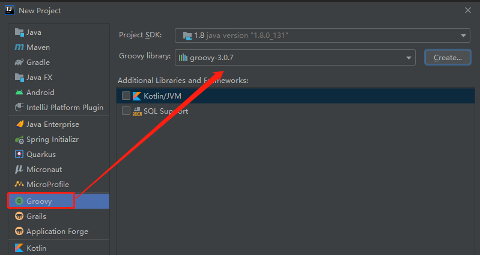
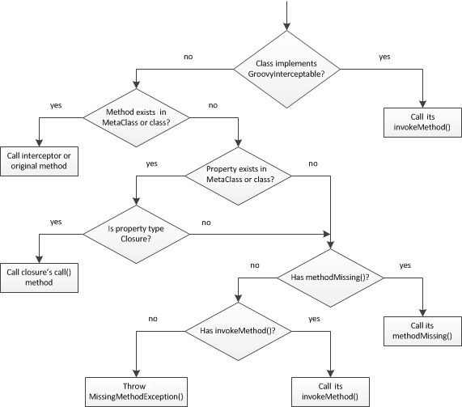

# Gradle概念

## DSL

- 领域特定语言
- 特点
  - 求专不求全，解决特定的问题

## 介绍

- 一种基于jvm的开发语言
- 结合了python，rubyde 许多强大的特性
- 可以与java完美结合，可以使用java的类库

# 环境搭建

- 下载groovy-sdk  --->https://groovy.apache.org/download.html
- 按照jvm环境
- 配置bin的环境变量path
- 查看版本

```shell
λ groovy --version
```

## idea创建groovy项目

- 新建项目，选择groovy



# Groovy语法

## 变量

- 弱类型定义(如下会自动转为java.math.BigDecimal)

```groovy
def t1 = 2.22
println t1.class;
```

- 字符串
  - 单引号：他的类型就是String类型
  - 三引号：可以换行输入，而不是字符串拼接

```groovy
def name = '''老
肖
'''
println name;
```

- - 双引号:字符串如果使用${}则自动转换：org.codehaus.groovy.runtime.GStringImpl

```groovy
def nameTmp = "我是 ${name}"
println nameTmp.class
```

## 闭包

- 有参数的闭包

```groovy
def closure = { name -> println "my name is ${name}"}
closure("老肖")
//my name is 老肖
```

- 闭包返回值

```groovy
//输出  my name is 老肖
//默认将最后一行返回
def closure = { name ->  "my name is ${name}"}
println(closure("老肖"))
```

- 闭包:阶乘

```groovy
println(fab(5))
int fab(int number) {
    int result = 1;
    //从一开始，一直执行到number，每一次调用Number的闭包
    1.upto(number, {num -> result=result*num})
    return  result;
}
```

- 累加

```groovy
//累加计算
int fab2(int number) {
    int result=0;
    //从0开始，循环number次执行闭包
    //方法最尾部参数是闭包可以写到方法外
    number.times {num -> result = result+num}
    return result;
}
```

### String 与闭包结合

- 字符串遍历

```groovy
String str = 'i have a dog';
//每个字符输出两遍
str.each {it -> print it.multiply(2)}
//输出结果
//sii  hhaavvee  aa  ddoogg
```

- 寻找符合的字符串

```groovy
String str = 'i have a 1 dog';
//寻找字符串满足的值，满足则返回对应的字符
println str.find{it -> it.isNumber()}
//输出结果
//1
```

### 三变量

- this, owner, delegate
- this: 指向本类
- owner:指向本类或者就近的闭包
- delegate:默认和owner相等，可以认为的修改（this owner 是不能修改的）

```groovy
//this == ownere == delegate
def classClouser = {
    println "this: "+ this;
    println "owner: " + owner;
    println "delegate: " + delegate;
}
classClouser.call();
```

```groovy
//this != owner ==delegate
//此刻，owner=最近的闭包的调用
def methodClouser = {
    def method = {
        println "this: "+ this;
        println "owner: " + owner;
        println "delegate: " + delegate;
    }
    method.call();
}
methodClouser.call();
```

### 委托策略

```groovy
class Student  {
    String name;
    def showName = {
        println "this def name is : ${name}"
    }
    String toString() {
        showName.call();
    }
}

class Teacher {
    String name;
}

def stu = new Student(name: "李学生");
def tea = new Teacher(name: "张老师");
//输出:this def name is : 李学生
println stu.toString();
//更改showName闭包的delegate
stu.showName.delegate = tea;
//将闭包的策略改为delegate， 此时，引用的变量为更换后的delegate
stu.showName.resolveStrategy = Closure.DELEGATE_ONLY;
//输出：this def name is : 张老师
println stu.toString();
```

## 范围

```groovy
//定义1-10的范围
def range=1..10;
//取出index=3的值
println range[3];
```

## 元编程

- 执行流程图



- 执行流程测试

```groovy
def person = new Person();
person.cry();

//会抛出MissingMethodException异常，因为cry方法不存在
```

在Person中重写invokeMethod方法，会调用此方法，

```groovy
class Person {
    @Override
    Object invokeMethod(String name, Object args) {
        println "invokeMethod: ${name}, ${args}";
    }
}
```

在person中定义methodMissing方法，智慧调用missing方法

```groovy
class Person {
    @Override
    Object invokeMethod(String name, Object args) {
        println "invokeMethod: ${name}, ${args}";
    }

    def methodMissing(String name, Object args) {
        println "methodMissing: ${name}, ${args}";
    }
}
```

- 动态添加属性
  - 输出 变态，因为已经动态的给Person添加了不存在的属性

```groovy
Person.metaClass.sex="变态";
def person = new Person();
println person.sex;U
```

- 动态添加方法

```groovy
Person.metaClass.sex="变态";

Person.metaClass.getSexUpper = {
    -> println "get Sex uppder ${sex}"
}
def person2 = new Person();
person2.getSexUpper();
```

- 动态添加静态方法

```groovy
Person.metaClass.static.getSexUpperStatic = {
    -> println "get Sex getSexUpperStatic"
}
Person.getSexUpperStatic();
```

- 动态添加全局有效
  - 默认情况下，只在当前闭包有效，想要全局有效则需要启动配置

```groovy
ExpandoMetaClass.enableGlobally()
```

## xml操作

### 解析

```groovy
def parser = new XmlParser().parseText(xml);
def to = parser.to.text();
println to;
```