- 先给idea装jclasslib ByteCode Viewer插件
- **本笔记观看尚硅谷JVM所书**

# jRE JDK关系

- JDK包含了JRE,JDK有编译器等
-  JRE中包含虚拟机JVM


# JVM结构

- class 文件通过class loader加载到内存中
- 内存中
  - 多线程之间，方法区和堆是共享的
  - 每个线程独有一份计数器和栈
  - java的指令是基于栈实现的（**主要考虑夸平台性**）
- 执行引擎（加载内存后，解释运行，将字节码文件解释成**机器指令**）
  - 解释器
    - 逐行解释字节码进行执行
    - 响应时间快
  - JIT编译器
    - 寻找热点代码进行缓存，然后编译执行
    - 性能好
  - 垃圾回收器

- 程序计数器
  - 线程私有的
  - 字节码解释器工作时就是通过改变这个计数器的值来选取下一条需要执行的字节码指令
  - 如果线程正在执行的是一个Java方法，这个计数器记录的是正在执行的虚拟机字节码指令的地址
  - 如果正在执行的是本地（Native）方法，这个计数器值则应为空（Undefined）

# JVM架构模型

- java指令是根据栈来设计的
- 栈
  - 跨平台性，指令集小
  - 指令多，执行性能比寄存器差

# JVM生命周期

- 虚拟机启动
  - java虚拟机启动是通过引导类加载器创建一个初始类来完成的
- 虚拟机的执行
  - 执行一个java程序，真正的执行的是一个java虚拟机的进程
- 虚拟机的退出
  - 正常退出
  - 某线程调用Runtime或者System类的exit方法

# 类加载过程

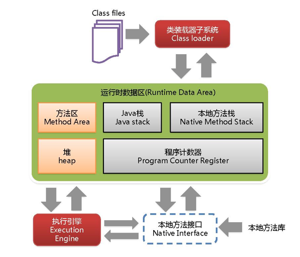

- 详细图


# 类加载子系统

## 加载过程

- 类加载子系统只负责从文件系统加载class文件，
- 加载的类信息存在方法区的内存空间，方法区还存放运行时的常量池信息
- 类加载子系统只负责加载，能不能运行由执行引擎决定

### 加载class文件方式

- 本地系统
- 网络获取
- 压缩包中读取
- 运行时计算生成，如动态代理
- 从加密文件中获取，如一些防止反编译的措施

## 链接过程

- 验证
  - 所有的字节码起始开头都是 CA FE BA BE
  - 保证加载类的正确性
  
- 准备
  - 一开始定义变量
    - 如int类型，一开始才是0
  - 为**类变量**分配内存并且设置该类的初始值
  
- 解析

  - 将符号引用转为对应直接引用

  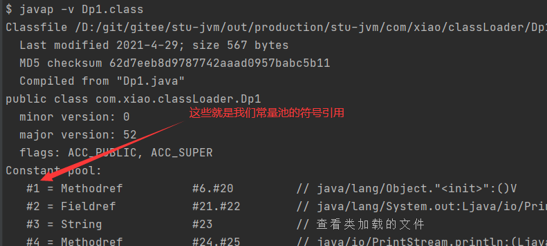

  - 一个类可能会引用很多其他类

## 初始化过程

- 类初始化过程就是执行构造方法clinit的过程

```java
class A {
    static{
        //clinit
    }
}  
```

- 他只有类存在静态代码时才会有
- 他不需要定义，是javac编译器自动收集类中所有变量的赋值动作和静态代码块中的语句合并而来

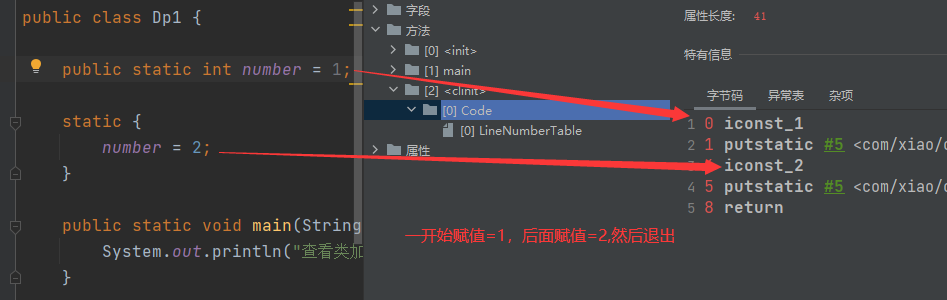

- 他是按照代码的顺序执行的

```java
static {
    number = 2;
    num = 3;
    //这里是不允许使用的，非法的前向引用
    System.out.println(num);
}
//这里最终输出的结果是4
private static int num = 4;
```

- 虚拟机保证每个类的clinit在多线程下都是同步加锁的（只会有一个线程加载一个类的clinit方法）
  - **如果加载过程中 出现这个问题，会造成线程加载阻塞 **
- 如果存在父类，会先执行父类的clinit

## 类加载器

### 类加载器分类

- 引导类加载器和自定义加载器
- 所有派生于抽象类ClassLoader的类加载器都划分为自定义加载器

### 代码获取类加载器

```java
//获取系统类加载器
ClassLoader systemClassLoader = ClassLoader.getSystemClassLoader();
//sun.misc.Launcher$AppClassLoader@18b4aac2
System.out.println(systemClassLoader);
//获取自定义类加载器（可以发现他默认使用的是系统类加载器）
ClassLoader classLoader = TestClassLoader.class.getClassLoader();
//sun.misc.Launcher$AppClassLoader@18b4aac2
System.out.println(classLoader);
```

### 引导类加载器

- 启动类加载器， 自定义类加载器没办法获取到引导类加载器

- 它用来加载java的核心库(例如：String 类型)
- 它没有父类加载器

```java
//String 类使用引导类加载器
//java核心库使用引导类加载器
ClassLoader str = String.class.getClassLoader();
//输出null（凡是这里是null的都是引导类加载器）
System.out.println(str);
```

### 自定义类加载器

- ·什么时候需要自定义类加载器

  - 隔离加载器
  - 修改类的加载方式
  - 扩展加载源
  - 防止源码泄露

- 自定义类加载器方式

  继承URLClassLoader即可

### 获取类加载器的方式

1. Clasz.getClassLoader()

```java
Class.forName("java.lang.String").getClassLoader();
```

2. 线程的方式获取上下文的loader

```java
Thread.currentThread().getContextClassLoader()
```

3. 获取当前系统类加载器

```java
ClassLoader.getSystemClassLoader()
```

- 获取类加载器能够加载的jar包

```java
URL[] urLs = Launcher.getBootstrapClassPath().getURLs();
Stream.of(urLs).forEach(url -> System.out.println(url.toExternalForm()));
```


## 双亲委派机制

### 原理

- 如果一个类加载器收到请求，它不会自己先去加载，二十把这个加载委托给父类的加载器，如果父类加载器还存在父类加载器，就会依次递归，直到最顶层的启动类加载器
- 如果父类加载器加载返回失败，则子类才会自己尝试去加载

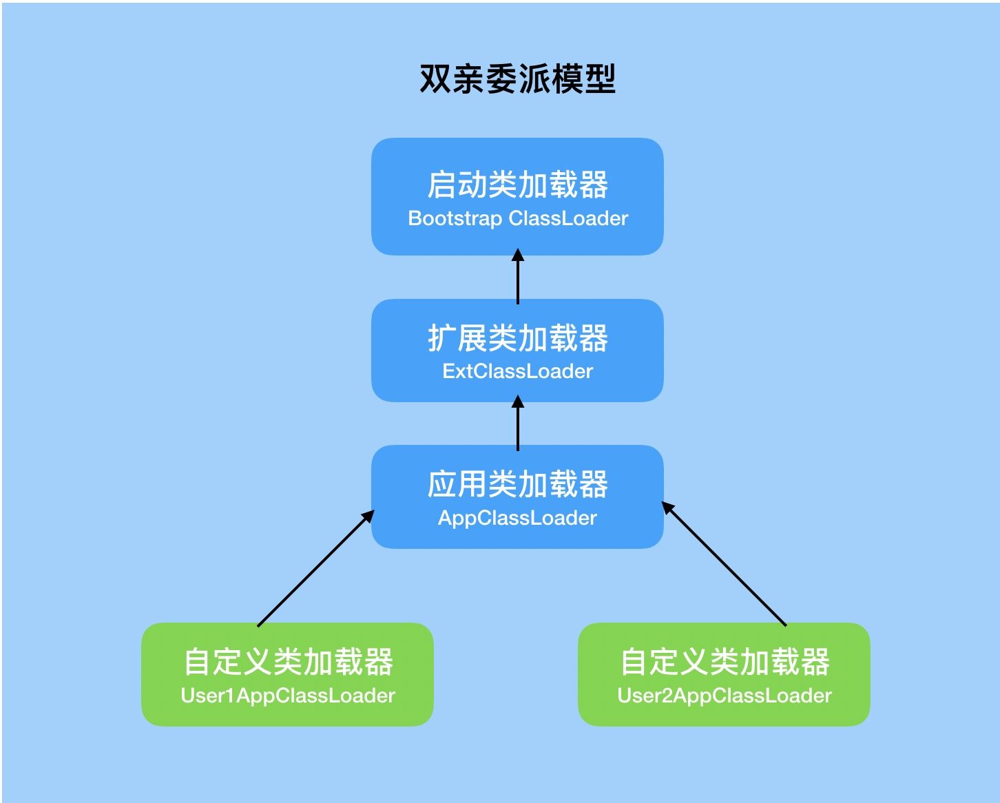

例1：

如果new一个java.lang.String类，则是引导类加载器加载

### 优势

- 避免类的重复加载
- 保护程序加载，避免核心API恶意篡改

### 判断同一个类条件

- 包目录类名相同
- 类加载器相同

---

# 运行时数据区

```text
通过类加载子系统初始化加载后
运行时的类数据保存到方法区
```


## 详细图


- 程序计数器、栈、本地栈是线程私有的
- JIT编译缓存在非堆空间

## JVM线程（了解）

- JVM允许一个应用多个线程**并行**执行
- JVM线程分类
  - 虚拟机线程
  - 周期任务线程
  - GC线程（后台线程/守护线程）

## 程序计数器

- （PC Registery）/PC 寄存器

- 用来存储指向下一条指令的地址（代码的指令存放在栈帧当中）
- 一个很小的内存空间
- 线程私有的

### 举例说明

```java
public static void main(String[] args) {
    int a=10;
    int b=20;
    String c ="abc";
}
```

反编译class

最左边的数字就是偏移地址（指令地址），中间的是操作指令

加入执行到5时，PC寄存器将5存入（**程序计数器记录的是左边的序号**）

执行引擎通过PC寄存器记录的地址读取对应的操作指令，然后操作栈结构，局部变量表，实现存取计算等

将字节码指令翻译成机器指令，到cpu做计算

```java
0 bipush 10
2 istore_1
3 bipush 20
5 istore_2
6 ldc #2 <abc>
8 astore_3
9 return

```

### 常见问题

- 为什么要使用pc寄存器记录当前线程的执行地址

cpu需要不停的切换线程，这个时候切换回来，知道它执行到哪了

- pc寄存器为什么是线程私有的

如果不是私有，那么寄存器公有，则切换线程时，是无法找到切换回来的线程下个执行的步骤的

## 虚拟机栈

### 概述

- 一个栈帧对应着一个方法
- 生命周期和线程一致
- 主要用于保存方法的局部变量（8种基本数据类型/引用类型地址）和部分结果和返回
- 正常的函数返回（使用return指令）或者抛出异常，都会导致栈帧被弹出

### 图解

- 当我们每执行一个方法的时候，当前执行方法的局部变量等相当于一个栈帧，执行入栈操作
- 栈帧1、2、3 相当于method1、2、3


### 栈常见异常

- stackoverflowerror
  - 栈如果是固定的，栈满了，就会抛出
  - 一般递归
- outofmemoryerror
  - 栈如果是动态扩展，如果去申请内存，没有内存了就会抛出

### 设置栈大小

#### 查看文档

https://docs.oracle.com/en/java/javase/11/tools/tools-and-command-reference.html


#### 具体命令

```shell
-Xss size
##举例
-Xss1m
-Xss1024k
-Xss1048576

```

### 栈的存储单位

- 栈的数据是以栈帧的格式存在的
- 每个方法对应一个栈针

### 栈帧的内部结构

- 局部变量表
- 操作数栈
- 动态链接
  - 指向运行时常量池的方法引用
- 方法返回地址
- 一些附加信息

**一个栈能放多少个栈帧取决于栈针的大小**

### 局部变量表

- 也称局部变量数组
- 一个数字数组（存放**8种基本数据类型、对象引用地址**）
- 在编译的时候，就确定了局部变量表的长度

```tex
在栈帧中，与性能调优关系最为密切的部分就是局部变量表。局部变量表中的变量也是重要的垃圾回收根节点，只要被局部变量表中直接或间接引用的对象都不会被回收。
```

- 一个方法开始，局部变量表会存储几个数据（**this**、形参）

#### 从jclasslib看

看class

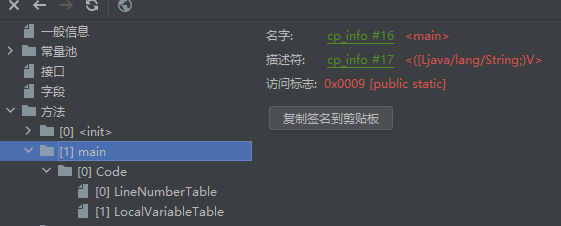

- linenumbertable
  - 编译后的字节码对应的编号（start pc）与java代码的对应行号关系


- localvaribletable
  - 局部变量相关信息
  - start pc 变量起始的位置
  - 长度（长度的每个index对应着字节码编号），slot存储坐标

#### 基本单位

- 局部变量表最基本存储单元slot（槽）
- 32位类型占一个slot，64位占两个槽（一个字节8位）
- 局部变量安装声明顺序存储
- 如果是非static方法，this存放到0的位置（**为什么static不能使用this，因为static 的局部变量表中不存在this**）


- **局部变量表中的变量是重要的垃圾回收根节点，只要被局部变量表中直接或者间接引用的对象，就不会被回收**

```java
//java的非static方法的local
LocalVariableTable:
        Start  Length  Slot  Name   Signature
            0       4     0  this   LDataTest1;
            3       1     1     a   Ljava/lang/String;

```

####  slot重复利用问题

定义一个代码

```java
public void test1(){
    int a = 1;
    {
        int b=0;
        b=a+1;
    }
    int c = a+2;
}
```

查看，发现局部变量b先使用了slot，然后c又使用了b的slot

因为b在代码块结束就销毁了，但是slot长度编译时就定义了，不能减少

```java
 Start  Length  Slot  Name   Signature
            4       4     2     b   I
            0      13     0  this   LDataTest1;
            2      11     1     a   I
           12       1     2     c   I

```

### 操作数栈

- 又称表达式栈
- 主要用于保存计算过程的中间结果或者计算过程中的变量的临时存储空间
- 当一个方法刚开始执行的时候，新的栈帧随之被创建，这个方法的操作数栈是空的

```java
public void test2() {
    byte i = 15;
    int b = 10;

    int j = i+b;
}
```

- stack：栈深度
- locals：局部变量表的深度

```shell
  stack=2, locals=4, args_size=1
  		## 将15入栈，
         0: bipush        15
         #弹出操作数栈栈顶元素，保存到局部变量表第1个位置
         2: istore_1
         3: bipush        10
         5: istore_2
         # 第1，2个变量从局部变量表压入操作数栈
         6: iload_1
         7: iload_2
         ## 出栈相加，放入操作数栈中
         8: iadd
         9: istore_3
        10: return

```


## 动态链接

- 栈帧中,当前使用了常量池的变量的引用

- 在字节码文件中，有个constant pool（常量池，当运行时，就会将其存储到方法区）

- 编译后，所有的变量和方法引用都作为符号引用（#开头的数字），保存到class文件的常量池中

- 当方法调用另一个方法时，就用常量池的指向方法的符号引用表示

- **作用就是将符号引用转化为直接引用**


### 方法的调用

- 静态链接
  - 如果被调用方法，在编译期间就可以确定符号引用，那么它就是静态链接

```java
public class TestBing extends TestLocalVariable {
    public TestBing() {
        //如这个super，已经确定调用父类的方法
        super();
    }
}
```

- 动态链接

#### 虚方法与非虚方法

- 非虚方法
  - 编译期就确定了调用的方法
  - 静态方法，私有方法、final方法，实例构造器，父类方法都是非虚方法
  
- 虚方法

  - 不确定调用的方法，如重写的方法
  - java因为**重写**而有了虚方法的概念

#### 虚方法表

- 因为虚方法会循环的寻找父类（如果没有重写）
- 所以在类加载的链接阶段，建立了

### 动态语言与静态语言区别

- 区别在于类型的检查是**编译期间还是运行期间**
- java因为引入了Lambda表达式而引入了动态语言

静态语言定义变量是根据类型来确定变量类型的

动态语言是根据值来确定类型的，如js

## 方法返回地址

- 存放调用该方法的pc寄存器的值
  - 如果是正常退出，则是调用该方法的下条指令值
  - 异常退出，返回地址是要通过异常表来确定的
- 本质上，方法的退出就是当前栈帧出栈的过程，此时需要恢复上层方法的局部变量表、操作数栈，将返回值压入调用者栈针的操作数栈，设置pc寄存器等（将返回值返回给调用的方法）

## 本地方法栈

- 他是调用C相关的方法的存储
- 管理**本地方法**的调用

- native 方法，是一个java方法，但是是由非java语言实现的

### 本地方法

- 用native修饰的方法是**本地方法**

```java
public static native void yield();
public static native void sleep(long millis) throws InterruptedException;
```

## 相关面试题

- 局部变量是线程安全的么？
  - 如果方法里的多线程去共用局部变量，则不是安全的

# 堆


## 核心概述

- 堆是线程共享的，但还是有划分私有的堆空间
- 堆可以是物理上不连续，但逻辑上连续的内存空间
- 并非所有的堆是线程共享的，小块的**TLAB空间**是线程私有的

## 插件安装


## 内存细分

- 7以前：新生代+老年代+永久区
  - 新生代：
- 8以后：新生代+老年代+元空间（本地内存）
### 新生代老年代

https://docs.oracle.com/javase/8/

- 存储jvm中的java对象可以被划分为两类
  - 一类是生命周期短
  - 一类是生命周期长，甚至与jvm生命周期保持一致
- 堆区细分的话，分为年轻代和老年代
- 年轻代分为eden区/S0区，S1区（有时叫from和to区）
  - 比例2：1
  - 新生的对象在eden，没有被第一次GC，则进入S区

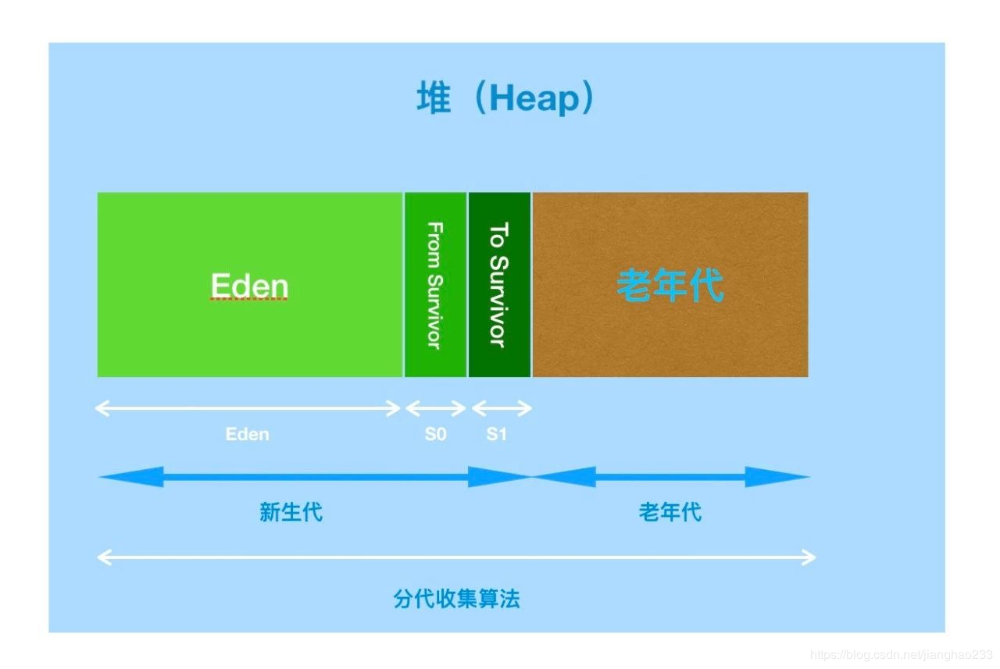


### 设置新生代老年代比例

https://docs.oracle.com/javase/8/docs/technotes/tools/unix/java.html#BGBCIEFC

- 默认设置比例为2  新生代/老年代=1/ 2
- 一般不调整，如果知道明细的很多对象周期长，则可以将老年代增大

```shell
-XX:NewRatio=2
```

- 默认的Eden:S0:S1在官方文档中是8:1:1,但是因为自适应问题，不会绝对的按照这个比例，如果需要按照比例分配,可以配置参数

```shell
-XX:SurvivorRatio=8
```


## 设置堆空间大小

**建议设置xms和xmx设置一样大**，避免GC之后造成堆内存减少，消耗性能

- 设置的是年轻代+老年代
- -Xms:堆区的起始内存，默认 **物理/64**
  - -X：jvm运行参数，ms是缩写，既memory start
- -Xmx:堆区最大的内存， 默认 **物理/4**

```java
public static void main(String[] args) {
    //堆内存总量
    long totalMemory = Runtime.getRuntime().totalMemory() / 1024 / 1024;
    //最大堆内存
    long maxMemory = Runtime.getRuntime().maxMemory() / 1024 / 1024;

    System.out.println("-Xms:" + totalMemory + "M");
    System.out.println("-Xmx:" + maxMemory + "M");

    System.out.println("系统内存大小:" + totalMemory*64 + "M");
    System.out.println("系统内存大小:" + maxMemory*4 + "M");
}
```

## 命令查看GC

- 方式1
  - S0和S1只会有一个同一时刻存储数据
  - 代码中Runtime.getRuntime().totalMemory()只会计算一个S区的内存

```shell
C:\Users\alonePc>jps
12192
14296 Jps
15192 HeapSpace
9720 Launcher
# 老年代， OC:总量 OU：使用的数量（kb）/1024=M
C:\Users\alonePc>jstat -gc 15192
 S0C    S1C    S0U    S1U      EC       EU        OC         OU       MC     MU    CCSC   CCSU   YGC     YGCT    FGC    FGCT     GCT
10752.0 10752.0  0.0    0.0   65536.0   5243.8   175104.0     0.0     4480.0 781.2  384.0   75.9       0    0.000   0      0.000    0.000
```

- 方式2

  - 设置启动参数
  - 他是程序执行之后打印的

```shell
-XX:+PrintGCDetails
```


## 内存分配策略

- 优先分配Eden
- 大对象直接分配到老年代
  - 尽量避免程序出现过多的大对象
  - 尤其是那种朝生即死的大对象
- 长期存活的对象存入老年代（15岁）
- s区相同年龄的对象大小大于s区的一半，则直接进入老年代

## TLAB内存区域

- 为每个线程在Eden区分配了一部分（默认eden的1%）私有的内存区
- 增加内存吞吐量
- 避免线程安全问题
- 不是所有对象都能在tlab区分配对象（他比较少）
- 命令行 jinfo -flag UseTLAB 进程号  可以查看是否开启
- 一旦对象分配TLAB区域失败，JVM就会尝试使用**加锁**的机制，确保数据的原子性

## GC过程

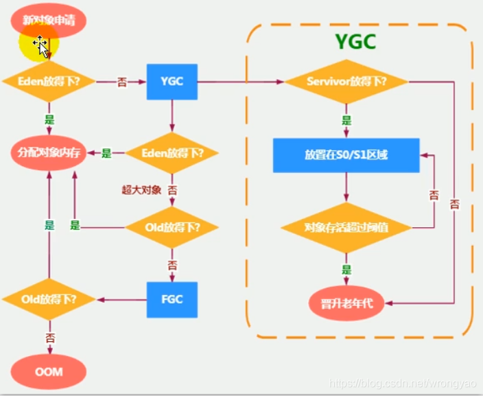

- Eden区内存满时，这时候触发一次**Minor GC**，把Eden区的存活对象转移到From区，非存活对象进行清理，然后给新创建的对象分配空间，存入Eden区
- 随着分配对象的增多，Eden区的空间又不足了，这时候再触发一次Minor GC，清理掉Eden区和S1区的死亡对象，把存活对象转移到S2区，然后再给新对象分配内存
- From区和To区是相对的关系，哪个区中有对象，哪个区就是From区，比如，再进行一次Minor GC，会把存活对象转移到S1区，再为转移之前，S2区是From区，S1区是To区，转移后，S2区中没有存活对象，变为To区，而S1区变为From区
- 如果S区无法存放，则进入Old区
- 大对象直接进入老年代，假设新创建的对象很大，比如为5M(这个值可以通过PretenureSizeThreshold这个参数进行设置，默认3M)，那么即使Eden区有足够的空间来存放，**也不会存放在Eden区，而是直接存入老年代**
- 长期存活的对象将进入老年代（15岁）

```shell
-XX:MaxTenuringThreshold=15
```


- 如果某个(些)对象(原来在内存中存活的对象或者新创建的对象)由于以上原因需要被移动到老年代中，而老年代中没有足够空间容纳这个(些)对象，那么会触发一次Full GC

总结：**复制之后有交换，谁空谁是to.**(Eden采用复制算法/  Eden的存活对象少，所以需要复制的对象也少)

## GC日志

- OutOfMemeryError之前一定发生FullGC，因为FullGC之后，老年代内存不够才会报错误

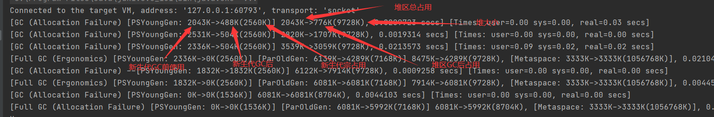


## GC算法

- 年轻代（YoungGeneration）的回收算法（回收主要以Copying为主）
  1. 所有新生成的对象首先都是放在年经代的。年轻代的目标就是尽可能快速的收集掉那些生命周期短的对象
  2. 新生代内存按照8:1:1的比例分为一个eden区和两个survivor(s0,s1）区。大部分对象在eden区中生成．回收时先将eden区存活对象复制到一个s0区，然后清空eden区，当下一次eden区又满了时，则将eden区和s0区存活对象复制到另一个s1区，然后清空eden和这个s0区，此时s0区是空的，然后将s0区和s1区交换，即保持s1区为空，如此往复.(**谁空谁是to**））。
  3. 当s1区不足以存放eden和survivoro的存活对象时，就将存活对象直接存放到老年代。若是老年代也满了就会触发一次fulIGC(MajorGC)，也就是新生代、老年代都进行回收．
  4. 新生代发生的GC也叫做MinorGC,MinorGC发生频率比较高（不一走等Eden区满了才触发）.
- 老年代（OldGeneration）的回收算法（回收主要以Mark一Colnpact为主）
     1. 在年轻代中经历了N次垃圾回收后仍然存活的对象，就会被放到年老代中．因此，可以认为年老代中存放的都是一些生命周期较长的对象。
     2. 内存比新生代也大很多（大概比例是1:2)，当老年代内存满时触发MajorGC，发生频率比较低，老年代对象存活时间比较长，存活率标记高。
- 持久代（pernlallentGelleration）的回收算法
  用于存放静态文件，如java类、方法等。持久代对垃圾回收没有显著影响，但是有些应用可能动态生成或者调用一些dass，例如Hibernate等，在这种时侯需要设置一个比较大的持久代空间来存放这些运行过程中新增的类。持久代也称方法区

### Minor GC

- 只是新生代的垃圾回收
- 当年轻代**Eden区**空间不足，触发gc，回收eden和s0
  - **Survivol区满了不会触发GC**
- Minor GC时会引发STW，暂停其他用户线程

### Major GC

- 只是老年代的收集
  - CMS GC会单独收集老年代行为
  - 很多时候Major GC会和Full GC混淆使用，需要区分是老年代收集还是整堆收集
- 执行时间是Minor的10倍以上，停顿时间更长

### Full GC

- 整堆和方法区的垃圾回收
- 老年代空间不足，**方法区**空间不足，触发

## 算法优劣

### 复制算法

当这一块的内存用完了，就将还存活着的对象复制到另外一块内存上面，然后再把已使用过的内存空间一次清理掉

### 标记清除

首先标记出所需回收的对象，在标记完成后统一回收掉所有被标记的对象，**它的标记过程其实就是前面的可达性分析算法中判定垃圾对象的标记过程**

## 常用参数

https://docs.oracle.com/javase/8/docs/technotes/tools/unix/java.html

```
-Xms 设置堆的初始值(默认物理内存的1/64)
-Xmx 设置堆的最大值（默认物理内存的1/4）
-Xmn 设置新生代的大小
-XX:NewRatio 新生代与老年代的比例
-XX:+PrintGCDetails 打印 垃圾回收 的细节
```

- 查看默认值

```shell

## 查看某个参数的设置值
$ jinfo -flag NewRatio 8884
-XX:NewRatio=2
```

- 打印GC信息

```shell
## 打印详细信息
-XX:+PrintGCDetails
## 打印简要信息
-XX:+PrintGC
```

- 虚拟机空间担保策略

```tex
在发生Minor GC之前，虚拟机会检查老年代最大可用的连续空间是否大于新生代所有对象的总空间，

如果大于，则此次Minor GC是安全的

如果小于，则虚拟机会查看HandlePromotionFailure设置值是否允许担保失败。
如果HandlePromotionFailure=true，那么会继续检查老年代最大可用连续空间是否大于历次晋升到老年代的对象的平均大小，如果大于，则尝试进行一次Minor GC，但这次Minor GC依然是有风险的；如果小于或者HandlePromotionFailure=false，则改为进行一次Full GC。

上面提到了Minor GC依然会有风险，是因为新生代采用复制收集算法，假如大量对象在Minor GC后仍然存活（最极端情况为内存回收后新生代中所有对象均存活），而Survivor空间是比较小的，这时就需要老年代进行分配担保，把Survivor无法容纳的对象放到老年代。老年代要进行空间分配担保，前提是老年代得有足够空间来容纳这些对象，但一共有多少对象在内存回收后存活下来是不可预知的，因此只好取之前每次垃圾回收后晋升到老年代的对象大小的平均值作为参考。使用这个平均值与老年代剩余空间进行比较，来决定是否进行Full GC来让老年代腾出更多空间。

取平均值仍然是一种概率性的事件，如果某次Minor GC后存活对象陡增，远高于平均值的话，必然导致担保失败，如果出现了分配担保失败，就只能在失败后重新发起一次Full GC。虽然存在发生这种情况的概率，但大部分时候都是能够成功分配担保的，这样就避免了过于频繁执行Full GC。
```


## 逃逸分析

- 堆不是分配对象存储的唯一选择（也可以**栈上分配**/标量替换/同步消除）
- 一个对象，如果没有发生逃逸，则他的内存可以在堆上分配
- 判断逃逸：如果一个方法里的对象，可能被其他方法调用，则new 的对象发生逃逸
  （看new的对象是不是在外部表用）

```java
//这里A没有方法外部调用，没有发生逃逸
public void method() {
  A a =  new A();
    ....
  a = null;
}
```

- 结论：能使用局部变量的，不要在方法外定义（堆上分配不需要GC）

```tex
Java8 逃逸分析默认是打开的，也可通过开关控制

-XX:+DoEscapeAnalysis开启逃逸分析
-XX:-DoEscapeAnalysis 关闭逃逸分析
```

- 但是 Hotspot 并未开启栈上分配，但是开启了标量替换

# 方法区

https://docs.oracle.com/javase/specs/jvms/se8/html/index.html

## 栈堆方法区交互关系

- 类结构放在方法区

- new的对象放在堆空间

- 对象所在的方法的栈帧存在栈区

## 方法区介绍

- jdk7是 永久代 Per ,  JDK8是元空间 MetaspaceSize

- 创建在线程启动的时候**类加载器**加载类到方法区
- 过多的生成放射类可能导致方法区OOM

- 线程共享的
- 方法区（Metaspace）大小，决定系统可以保存多少个类

## 设置固定大小

https://docs.oracle.com/javase/8/docs/technotes/tools/unix/java.html#BGBCIEFC

```tex
##设置元空间最大值（默认-1，无限制）
-XX:MaxMetaspaceSize=size
##设置初始大小（默认21M）
-XX:MetaspaceSize=size
```

- -XX:Metaspacesize:设置初始的元空间大小。对于一个64位的服务器端JVM来说其默认的-XX:MetaspaceSize值为21MB。这就是初始的高水位线，一旦触及这个水位线，Full Gc将会被触发并卸载没用的类（即这些类对应的类加载器不再存活)然后这个高水位线将会重置。新的高水位线的值取决于Gc后释放了多少元空间。如果释放的空间不足，那么在不超过MaxMetaspacesize时，适当提高该值。如果释放空间过多，则适当降低该值。
- 如果初始化的高水位线设置过低，上述高水位线调整情况会发生很多次。通过垃圾回收器的日志可以观察到Full GC多次调用。为了避免频繁地GC ，建议将-XX:Metaspacesize设置为一个相对较高的值。

## 方法区的溢出

方法区存的是类的定义

可以通过ClassWriter来动态生成类/CGlib生成动态代理类来模拟溢出

## 内部结构

### 存储内容

- 类型信息
  - 类class，接口。枚举，注解
  - 域（Field）信息：名称，类型，修饰符（public,private,static,final等）
  - 方法信息
- 常量
- 静态变量
- 及时编译的代码缓存

## 全局常量

- 既**static final **修饰的常量

```java
static int a=1;
static final int b=2;
```

- 这种常量在**编译阶段**就已经赋值了

- 其他static 变量在init阶段赋值

## 运行时常量池

- 类加载之后，从字节码读取的常量存储在方法区中

- constant pool 

  - 字面量信息
  - 类型、域、方法的符号引用

- 为什么需要常量池

  - 常量池是字节码一部分

  - jvm 在栈帧(frame) 中进行操作数和方法的动态链接(link)，为了便于链接，jvm 使用常量池来保存跟踪当前类中引用的其他类及其成员变量和成员方法。
  
    每个栈帧(frame)都包含一个运行常量池的引用，这个引用指向当前栈帧需要执行的方法，jvm使用这个引用来进行动态链接
  
  - 当真正的需要使用时，通过引用来调用常量（减少了代码文件大小），加载到内存中

## 方法区GC

- 虚拟机规范并没有要求方法区GC

- 方法去GC收集主要回收：
  - 常量池废弃的常量（字面量，符号引用）
  - 不再使用的类型（类卸载）

## 方法区的演进

- 首先明确，只有HotSpot才有永久代

| 版本         | 描述                                                         |
| ------------ | ------------------------------------------------------------ |
| jdk1.6及之前 | 有永久代（permanent generation） ，静态变量存放在永久代上    |
| jdk1.7       | 有永久代，但已经逐步“去永久代”，字符串常量池、静态变量移除，保存在堆中 |
| jdk1.8及之后 | 无永久代，类型信息、字段、方法、常量保存在本地内存的元空间，**但字符串常量池、静态变量仍在堆** |

- 为什么设置永久代被元空间代替
  - 永久代设置空间是很难确定的，因为工作中可能加载很多动态类
  - 减少full gc

## 字符串常量

- String table为什么要变化
  - 永久代GC频率低，导致String table回收效率不高，导致永久代不足
  - 把字符串常量放到堆里能够和堆一起回收

# 对象

## 对象实例化

### 创建方式

- new 
  - 变形1：xxx的静态方法
  - 变性2：xxxbuilder/xxxfactory
- Class的newInstance()(反射的方式，只能调用空参的构造器，权限必须是public)
- Constructor的newInstance()
  - 可以调用空参和带参的构造器
  - 权限没有要求
- 使用clone()
  - 当前类需要实现Cloneable的接口
- 使用反序列化
  - 从文件中/网络中获取对象的二进制流

### 创建对象步骤

- 判断对应的类是否加载、链接、初始化
  - new指令，首先检查这个指令的参数能不能在Metasoace常量池定位到符号引用，检测到了证明这个类被加载了， 就直接使用
  - 没有，在双亲委派模式下加载类
- 为对象分配内存
  - 规整内存------指针碰撞
  - 不规整内存--------虚拟机维护列表，记录哪些可用，哪些不可用
- 处理并发安全问题
  - 采用CAS
  - 每个线程分配一个TLAB
- 初始化分配到空间(属性的默认初始化，零值初始化)
- 设置对象头
  - 记录当前所属的类
  - 记录hash值
- 执行init方法进行初始化(类构造器<init>)

## 对象内存布局

### 对象头

- 运行时元数据
  - hash值（hashcode）
  - GC分代年龄
  - 锁状态标志
- 类型指针
  - 指向类元数据instanceKlass，确定该对象的类型
- 如果创建的是数组，还需要记录数组的长度

### 实例数据

- instance data

- 说明
  - 他是对象的真正存储有效信息
- 规则
  - 相同宽度的字段总是被分配在一起
  - 父类定义的变量会出现在子类之前

### 对齐填充

- 不是必须，就起到占位符作用

### 图示

```java
public class CustomerTest {
    public static void main(String[] args) {
        Customer cust = new Customer();
    }
}
```

- 局部变量表存了一个cust的变量
- cust指向堆空间


## 对象访问定位

- jvm如何通过栈帧中的对象引用访问到对象的实例?
  - 通过栈上reference访问

### 对象访问方式

- 句柄访问(效率低，要访问先得访问句柄，然后再访问对象) 
  - 一个对象有一个句柄

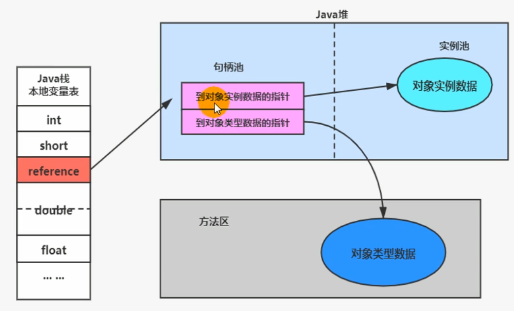

- 直接访问(hotspot)
  - 如果对象地址发生移动（复制算法回收垃圾时），就要去更改reference

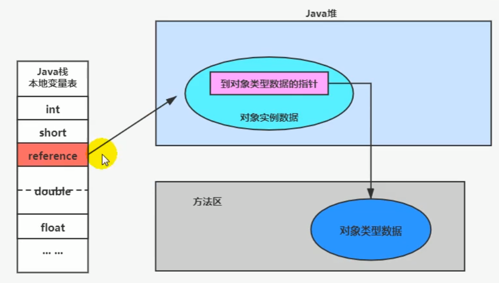

# 本地内存

- 直接内存在java堆外的，直接向系统申请的内存区间
- 来源于NIO
- 有时候，我们将虚拟机内存分配过大，却忽略了直接内存的存在，从而导致了本地内存的OOM
- 如果不指定，则默认值于堆空间最大值（-Xmx）一样大小

# 执行引擎

## 概述

- jvm主要任务
  - 负责装载字节码到其内部
  - 只要编译成jvm可以识别的字节码，都可以在jvm上执行 
- 执行引擎任务
  - 将**字节码指令**解释/翻译为平台上的本地机器指令

## 为什么java是半编译半解释语言？

```tex
因为java既可以用解释器解释
又可以用JIT编译器编译
```

- 解释器
  - 虚拟机启动时，对字节码逐行的解释方式执行，翻译成机器指令执行
- JIT编译器
  - 虚拟机将源代码直接编译成机器相关的机器语言（并不会马上执行）

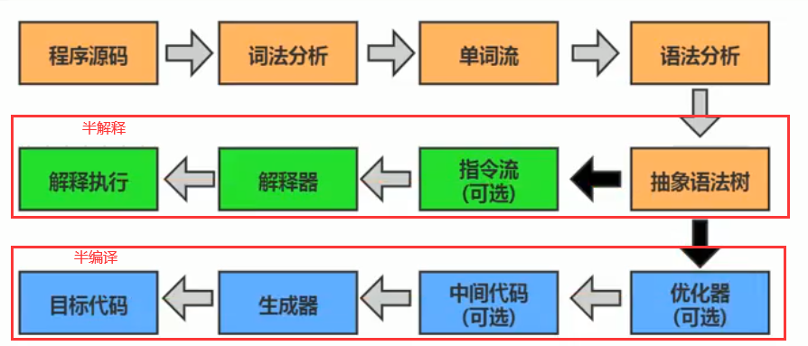

## 指令等概念

- 机器码
  - 机器指令码，就是010101这种
  - 和cpu密切相关
- 指令
  - 把0 1 简化成对应的指令，如： mov inc等
- 指令集
  - 针对不同的平台，指令不同，每个平台支持的指令集称之为对应平台的指令集
- 汇编
  - 用助记符代替机器指令的操作码
  - 用地址符号和标号代替指令或者操作数的地址
  - 汇编需要**翻译成机器指令码才能识别**
- 高级语言
  - 翻译成汇编（编译过程）->机器指令（汇编过程）->cpu

## 解释器

- 解释器，程序启动，翻译成机器指令，**节省运行时编译时间**，响应快

## JIT编译器

- 执行频率高的代码（热点代码），使用JIT编译器 
- JIT及时翻译成机器指令，翻译后速度快
- 速度快
- code cache 在元空间

### 编译器分类

- 前端编译器
  - 将.java文件编译成class字节码
- 后端运行器编译器
  - 将字节码编译成机器码指令

### 热点代码

- 一个被多次调用的方法，或者方法体内部循环多次的循环体都称之为热点代码
- Hotspot 基于计数器的热点探测
  - 方法调用计数器
  - 回边计数器：统计循环体的计数


## 设置程序执行模式

- 默认是混合模式，可以通过参数的方式设置

```tex
## 完全解释器
-Xint

## 完全编译器
-Xcomp

## 混合模式
-Xmixed
```

## Graal编译器

- JDK10开始，加入hotspot
- 还在试验阶段

# String Table

## String 基本特性

- jdk8 char数组存储， jdk9 byte数组存储
  - 因为大部分的String存储的是拉丁文，占一个字节
- 字符串常量池不会存储相同的字符串
  - String pool底层是一个固定大小的StringTable
  - 更改StringTable的大小：-XX:StringTableSize
- String:代表不可变的字符串序列（不可变性）

```java
/**
  * 字面量定义的字符串常量
  *  当堆区的字符串常量修改时，会复制一份出来进行修改
 */
@Test
public void test1() {
    String a = "abc";
    String b = "abc";
    //true
    System.out.println(a==b);
    a = "dfe";
    // false
    System.out.println(a==b);
}

/**
 * 使用replace时，也是复制一份再进行修改
*/
@Test
public void test2() {
    String a = "abc";
    String b = "abc";
    b = a.replace('a', 'd');
    //abc
    System.out.println(a);
    //dbc
    System.out.println(b);
}
```

## 字符串拼接

- 常量与常量的拼接结果在常量池，原理是编译器优化
- 只要其中一个是变量，结果就在堆中（相当于new），原理是StringBuilder.append().toString()

```java
//所以拼接字符串的方式会效率很低
//toString ==> new String()
new StringBuilder().append("a").append("b").toString();
```

- 如果拼接的结果调用intern()方法，则主动将常量池还没有字符串的对象放入池中，并返回地址

```java
String a = "a"+"b";
String b = "ab";
//true
System.out.println(a==b);
String c = "a";
String d = c+"b";
//false
System.out.println(b==d);
String f = d.intern();
//true
System.out.println(b==f);
```

- 使用final修饰的常量是编译期优化

  所以，在代码中，建议 能使用final修饰的使用final修饰

```java
final String a = "a";
final String b = "b";
String c = "ab";
String d = a+b;
//true
System.out.println(c == d);
```

## String对象

- new String("ab") 会造几个对象
  - 查看字节码，我们发现是两个

```shell
## 先new一个String对象
0 new #2 <java/lang/String>
3 dup
## 从常量池获取 ab （第二次）
4 ldc #3 <ab>
## 调用String的构造方法
6 invokespecial #4 <java/lang/String.<init>>
```

## intern()方法

```java
//StringBuilder的toString不会在常量池产生“ab"
String str = new String("a") + new String("b");
//常量池没有，在常量池创建一个引用，指向堆区的“ab"
str.intern();
String b = "ab";
//true
System.out.println(str == b);
```

- 对于字符串，如果有大量存在的重复字符串时，使用intern能够节省内存空间

# 垃圾回收

## 垃圾回收的相关算法

- 标记阶段
  - 引用计数算法
  - 可达性分析算法
- 清除阶段
  - 标记- 清除算法
  - 复制算法
  - 标记-压缩算法

## 引用计数算法

- 对每个对象保存一个整型的引用计数器属性
- 如果一个对象，被引用了，则+1，如果引用失效，就-1
- 只要对象计数为0，则可被回收
- **java未使用该算法**（因为无法处理循环引用）
- python使用了引用计数（1.手动解除，2.弱引用）

## 可达性分析

- java c#的垃圾回收选择
- 通过一系列称为GC Roots的对象作为起点，然后向下搜索，搜索所走过的路径称为引用链/Reference Chain，当一个对象到GC Roots没有任何引用链相连时，即该对象不可达，也就说明此对象是不可用的


### GC Roots

- GC Roots可以理解为由堆外指向堆内的引用， 一般而言，GC Roots包括（但不限于）以下几种：

1. Java 方法栈桢中的局部变量；
2. 已加载类的静态变量；
3. JNI handles；
4. 已启动且未停止的 Java 线程。

- 比如说：

```tex
虚拟机栈中引用的对象（参数，局部变量等）
方法区中类静态变量
方法区中常量引用的对象
本地方法栈中引用的对象
被同步锁（synchronized）持有的对象
```

## finalization机制

- GC之前自动的调用 java.lang.Object#finalize方法
- finalize调用是逃离死亡的最后机会
- finalize只会被调用一次

## 清除算法

### 标记-清除

#### 描述

当堆中的有效内存空间(available memory）被耗尽的时候，就会停止整个程序（也被称为stop the world， 简称**STW**)，然后进行两项工作，第一项则是标记，第二项则是清除。

- 标记：从引用根节点遍历，标记所有被引用对象（**既不可回收对象**），将标记结果记录在对象的header中
- 清除：将所有对象线性遍历，如果发现没有被标记，则回收

#### 缺点

- 效率不算高
- GC时需要停止整个应用
- 清理内存时不连续的，容易产生内存碎片（这样需要维护一个虚拟列表）

### 复制算法

- 适用于存活对象少，垃圾多的场景（新生代）

- 核心思想

```tex

将活着的内存空间分为两块，每次只使用其中一块，在垃圾回收时将正在使用的内存中的存活对象复制到未被使用的内存块中，之后清除正在使用的内存块中的所有对象，交换两个内存的角色，最后完成垃圾回收。
```

- 优点

```tex
没有标记和清除过程，实现简单，运行高效
复制过去以后保证空间的连续性，不会出现“碎片”问题
```

- 缺点

```tex
此算法的缺点也是很明显的，就是需要两倍的内存空间。
对于G1这种分拆成为大量region的GC，复制而不是移动，意味着GC需要维护region之间对象引用关系(意味着对象引用需要更改引用地址)，不管是内存占用或者时间开销也不小。
```

### 标记-压缩

- 执行过程

1. 第一阶段和标记-清除算法一样,从根节点开始标记所有被引用对象
2. 第二阶段将所有的存活对象压缩到内存的一端，按顺序排放。
3. 清理边界外所有的空间。

- 优点

```tex
消除了复制算法当中，内存减半的高额代价。
没有碎片化的内存
```

- 缺点

```tex
效率低
移动对象的同时，需要更改对象引用地址
移动过程，需要STW
```

## 复合算法

### 分代收集算法

- 将区域划分成新生代、老年代
- 新生代
  - 区域相对老年代较小，对象生命周期短、存活率低，回收频繁
  - 适用复制算法
- 老年代
  - 区域较大，对象生命周期长、存活率高，回收不及年轻代频繁
  - 一般使用标记清除/标记-压缩算法

### 增量收集算法

- 基本思想

```tex
每次，垃圾收集线程只收集一小片区域的内存空间，接着切换到应用程序线程。依次反复，直到垃圾收集完成。
```

- 缺点

```tex
由于在垃圾回收过程中，间断性地还执行了应用程序代码，所以能减少系统的停顿时间。但是，因为线程切换和上下文转换的消耗，会使得垃圾回收的总体成本上升，造成系统吞吐量的下降。
```

### 分区算法

- 基本思想

```tex
分区算法将整个堆空间划分成连续的不同小区间region。
每个小区间都独立使用，独立回收
```

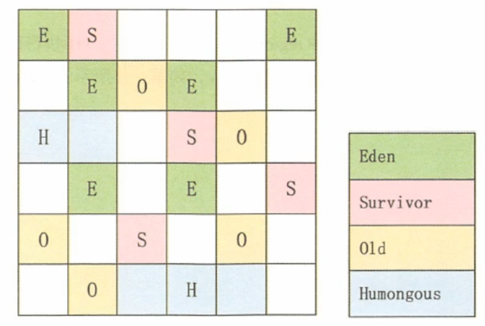

## System.gc()

- System.gc()可以手动的触发FULL GC，但是无法保证立即GC/无法保证执行

### 可达性分析

- 调用GC时不会回收buffer，因为此时，局部变量表的solt(01)还被buffer占用

```java
public  void gc1() {
    {
        byte[] buffer = new byte[1024*1024];
    }
    System.gc();
}
```

- 会回收buffer，因为此时定义了变量i，占用了01号槽为，（00）号被this占用

```java
public  void gc2() {
    {
        byte[] buffer = new byte[1024*1024];
    }
    int i = 10;
    System.gc();
}
```

## 内存泄漏

- 严格来说，只有对象不会再被程序用到了，但是GC又不能回收他们的情况，才叫内存泄漏。
- 尽管内存泄漏并不会立刻引起程序崩溃，但是一旦发生内存泄漏，程序中的可用内存就会被逐步蚕食，直至耗尽所有内存，最终出现OutOfMemory异常导致程序崩溃。

### 举例

- 单例模式

```java
单例的生命周期和应用程序是一样长的，所以单例程序中，如果持有对外部对象的引用的话，那么这个外部对象是不能被回收的，则会导致内存泄漏的产生。
```

- 一些资源未close

```java
数据库连接（dataSourse.getConnection( ))，网络连接(socket)和IO连接必须手动close，否则是不能被回收的。
```

## Stop the Word

- 可达性分析算法中枚举根节点(GC Roots）会导致所有Java执行线程停顿
- 被STW中断的应用程序线程会在完成GC之后恢复

## 垃圾回收的并行与并发

- 众所周知，cpu的并发及一个CPU在执行多个线程的工作时，只能有个线程在同一时刻执行，并行即多核cpu在同一时刻执行多个线程
- 垃圾回收并行并发

```tex
并行(Parallel):指多条垃圾收集线程并行工作，但此时用户线程仍处于等待状态。

串行(Serial)：相较于并行的概念，单线程执行。

并发：指用户线程与垃圾收集线程同时执行
```

## 安全点

程序执行时并非在所有地方都能停顿下来开始GC，只有在**特定的位置**才能停顿下来开始Gc，这些位置称为“安全点（ safepoint) ”。

- 如何在GC发生时，检查所有线程都跑到最近的安全点停顿下来呢?

```tex
抢先式中断:（目前没有虚拟机采用了)
首先中断所有线程。如果还有线程不在安全点，就恢复线程，让线程跑到安全点。

主动式中断:
设置一个中断标志，各个线程运行到safe Point的时候主动轮询这个标志,如果中断标志为真，则将自己进行中断挂起。
```

## 安全区域

- 一个程序，在某个执行区域内都是安全的，则在这个区域内可停下来执行GC

## 四种引用

### 强引用

最传统的“引用”的定义，是指在程序代码之中普遍存在的引用赋值，即类似“object obj=new object()”这种引用关系。无论任何情况下，只要强引用关系还存在，垃圾收集器就永远不会回收掉被引用的对象。

### 软引用

- 内存不足既回收

在系统将要发生内存溢出之前，将会把这些对象列入回收范围之中进行第二次回收。如果这次回收后还没有足够的内存，才会抛出内存溢出异常。

```java
Object o = new Object();
SoftReference<Object> reference = new SoftReference<>(o);
//销毁强引用
o = null;
//获取软引用对象
Object o1 = reference.get();
```

### 弱引用

- GC既回收

弱引用(weakReferehce):被弱引用关联的对象只能生存到下一次垃圾收集之前。当垃圾收集器工作时，无论内存空间是否足够，都会回收掉被弱引用关联的对象。

```java
Object o = new Object();
WeakReference<Object> weakReference = new WeakReference<>(o);
o = null;
Object o1 = weakReference.get();
```

- 相关类：WeakHashMap

### 虚引用

虚引用(PhantomReference) :一个对象是否有虚引用的存在，完全不会对其生存时间构成影响，也无法通过虚引用来获得一个对象的实例。**为一个对象设置虚引用关联的唯一目的就是能在这个对象被收集器回收时收到一个系统通知。**（用来对象回收跟踪）

```java
Object o = new Object();
ReferenceQueue<Object> referenceQueue = new ReferenceQueue<>();
PhantomReference<Object> reference = new PhantomReference<>(o, referenceQueue);
//一旦将Object对象回收，就会将虚引用存放到ReferenceQueue队列
o = null;
```

# 垃圾回收器

## GC分类

- 按线程数分
  - 串型垃圾回收
  - 并行垃圾回收

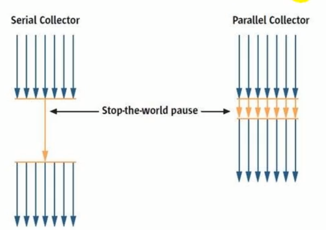

- 按工作模式分
  - 独占式
  - 并发式：工作线程和GC线程能同时进行

- 碎片处理方式
  - 压缩式
  - 非压缩式

## 评估GC的性能指标

- 吞吐量
  - 运行用户代码的时间占总运行时间的比例
  - 总运行时间:程序的运行时间＋内存回收的时间
- 暂停时间
  - 执行垃圾收集时，程序的工作线程被暂停的时间。
- 内存占用 
  - Java 堆区所占的内存大小

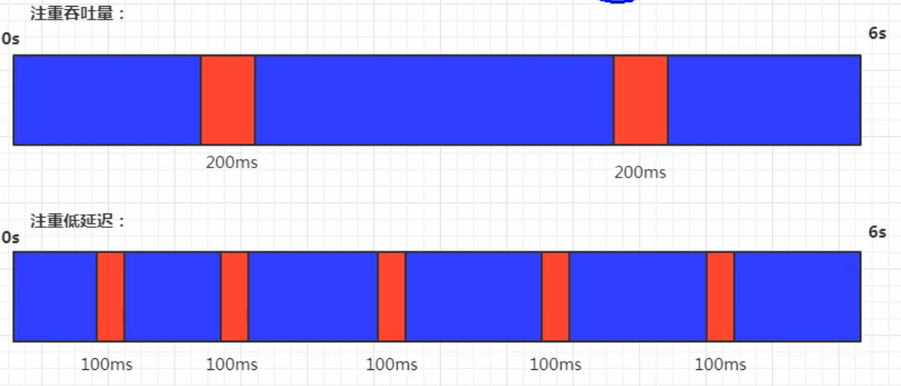

## 七种经典回收器

1. 新生代收集器：Serial（复制算法）、ParNew、Parallel Scavenge；

2. 老年代收集器：Serial Old（标记-整理）、Parallel Old、CMS（标记-清除）；

3. 整堆收集器：G1（标记-整理）；

- 搭配关系图
  - 红色虚线：jdk8移除
  - 绿色虚线：jdk14移除
  - 青色虚线：jdk14移除（删除CMS垃圾回收）


## 查看垃圾回收器

- 添加参数：-XX:+PrintCommandLineFlags
  - 可以看到UseParallelGC垃圾回去

```tex
-XX:InitialHeapSize=6291456 -XX:MaxHeapSize=6291456 -XX:+PrintCommandLineFlags -XX:+PrintGCDetails -XX:+UseCompressedClassPointers -XX:+UseCompressedOops -XX:-UseLargePagesIndividualAllocation -XX:+UseParallelGC 
```

- jinfo -flag UseParallelGC 进程号

## Serial回收器

- Serial收集器采用复制算法、串行回收和"Stop-the-World"机制的方式执行内存回收。
- 除了年轻代之外，Serial收集器还提供用于执行老年代垃圾收集的serial old收集器。serial old收集器同样也采用了串行回收(标记-压缩算法)
  - Serial old是运行在client模式下默认的老年代的垃圾回收器
  - Serial old在Server模式下主要有两个用途:①与新生代的Parallelscavenge配合使用作为老年代CMS收集器的后备垃圾收集方案


## ParNew 回收器

- 采用并行回收的方式执行内存回收
- 年轻代采用复制算法
- JDK14凉了

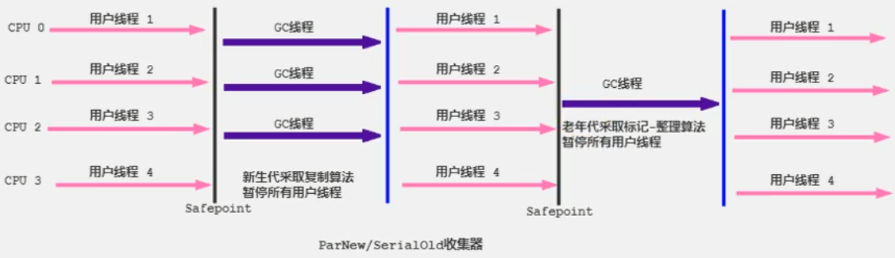

## Parallel Scavenge回收器

- **吞吐量优先**
- JDK8默认垃圾回收
- 适合在后台运算而不需要太多交互的任务的业务场景（例如：那些执行批量处理、订单处理、工资支付、科学计算的应用程序。）
- Parallel 收集器在JDK1.6时提供了用于执行老年代垃圾收集的Parallel old收集器，用来代替老年代的Serial old收集器。
- Parallel old收集器采用了**标记-压缩算法**，但同样也是基于**并行回收**


## CMS 回收器

- **低延迟**

- 第一款真正意义上的并发收集器（用户线程和GC线程并发执行）
- 采用标记-清除算法

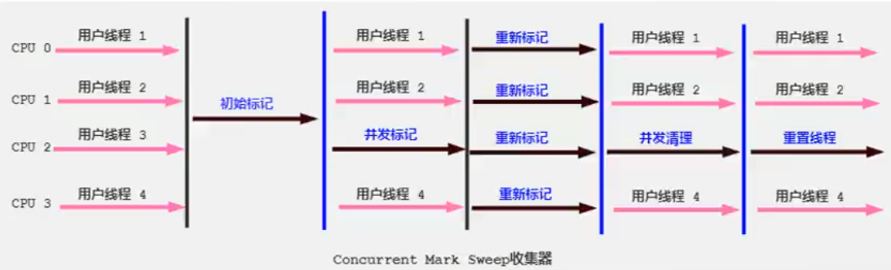

- GC阶段
  - 初始标记：标记出GC Roots能直接关联到的对象
  - 并发标记(Concurrent-Mark)阶段:从GC Roots的直接关联对象开始遍历整个对象图的过程
  - 重新标记
  - 并发清除

```tex
有人会觉得既然Mark Sweep会造成内存碎片,那么为什么不把算法换成Mark Compact呢?

因为在清除阶段，用户线程还在使用
```

## G1垃圾回收器

```tex
官方给G1设定的目标是在延迟可控的情况下获得尽可能高的吞吐量，所以才担当起“全功能收集器”的重任与期望。
```

- G1是一个并行回收器，它把堆内存分割为很多不相关的区域(Region),使用不同的Region来表示Eden、幸存者0区，幸存者1区，老年代等
- 后台维护一个优先列表，每次根据允许的收集时间，优先回收价值最大的Region(比如有些region，回收过后依旧还占很大内存，那么这个回收价值不大)
- JDK9默认垃圾回收

### 特点

- 并行与并发
  - 并行性:G1在回收期间，可以有多个GC线程同时工作，有效利用多核计算能力。此时用户线程STW
  - 并发性:G1拥有与应用程序交替执行的能力，部分工作可以和应用程序同时执行，因此，一般来说，不会在整个回收阶段发生完全阻塞应用程序的情况
- 分代收集
  - 从分代上看，G1依然属于分代型垃圾回收器，它会区分年轻代和老年代，年轻代依然有Eden区和survivor区。但从堆的结构上看，它不要求整个Eden区、年轻代或者老年代都是连续的，也不再坚持固定大小和固定数量。
  - 将堆空间分为若干个区域(Region)，这些区域中包含了逻辑上的年轻代和老年代
  - 堆内存一旦占满，就进行fullGC

- 空间整合
  - Region之间是复制算法
- 可预见的时间模型

### 缺点

- 额外内存占用比较大（小内存应用上CMS表现要好点，6-8Gb）

### 参数设置

-XX:+UseG1GC：手动指定G1垃圾回收

-XX:G1HeapRegionsize设置每个Region的大小值是2的幂，范围是1MB到32MB之间，目标是根据最小的Java堆大小划分出约2048个区域。默认是堆内存的1/2000。

-XX:MaxGCPauseMillis:设置期望达到的最大GC停顿时间指标(JVM会尽力,实现，但不保证达到)。默认值是200ms

### G1常见调优

第一步:开启G1垃圾收集器

第二步:设置堆的最大内存

第三步:设置最大的停顿时间

### 适用场景

- 面向服务端应用，针对具有大内存、多处理器的机器。(在普通大小的堆里表现并惊喜)

- 最主要的应用是需要低GC延迟，并具有大堆的应用程序提供解决方案;

### Region


- Humoungous:大对象存储区域
- 设置H的原因

```tex
对于堆中的大对象,默认直接会被分配到老年代，但是如果它是一个短期存在的大对象就会对垃圾收集器造成负面影响。为了解决这个问题，G1划分了一个Humongous区,它用来专门存放大对象。如果一个H区装不下一个大对象，那么G1会寻找连续的H区来存储。为了能找到连续的H区，有时候不得不启动Full GC。G1的大多数行为都把H区作为老年代的一部分来看待。
```

### 垃圾回收过程

- 年轻代GC

```tex
应用程序分配内存，当年轻代的Eden区用尽时开始年轻代回收过程;G1的年轻代收集阶段是一个并行的独占式收集器。在年轻代回收期，61 GC暂停所有应用程序线程，启动多线程执行年轻代回收。然后从年轻代区间移动存活对象到survivor区间或者老年区间，也有可能是两个区间都会涉及。
```

- 老年代并发标记过程

```tex
当堆内存使用达到一定值（默认45%）时，开始老年代并发标记过程。
```

- 混合回收

```tex
标记完成马上开始混合回收过程。对于一个混合回收期，G1 GC从老年区间移动存活对象到空闲区间，这些空闲区间也就成为了老年代的一部分。和年轻代不同，老年代的G1回收器和其他GC不同，G1的老年代回收器不需要整个老年代被回收，一次只需要扫描/回收一小部分老年代的Region就可以了。同时，这个老年代Region是和年轻代一起被回收的。
```

- (如果需要，单线程、独占式、高强度的Full GC还是继续存在的。它针对Gc的评估失败提供了一种失败保护机制，即强力回收。)

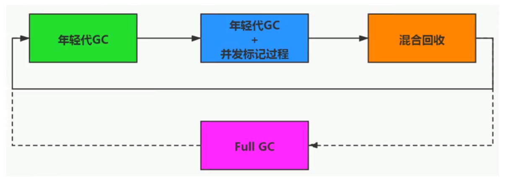

#### 年轻代回收过程

- Remembered Set

---

问题：

- 一个对象可能被不同区域的对象引用引用
- 回收新生代不得不扫描老年代（可能老年代的引用指向新生代）

---

解决办法：

- 无论G1还是其他分代收集器，JVM都是使用Remembered set来避免全局扫描
- 每个Region都有一个对应的Remembered set;

- 当我们需要回收某个region时，只需要搜索set，去扫描对应的有指向本region的其他region

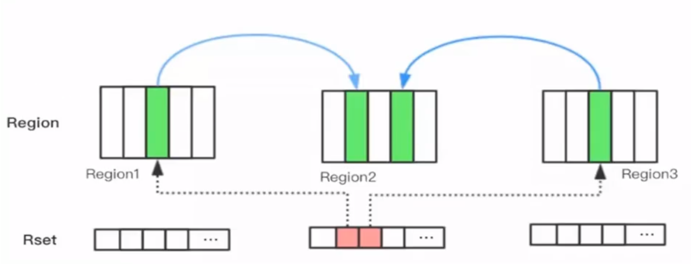

---

#### 并发标记

1. 初始化标记阶段
2. 根区域扫描
3. 并发标记：（如果发现区域内都是垃圾，则直接全部回收）
4. 再次标记
5. 独占清理
   1. 计算各个区域的存活对象和GC回收比例，并进行排序识别可以混合回收的区域。为下阶段做铺垫。是STW的。
6. 并发清理

#### 混合GC

1. 当越来越多的对象晋升到老年代oldregion时，为了避免堆内存被耗尽，虚拟机会触发一个混合的垃圾收集器,即Mixed GC
2. 一部分老年代，而不是全部老年代回收（除了回收整个young region，还会回收一部分的old region）

#### FULL GC

- 导致Full GC的原因

1.  Evacuation的时候没有足够的to-space来存放晋升的对象;
2. 并发处理过程完成之前空间耗尽。（堆空间太小）

## 总结


# GC日志分析

## 常用参数

```shell
## 输出GC日志
-XX:+PrintGC
## 输出GC详细信息
-XX:+PrintGCDetails
## 输出GC时间蹉
-XX:+PrintGCTimeStamps
## 输出GC时间（以日期为基准）
-XX:+PrintGCDateStamps
## -在GC前后打印堆的信息
-XX：+PrintHeapAtGC
## 日志文件输出
-Xloggc:../logs/gc.log
```

- -XX:+PrintGC
  - GC/Full GC: GC的类型
  - Allocation Failure：GC原因
  - 3708K->3844K：GC前后大小
  - (5632K)：堆大小

```tex
[GC (Allocation Failure)  3708K->3844K(5632K), 0.0007932 secs]
[Full GC (Ergonomics)  3844K->3305K(5632K), 0.0071881 secs]
```

- -XX:+PrintGCDetails
  - PSYoungGen:对应新生代垃圾回收（Parallel）
  - PSYoungGen: 1512K->488K(1536K)：新生代内容
  - Times: user=0.06 sys=0.00, real=0.01 secs: 执行时间，系统时间，垃圾实际时间

```tex
[GC (Allocation Failure) [PSYoungGen: 1512K->488K(1536K)] 3764K->3900K(5632K), 0.0011602 secs] [Times: user=0.00 sys=0.00, real=0.00 secs] 
[Full GC (Ergonomics) [PSYoungGen: 488K->0K(1536K)] [ParOldGen: 3412K->3407K(4096K)] 3900K->3407K(5632K), [Metaspace: 3330K->3330K(1056768K)], 0.0087257 secs] [Times: user=0.06 sys=0.00, real=0.01 secs] 

```

## GC工具分析日志

1. -Xloggc:gc.log进行GC日志输出
2. 使用工具上传文件（gcviewer/https://gceasy.io/）

# 新时代的GC

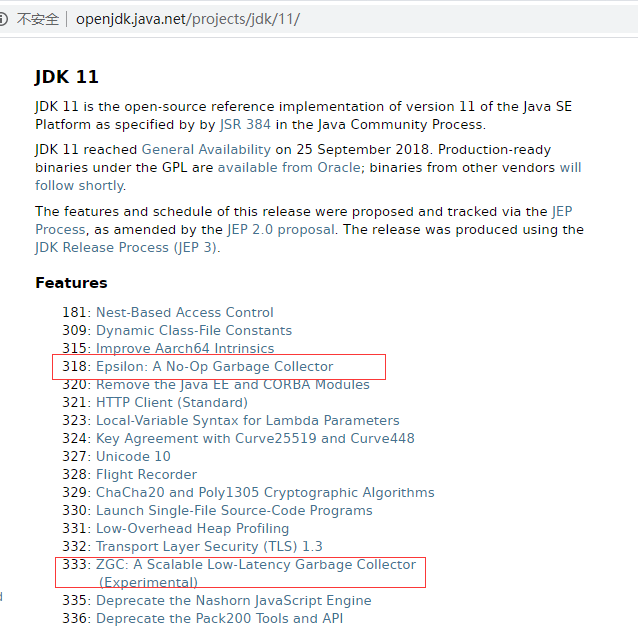

- ZGC（JDK14）:主打低延迟

# 常用调优工具

## JDK命令行

## VisualVM

安装对应的插件 [Visual GC](https://visualvm.github.io/archive/downloads/release136/com-sun-tools-visualvm-modules-visualgc_1.nbm)


## jprofiler

- 先装jprofiler
- 再在idea上装jprofiler插件
- 在启动项目旁边有个jprofiler启动工具

### 查看OOM

- 在命令行加入命令：

```shell
-XX:+HeapDumpOnOutOfMemoryError -XX:HeapDumpPath=${目录}
```

- 当出现OOM时会生成dump文件

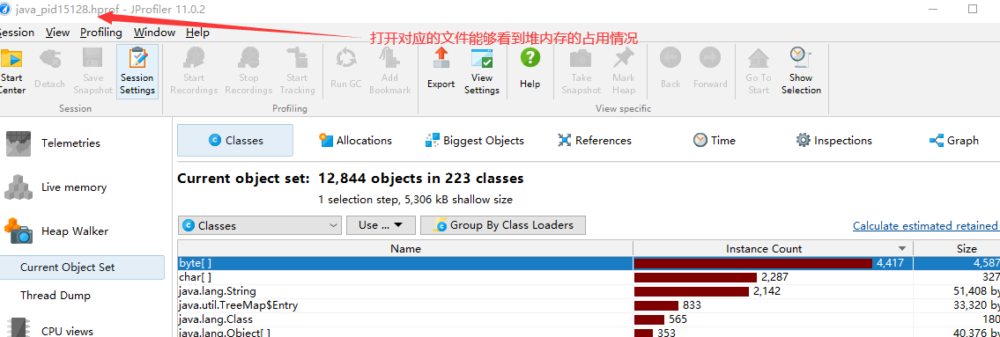

- 查看超大对象


# JVM常用线上工具


# JAVA虚拟机规范

https://docs.oracle.com/javase/specs/index.html

# 字节码文件

## 几个常见面试题

- Integer比较

```java
Integer i1 = 5;
Integer i2= 5;
System.out.println(i1 == i2);
```

解析：

1. 从字节码指令解析

```shell
 ## 将5放入操作数栈
 0 iconst_5 
 ## 调用 valueOf方法
 1 invokestatic #2 <java/lang/Integer.valueOf>
```

2. 从valueOf可以看出，如果超过了某个长度（[-128, 127] ），则会直接new一个，否则从缓存（**内部数组初始化的值**）中取一个书，也就是说，这个范围内的数的地址都是相等的

```java
public static Integer valueOf(int i) {
    if (i >= IntegerCache.low && i <= IntegerCache.high)
        return IntegerCache.cache[i + (-IntegerCache.low)];
    return new Integer(i);
}
```

- 插箱比较

```java
Integer i3 = 128;
int i4 = 128;
System.out.println(i3 == i4);
```

1. 因为i3会调用Integer.intValue自动拆箱，所以不在Integer缓存范围也会相等

```shell
invokevirtual #5 <java/lang/Integer.intValue>
```

## 成员变量赋值过程

1. 默认初始化
2. 显示初始化/代码块中初始化
3. 构造器中初始化
4. 对象中赋值

### 直接父类的方式赋值

```java
class Father {
    int i= 10;
    Father() {
        this.print();
        i = 20;
    }
    public void print() {
        System.out.println(i);
    }
}
//输出结果 10
```

- 字节码指令

```shell
 ## 加载this指针
 0 aload_0
 #默认调用父类初始化方法
 1 invokespecial #1 <java/lang/Object.<init>>
 4 aload_0
 ##将10push到操作数栈
 5 bipush 10
 ## 赋值
 7 putfield #2 <com/xiao/classLoader/Father.i>
10 aload_0
11 invokevirtual #3 <com/xiao/classLoader/Father.print>
14 aload_0
15 bipush 20
17 putfield #2 <com/xiao/classLoader/Father.i>
20 return

```

### 子类的方式赋值

```java
class Son extends Father {
    int i = 30;
    Son() {
        this.print();
        i = 40;
    }
    public void print() {
        System.out.println(i);
    }
}
//输出： 0   30
```

- 构造方法初始化

```shell
 0 aload_0
 ## 调用父类的初始化，此时i还没有初始化，所以i=0
 1 invokespecial #1 <com/xiao/classLoader/Father.<init>>
 4 aload_0
 5 bipush 30
 7 putfield #2 <com/xiao/classLoader/Son.i>
10 aload_0
11 invokevirtual #3 <com/xiao/classLoader/Son.print>
14 aload_0
15 bipush 40
17 putfield #2 <com/xiao/classLoader/Son.i>
20 return
```


## 字节码指令

- java虚拟机指令由一个字节长度，代表某个特定操作含义的操作码+0到多个代表此操作需要的参数操作数所构成
- 操作码 [操作数]

## 查看字节码的方式

- vscode插件
  - JVM Bytecode Viewer
  - Binary Viewer

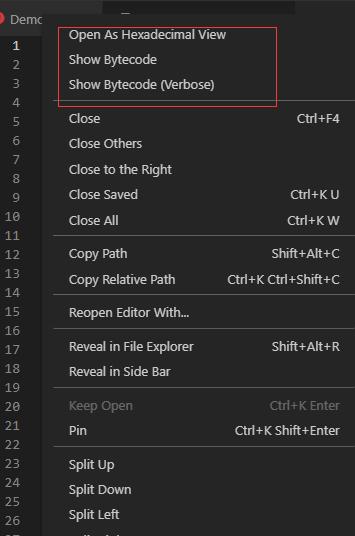

- idea插件
  - jclasslib Bytecode

## 字节码文件结构

```shell
ClassFile {
    u4             magic;
    u2             minor_version;
    u2             major_version;
    u2             constant_pool_count;
    cp_info        constant_pool[constant_pool_count-1];
    u2             access_flags;
    u2             this_class;
    u2             super_class;
    u2             interfaces_count;
    u2             interfaces[interfaces_count];
    u2             fields_count;
    field_info     fields[fields_count];
    u2             methods_count;
    method_info    methods[methods_count];
    u2             attributes_count;
    attribute_info attributes[attributes_count];
}
```

| 字节长度 | 名称（英文）        | 名称（中文）                   | 描述                          |
| -------- | ------------------- | ------------------------------ | ----------------------------- |
| u4       | magic               | 魔数                           | 用于区分是否是class字节码文件 |
| u2       | minor_version       | 主版本                         |                               |
| u2       | major_version       | 副版本                         |                               |
| u2       | constant_pool_count | 常量池计数器                   | 记录常量池有多少项            |
| cp_info  | constant_pool       | 常量池                         |                               |
| u2       | access_flags        | 访问标识                       |                               |
|          |                     | 类索引，父类索引，接口索引集合 |                               |
| u2       |                     | 字段计数器                     |                               |
|          |                     | 字段                           |                               |
|          |                     | 方法计数器                     |                               |
|          |                     | 方法表                         |                               |
|          |                     | 属性表信息                     |                               |

```shell
ca fe ba be ## 魔数  
00 00 00 34 ## JDK主版本.副版本
```

### 常量池

- 常量池是不固定的，所以需要有一个常量池计数器记录常量池有多少项
- 常量池表项中，存放编译产 生的字面量和符号引用，部分内容加载后进入方法区的**运行时常量池**中

```shell
## 常量池计数器，表示有21个常量池（16转换为10进制=22）
00 16
```

#### 常量池数据

- 字面量
  1. 文本字符串（string str = "xxx"）
  2. 声明为final的常量值（final int num = 1）
- 符号引用
  1. 类和接口的全限定名（com/xiao/classLoader/Demo）
  2. 字段和方法的名称
  3. 字段的和方法的描述符（字段的数据类型，方法的参数和放回值）

#### 常量池结构

- 常量池11种数据类型


- 0a对应10，则太代表表中的CONSTANT_Mehtodref_info，后面两个index，个占两个字节，如此对应21个（对应常量池计数器）
- 注意如果是01字符串，则他的bytes长度是有前两个字节的length决定的

```shell
0a 00 04 00 12 
```

### 访问标志

在常量池后，紧跟着访问标记。该标记使用两个字节表示，用于识别一些类或者接口层次的访问信息，包括:这个Class是类还是接口;是否定义为public类型;是否定义为 abstract类型，如果是类的话，是否被声明为 final等。各种访问标记如下所示:

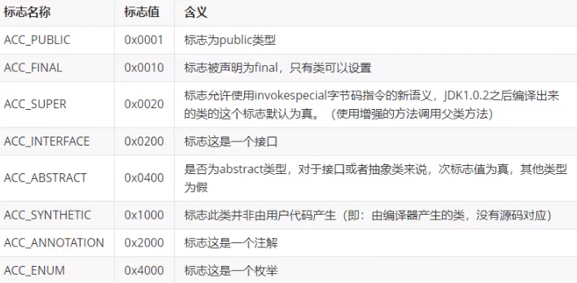

- 表示ACC_PUBLIC+ACC_SUPER(表明这个类是public的)

```shell
00 21
```

### 类索引，父类索引，接口索引集合

- 表示当前这个类是什么名字，父类有哪些，接口有哪些

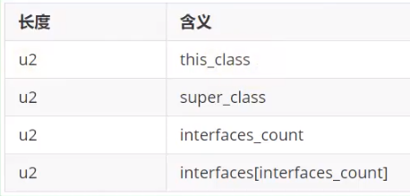

### 字段表集合

- 用于描述接口或类中声明的变量。字段(field)包括类级变量以及实例级变量，但是不包括方法内部、代码块内部声明的局部变量。
- 字段叫什么名字、字段被定义为什么数据类型，这些都是无法固定的，只能引用常量池中的常量来描述。
- 它指向常量池索引集合，它描述了每个字段的家整信息。比如字段的标识符、访问修饰符〈public、private或protected)、是类变量还是实例变量(static修饰符)、是否是常量(final修饰符）等。

1. 字段计数器：记录字段的个数

2. 字段表


- 属性
  - 一个字段还可能拥有一些属性，用于存储更多的额外信息。比如初始化值（常量的初始化值）、一些注释信息等。属性个数存放在attribute_count中，属性具体内容存放在attributes数组中。
  
  
### 方法表集合

指向常量池索引集合，它完整描述了每个方法的签名。

- 方法计数器
- 方法表


#### code结构

- code存储的是字节码指令
- 里面有若干属性集合

##### LineNumberTable

- code中的属性的名字
- 描述的是字节码指令和实际代码的对应关系

结构：

```java
LineNumberTable_attribute {
    u2 attribute_name_index;
    u4 attribute_length;
    u2 line_number_table_length;
    {   u2 start_pc;
        u2 line_number;	
    } line_number_table[line_number_table_length];
}
```

##### LocalVariableTable

- 描述变量作用的长度

```shell
LocalVariableTable_attribute {
    u2 attribute_name_index;
    u4 attribute_length;
    u2 local_variable_table_length;
    {   u2 start_pc;
        u2 length;
        u2 name_index;
        u2 descriptor_index;
        u2 index;
    } local_variable_table[local_variable_table_length];
}
```


### 属性表集合

- 方法表集合之后的属性表集合，指的是class文件所携带的辅助信息，比如该 class文件的**源文件的名称**。以及任何带有RetentionPolicy.CLASS或者RetentionPolicy.RUNTINE的注解。这类信息通常被用于Java虚拟机的验证和运行，以及Java程序的调试，一般无须深入了解。
- 字段表、方法表都可以有自己的属性表。用于描述某些场景专有的信息 

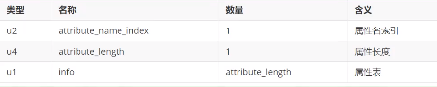

(比较复杂，后续再回过头补充 p230)

- 属性表结构


# 常用命令

## JAVAC命令

- 直接javac xx.java，就不会在生成对应的局部变量表等信息，如果你使用javac -g xx.java就可以生成所有相关信息了。

- 如果你使用的eclipse或IDEA，则默认情况下，eclipse、IDEA在编译时会帮你生成局部变量表、指令和代码行偏移量映射表等信息的。

## JAVAP命令

```shell
javap <options> <classes>
```

- options

```tex
 -version         当前javap所在的jdk的version版本
  -v  -verbose    输出附加信息（行号，本地变量表，反汇编等详细信息，不包括私有的方法）
```

- 包括私有的方法

```shell
javap -v -p classes
```

- 解析的文件解读

```tex
//字节码文件地址
Classfile /D:/git/gitee/stu-jvm/out/production/stu-jvm/com/xiao/stack/TestBing.class
//最后修改时间， 文件大小
  Last modified 2021-5-15; size 299 bytes
//MD5散列值
  MD5 checksum 8fd1a35f261c9f5a2f18ed40907f5c6f
  //源文件名称
  Compiled from "TestBing.java"
  //全类名
public class com.xiao.stack.TestBing extends com.xiao.stack.TestLocalVariable
//对应的主版本和副版本编号
  minor version: 0
  major version: 52
  
  flags: ACC_PUBLIC, ACC_SUPER
Constant pool:
   #1 = Methodref          #3.#13         // com/xiao/stack/TestLocalVariable."<init>":()V
   #2 = Class              #14            // com/xiao/stack/TestBing
   #3 = Class              #15            // com/xiao/stack/TestLocalVariable
   #4 = Utf8               <init>
   #5 = Utf8               ()V
   #6 = Utf8               Code
   #7 = Utf8               LineNumberTable
   #8 = Utf8               LocalVariableTable
   #9 = Utf8               this
  #10 = Utf8               Lcom/xiao/stack/TestBing;
  #11 = Utf8               SourceFile
  #12 = Utf8               TestBing.java
  #13 = NameAndType        #4:#5          // "<init>":()V
  #14 = Utf8               com/xiao/stack/TestBing
  #15 = Utf8               com/xiao/stack/TestLocalVariable
{
  public com.xiao.stack.TestBing();
    descriptor: ()V //方法描述符（形参，返回类型）
    //访问标识
    flags: ACC_PUBLIC
    Code:
    //操作数栈最大深度， 局部变量表长度， 方法接受参数的个数（包括this）
      stack=1, locals=1, args_size=1
      //编译量：操作码 操作数  #执行常量池索引
         0: aload_0
         1: invokespecial #1                  // Method com/xiao/stack/TestLocalVariable."<init>":()V
         4: return
      //行号表
      LineNumberTable:
        line 11: 0
        line 12: 4
      //局部变量表
      LocalVariableTable:
      	//局部变量的开始位置， 长度， 占用槽
        Start  Length  Slot  Name   Signature
            0       5     0  this   Lcom/xiao/stack/TestBing;
}
SourceFile: "TestBing.java"

```

# 字节码指令

## 执行模型

- 字节码大概执行的流程

```java
do{
    自动计算PC寄存器的值加1;
    根据PC寄存器的指示位置，从字节码流中取出操作码;
    if(字节码存在操作数)
        从字节码流中取出操作数;
    执行操作码所定义的操作;
}while(字节码长度小O):
```

## 字节码与数据类型

- 强相关的类型
  - 对于 bytem boolean 都是使用i标识

```shell
i代表对int类型的数据操作，
l代表long
s代表short
c代表char
f代表float
d代表double
```

- 隐含的数据类型

```tex
也有一些指令的助记符中没有明确地指明操作类型的字母，
如arraylength指令，它没有代表数据类型的特殊字符，但操作数永远只能是一个数组类型的对象.
```

- 无任何关系的

```tex
还有另外一些指令，如无条件跳转指令goto则是与数据类型无关的。
```

## 加载与存储指令

作用：加载和存储指令用于将数据从栈帧的局部变量表和操作数栈之间来回传递。

```tex
如果看到 load push  ldc const 相关的指令，那么他就是将局部变量表/常量池的数据压入操作数栈中
如果看到store相关的，那么他就是将数据存入局部变量表中
```

- 特殊的操作数
  - 有些操作数（一般0-3是和操作码一起的）
  - 如：iload_0 , 表示将局部变量表索引0的**数据**加载到操作数栈中

### 局部变量压栈指令

- 局部变量压栈指令将给定的局部变量表中的数据压入操作数栈
- xload_n / xload
- x: i(integer类型)、l、f、d、a（引用类型）
- n: 0-3

### 常量入栈指令

常量入栈指令的功能是将常数压入操作数栈，根据数据类型和入栈内容的不同，又可以分为const系列、push系列和ldc指令。

- 指令const系列:用于对特定的常量入栈，入栈的常量隐含在指令本身里

```tex
iconst_m1将-1压入操作数栈;
iconst_x (x为0到5）将x压入栈:
fconst_0、fconst_1、fconst_2分别将浮点数0、1、2压入栈;
dconst_0和dconst_1分别将double型0和1压入栈。
aconst_null将null压入操作数栈;
```

- 指令push系列:主要包括bipush和sipush。它们的区别在于接收数据类型的不同，bipush接收8位整数作为参数，sipush接收16位整数，它们都将参数压入栈。
- 指令ldc系列:如果以上指令都不能满足需求，那么可以使用万能的ldc指令，它可以接收一个8位的参数，该参数指向常量池中的int、 float或者string的索引，将指定的内容压入堆栈。

---

int的复制举例

```java
public void pushConstLdc() {
    int i = -1;
    int a = 5;
    int b = 6;
    int c = 127;
    int d = 128;
    int e = 32767;
    int f = 32768;
}
```

```shell
## -1 m1
0 iconst_m1
 1 istore_1
 ##const的范围0-5
 2 iconst_5
 3 istore_2
 # const无法使用，尝试使用bipush
 4 bipush 6
 6 istore_3
 ## bipush最大127(8位)
 7 bipush 127
 9 istore 4
 ## 超过8为sipush
11 sipush 128
14 istore 5
## 最大16位
16 sipush 32767
19 istore 6
## 超过使用常量池中的引用
21 ldc #2 <32768>
23 istore 7
25 return
```

---

### 装入局部变量表

出栈装入局部变量表指令用于将操作数栈中栈顶元素弹出后，装入局部变量表的指定位置，用于给局部变量赋值。

- 这类指令主要以store的形式存在，比如xstore (x为i、1、f、d、a)、 xstore_n (x为 i、1、f、d、a，n为至3）。
- 当store到局部变量表时，操作数栈做的是出栈操作

- 当有代码块时，需要考虑**槽位复用问题**

## 算数运算符

- 算术指令用于对两个操作数栈上的值进行某种特定运算，并把结果重新压入操作数栈。
- 大体上算术指令可以分为两种:对**整型数据**进行运算的指令与对**浮点类型数据**进行运算的指令。

### NaN值使用

当一个操作产生溢出时，将会使用有符号的无穷大表示，如果某个操作结果没有明确的数学定义的话，将会使用NaN值来表示。而且所有使用NaN值作为操作数的算术操作，结果都会返回 NaN;

```java
int i = 10;
double j = i / 0.0;
//Infinity
System.out.println(j);
//NaN
System.out.println(0.0/0.0);
```

### 所有运算符

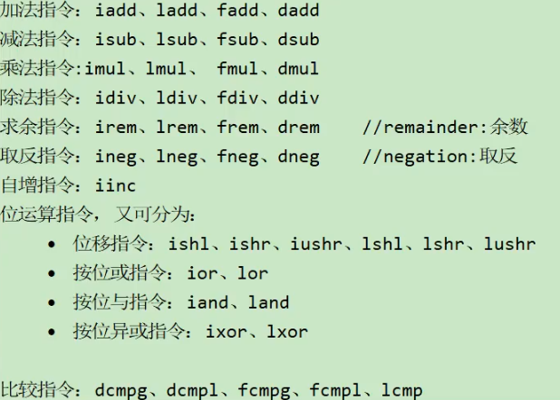

### ++运算符

- ++i 和 i++在没有赋值的时候，是一样的
-  i++是先赋值，++i是先计算

```shell
 0 bipush 10
 2 istore_1
 3 iload_1
 4 iinc 1 by 1
 ## i++，先赋值后自增 （此时store的是1的10）
 7 istore_2
 8 bipush 20
10 istore_3
11 iinc 3 by 1
14 iload_3
## ++j, 此时store的是操作数栈刚添加的自增的21
15 istore 4
17 return
```

- 

```java
int i=10;
i=i++;
//10
System.out.println(i);
```

## 比较指令

- 比较指令的作用是比较栈顶两个元素的大小，并将比较结果入栈

## 类型转换指令

- 类型转换指令可以将两种不同的数值米型进行相互转换。
- 这些转换操作一般用于实现用户代码中的显式类型转换操作,

### 宽化类型转换

- 小范围类型向大范围类型的安全转换
  - 从int类型到long、float或者double类型。对应的指令为: i21、i2f、i2d
  - 从long类型到float、double类型。对应的指令为:l2f、l2d
  - 从float类型到double类型。对应的指令为:f2d
  - 简化为: int --> long --> float --> double

### 窄化类型

## 对象指令

### 创建指令

- 虽然类实例和数组都是对象，但]ava虚拟机对类实例和数组的创建与操作使用了不同的字节码指令:
- 创建类实例指令：new
  - 它接收一个操作数，为指向常量池的索引，表示要创建的类型，执行完成后，将对象的引用压入栈。

- 创建数组： newarray（基本类型数组）、 anewarray（引用数据类型）、multianewarray（多维数组）。

### 字段访问指令

对象创建后，就可以通过对象访问指令获取对象实例或数组实例中的字段或者数组元素。

- 访问类字段(static字段，或者称为类变量）的指令: getstatic、putstatic
- 访问类实例字段（非static字段，或者称为实例变量）的指令: getfield、putfield

举例代码：

```java
public void method4() {
    System.out.println("hello");
}
```

```shell
##将out的引用放入操作数栈
0 getstatic #2 <java/lang/System.out>
## 将常量池中的hello压入栈
3 ldc #8 <hello>
5 invokevirtual #9 <java/io/PrintStream.println>
8 return
```

### 数组操作指令

数组操作指令主要有:xastore和xaload指令。具体为:

- 把一个数组元素加载到操作数栈的指令: baload、caload、saload、iaload、laload、faload、daload、aaload
- 将一个操作数栈的值存储到数组元素中的指令: bastore、 castore、sastore、iastore、lastore,fastore、dastore、aastore

说明：

```tex
xaload在执行时，要求操作数中栈顶元素为数组索引i,栈顶顺位第2个元素为数组引用a,该指令会弹出栈顶这两个元素，并将a[i]重新压入栈。
```

```tex
xastore则专门针对数组操作，以iastore为例，它用于给一个int数组的给定索引赋值。在iastore执行前，操作数栈顶需要以此准备3个元素:值、索引、数组引用，iastore会弹出这3个值，并将值赋给数组中指定索引的位置。
```

### 类型检查指令

检查类实例或数组类型的指令:instanceof、checkcast。

- 指令checkcast用于检查类型强制转换是否可以进行。如果可以进行，那么checkcast指令不会改变操作数栈，否则它会抛出ClassCastException异常。