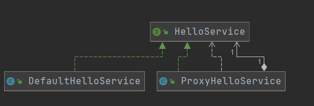

# 什么是AOP

面向切面编程是在模块化编程中切入关注点的一种方式，就像面向对象编程是模块化编程中关注公共点的方式一样。
面向方面编程(AOP)是面向对象编程(OOP)的补充，它提供了考虑程序结构的另一种方式。在OOP中模块化的关键单元是类，而在AOP中模块化的单元是方面。方面支持对跨多种类型和对象的关注点(如事务管理)进行模块化。

# 代理模式

## 静态代理



- 代理类定义一个service属性，指向需要被代理的类
- main方法直接调用代理类方法

具体实现：

```java
public interface HelloService {
    void sayHello(String name);
}
```

被代理类

```java
public class DefaultHelloService implements HelloService{
    @Override
    public void sayHello(String name) {
        System.out.println(name+" say hello ");
    }
}
```

代理类，在调用被代理的方法，中间操作一系列操作

```java
public class ProxyHelloService implements HelloService{
    private HelloService helloService;
    public ProxyHelloService(HelloService helloService) {
        this.helloService = helloService;
    }
    @Override
    public void sayHello(String name) {
        System.out.println("xx 转发了 "+name+ "请求");
        helloService.sayHello(name);
    }
}
```

- 调用类

```java
ProxyHelloService proxy = new ProxyHelloService(new DefaultHelloService());
proxy.sayHello("老肖");
```

## JDK动态代理

1、为接口创建代理类的字节码文件

2、使用ClassLoader将字节码文件加载到JVM

3、创建代理类实例对象，执行对象的目标方法


JDK代理类是会调用invoke方法

```java
Object object = Proxy.newProxyInstance(ClassLoader.getSystemClassLoader(),
        new Class[]{HelloService.class}, new InvocationHandler() {
            @Override
            public Object invoke(Object proxy, Method method, Object[] args) throws Throwable {
                DefaultHelloService defaultHelloService = new DefaultHelloService();
                defaultHelloService.sayHello(args[0] + " 在代理层做了些不可描述的事情");
                return null;
            }
        });
HelloService helloService = (HelloService) object;
helloService.sayHello("某人");
```

## Cglib代理

- JDK的动态代理机制只能代理实现了接口的类，而不能实现接口的类就不能实现JDK的动态代理，cglib是针对类来实现代理的，他的原理是对指定的目标类生成一个子类，并覆盖其中方法实现增强，**但因为采用的是继承，所以不能对final修饰的类进行代理**

- cglib 不同于 基于接口的 动态代理， cglib是基于类的代理

```java
Enhancer enhancer = new Enhancer();
//设置需要增强的类
enhancer.setSuperclass(DefaultHelloService.class);
enhancer.setCallback(new MethodInterceptor() {
    @Override
    public Object intercept(Object source, Method method, Object[] args, MethodProxy methodProxy) throws Throwable {
        System.out.println("执行前");
        Object result = methodProxy.invokeSuper(source, args);
        System.out.println("执行后");
        return result;
    }
});
HelloService helloService = (HelloService) enhancer.create();
helloService.sayHello("老肖");
```

# Spring反射工具类

## 获取Method

```java
Class<?> loadClass = Thread.currentThread()
        .getContextClassLoader()
        .loadClass("com.xiao.cglib.HelloService");
Method method = ReflectionUtils.findMethod(loadClass, "sayHello", String.class);
System.out.println("method:"+method);
```

## 方法过滤

```java
Class<?> loadClass = Thread.currentThread()
        .getContextClassLoader()
        .loadClass("com.xiao.cglib.HelloService");
ReflectionUtils.doWithMethods(loadClass, new ReflectionUtils.MethodCallback() {
    @Override
    public void doWith(Method method) throws IllegalArgumentException, IllegalAccessException {
        //扫描到方法调用
        System.out.println("Method:"+method);
    }
}, new ReflectionUtils.MethodFilter() {
    @Override
    public boolean matches(Method method) {
        //如果返回false，则不调用方法
        if(method.getName().equals("test")) {
            return false;
        }
        return true;
    }
});
```

## 字节码提升

- 添加字段

```java
BeanGenerator generator = new BeanGenerator();
generator.setSuperclass(Person.class);
generator.addProperty("str", String.class);
Object o = generator.create();
Method setStr = ReflectionUtils.findMethod(o.getClass(), "setStr", String.class);
ReflectionUtils.invokeMethod(setStr, o, "laoxiao");
System.out.println(ReflectionUtils.invokeMethod(ReflectionUtils.findMethod(o.getClass(), "getStr"), o));
```

# Spring Aop原理

>  EnableAspectJAutoProxy

1. Spring的Aop起源于@EnableAspectJAutoProxy注解

```java
@Import(AspectJAutoProxyRegistrar.class)
public @interface EnableAspectJAutoProxy
```

2. 这个注解是一个Spring的Enable编程，利用ImportBeanDefinitionRegistrar进行注册
   1. 它在这个方法里注册了AnnotationAwareAspectJAutoProxyCreator（自动代理注册器）这个bean

>AnnotationAwareAspectJAutoProxyCreator


1. 我们发现这个类实现了BeanPostProcessor后置处理器和 Aware模型
   1. 凡是Aware的都会有一个setBeanFactory方法
   2. BeanPostProcessor在refresh方法注册阶段进行创建
2. 在后置通知方法AbstractAutoProxyCreator#postProcessAfterInitialization中
   1. 通过AbstractAutoProxyCreator#wrapIfNecessary代理对象的创建
   2. 注意：**Spring 默认是jdk代理的，如果是直接使用类而不是接口，则是cglib**
   3. 当强制使用cglib时：需要配置`spring.aop.proxy-target-class=true`或`@EnableAspectJAutoProxy(proxyTargetClass = true`)

> 执行阶段

 JdkDynamicAopProxy/CglibAopProxy将每一个通知方法又被包装为方法拦截器，形成一条责任链调用

