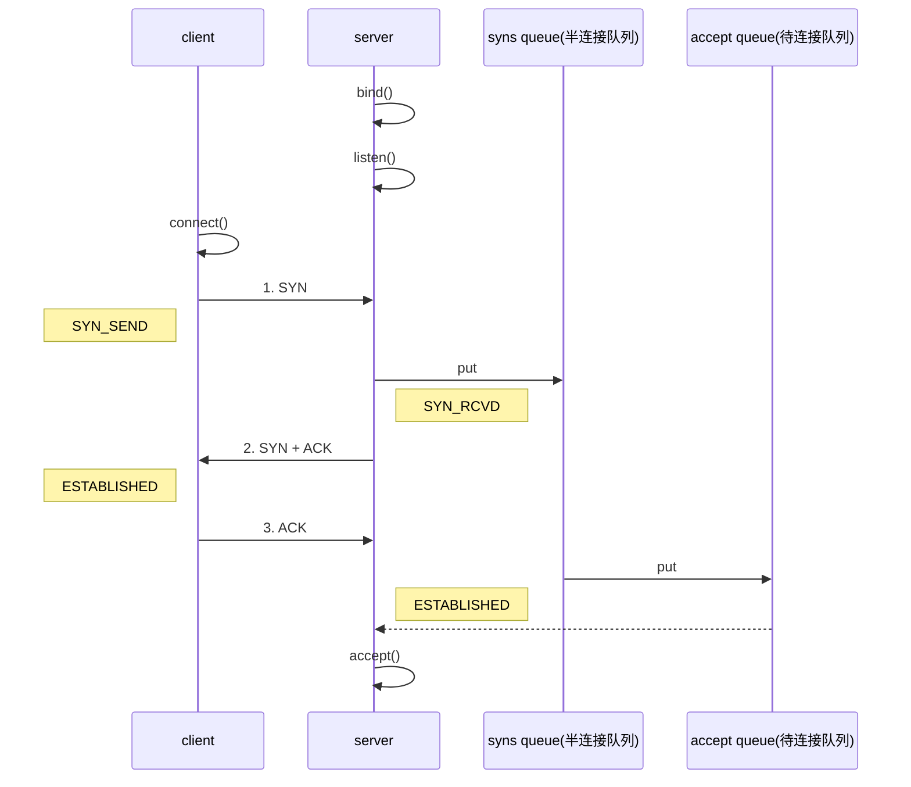

# TCP

## 三次握手

1. 第一次握手，client 发送 SYN （数据包）到 server，状态修改为 SYN_SEND，server 收到，状态改变为 SYN_REVD，并将该请求放入 sync queue 队列
   1. 服务器确定能收到客户端消息
2. 第二次握手，server 回复 SYN + ACK 给 client，client 收到，状态改变为 ESTABLISHED，并发送 ACK 给 server
3. 第三次握手，server 收到 ACK，状态改变为 ESTABLISHED，将该请求从 sync queue 放入 accept queue
   1. 客户端确定能收到服务器消息
   2. accept()：服务器建立连接资源有限，所以，要从队列中获取待连接数据,调用一次accept则队列少一个